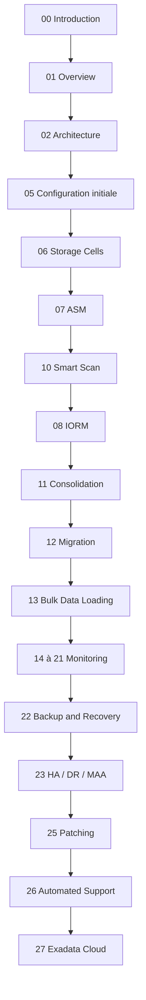

# Module 00 — Introduction au workshop Exadata

## 1. Objectif du module

Ce module introduit le parcours **Oracle Exadata Database Machine Administration Workshop**.

L’objectif est de comprendre ce que représente Exadata dans un contexte d’administration Oracle : une plateforme intégrée combinant serveurs de bases de données, serveurs de stockage intelligents, réseau interne rapide, Oracle Grid Infrastructure, ASM, Exadata System Software et outils de supervision/support.

À la fin de ce module, le lecteur doit être capable de :

- expliquer le but du workshop ;
- comprendre pourquoi Exadata n’est pas seulement une base Oracle plus rapide ;
- identifier les grandes familles de composants étudiées dans le cours ;
- comprendre la logique de progression des modules ;
- distinguer compréhension architecture, diagnostic read-only et actions de changement ;
- adopter une méthode prudente d’analyse avant toute intervention.

---

## 2. Pourquoi commencer par une introduction

Un administrateur qui découvre Exadata peut être tenté de l’aborder comme une base Oracle classique hébergée sur des serveurs puissants.

C’est une erreur.

Exadata est un **système intégré**. Les performances, la disponibilité et les incidents doivent être compris en reliant plusieurs couches :

```text
Applications
→ Services Oracle / listeners
→ Database servers
→ Grid Infrastructure / RAC
→ ASM
→ Réseau interne RoCE ou InfiniBand
→ Storage cells
→ Flash / disques
→ Outils de monitoring et support
```

Un symptôme visible côté base peut provenir :

- d’un plan SQL ;
- d’un service RAC mal placé ;
- d’une contention ASM ;
- d’une storage cell saturée ;
- d’un problème réseau interne ;
- d’un défaut de flash, disque ou firmware ;
- d’une mauvaise fenêtre de sauvegarde ;
- d’un workload concurrent non maîtrisé.

Ce module pose donc la règle de base du cours :

```text
Sur Exadata, on ne conclut jamais à partir d’une seule couche.
On relie toujours architecture, workload, métriques et impact métier.
```

---

## 3. Ce qu’est Oracle Exadata Database Machine

Oracle Exadata Database Machine est une plateforme Oracle intégrée pour bases de données critiques.

Elle combine :

| Couche | Rôle |
|---|---|
| Database Servers | Hébergent Oracle Database, instances RAC, services, listeners, Grid Infrastructure et processus Oracle. |
| Storage Cells | Fournissent le stockage intelligent, les disques, la flash, CellCLI, Smart Scan, Storage Index, IORM et métriques cellule. |
| ASM | Présente les diskgroups Oracle à partir des grid disks exposés par les storage cells. |
| Grid Infrastructure | Gère cluster, ressources RAC, ASM, services et haute disponibilité locale. |
| Réseau interne | Transporte le trafic RAC, ASM et iDB entre database servers et storage cells. |
| Réseaux externes | Séparent les flux client, administration, sauvegarde et intégration datacenter. |
| Outils Oracle | Enterprise Manager, AHF, Exachk, ORAchk, TFA, OSWatcher, ASR, RMAN, Data Guard selon les sujets. |

La force d’Exadata vient de l’intégration de ces couches.

Dans une architecture classique, une baie de stockage renvoie principalement des blocs vers les serveurs de base de données.  
Dans Exadata, les storage cells peuvent participer au traitement : filtrage, projection, offload SQL, optimisation I/O, priorisation IORM et réduction du volume retourné aux database servers.

---

## 4. Ce que le workshop doit couvrir

Le workshop ne se limite pas à l’architecture générale.

Il couvre progressivement :

| Domaine | Ce que l’on doit comprendre |
|---|---|
| Overview | Positionnement d’Exadata, usages, composants et différences avec une architecture Oracle classique. |
| Architecture | Rôle des database servers, storage cells, ASM, Grid Infrastructure et réseau interne. |
| Configuration initiale | Choix de réseau, stockage, redondance, layout, diskgroups et décisions amont. |
| Storage Server | CellCLI, physical disks, cell disks, grid disks, flash cache, flash log, alertes et sécurité. |
| ASM | Chaîne physical disk → cell disk → grid disk → ASM disk → diskgroup → fichiers Oracle. |
| Smart Scan | Offload SQL, predicate filtering, column projection, Direct Path Read, Storage Index, HCC. |
| IORM | Priorisation I/O, consolidation, noisy neighbor, Database Resource Manager et workloads concurrents. |
| Migration | Choix entre RMAN, Data Pump, transportable tablespaces, Data Guard, GoldenGate selon contraintes. |
| Bulk Loading | Chargement massif, direct path, external tables, SQL*Loader, Data Pump, DBFS. |
| Monitoring | Enterprise Manager, CellCLI, AWR, ASH, métriques cells, réseau, serveur, flash, disque. |
| Backup / Recovery | RMAN, FRA, validation, restore test, recovery, RPO/RTO. |
| HA / DR / MAA | RAC, Data Guard, Active Data Guard, Broker, FSFO, continuité de service. |
| Maintenance / Patching | Patching database, Grid Infrastructure, OS, firmware, Exadata System Software, prechecks et rollback. |
| Support automatisé | AHF, Exachk, ORAchk, TFA, ASR, collecte de preuves et préparation d’un dossier support. |
| Cloud | Exadata on-premises, Exadata Database Service, Exadata Cloud@Customer et responsabilités associées. |

---

## 5. Méthode de travail du cours

Chaque module suit une logique simple :

```text
1. Comprendre le concept.
2. Identifier les composants concernés.
3. Comprendre les décisions de configuration.
4. Lire les commandes ou vues utiles.
5. Interpréter les résultats.
6. Identifier les erreurs fréquentes.
7. Appliquer le raisonnement à un scénario.
8. Produire une conclusion technique prudente.
```

Cette méthode doit être conservée dans tout le dépôt.

Le but n’est pas d’accumuler des commandes.  
Le but est de savoir expliquer **pourquoi** une commande est utilisée, **quelle couche** elle observe, **quelle preuve** elle fournit et **ce qu’elle ne permet pas de conclure**.

---

## 6. Lecture read-only et actions de changement

Le cours privilégie les commandes de lecture et de diagnostic.

Exemples de commandes de lecture :

```bash
crsctl stat res -t
srvctl status database -d <db_unique_name> -v
asmcmd lsdg
cellcli -e "list cell detail"
cellcli -e "list griddisk detail"
```

Exemples de vues de lecture :

```sql
select inst_id, instance_name, host_name, status
from gv$instance
order by inst_id;

select name, total_mb, free_mb, type, state
from v$asm_diskgroup
order by name;
```

Ces commandes servent à comprendre l’état de la plateforme.

Une action de changement doit être traitée autrement :

| Type d’action | Exigence |
|---|---|
| Modification de configuration | Runbook, validation équipe, sauvegarde de l’état initial, fenêtre de maintenance. |
| Patching | Prechecks, documentation version, plan de rollback, validation post-patch. |
| Changement IORM | Justification workload, matrice de priorité, validation métier/production. |
| Changement ASM/storage | Analyse de capacité, redondance, risque de rebalance, validation DBA/infrastructure. |
| Incident critique | Collecte de preuves, ouverture SR si nécessaire, traçabilité des décisions. |

---

## 7. Schéma global du parcours



Ce schéma montre la logique pédagogique :

```text
Comprendre l’architecture
→ comprendre le stockage
→ comprendre la performance
→ comprendre l’exploitation
→ comprendre la continuité
→ comprendre la maintenance
→ comprendre les variantes cloud
```

---

## 8. Exemple de situation réelle

Une équipe reprend l’exploitation d’un environnement Exadata après migration.

Avant toute intervention, elle doit répondre à des questions simples :

```text
Combien y a-t-il de database servers ?
Combien y a-t-il de storage cells ?
Quels diskgroups ASM existent ?
Quels services RAC portent les applications ?
Quelles bases sont critiques ?
Où passent les flux client, admin, backup et interconnect ?
Quels outils de supervision sont en place ?
Quels rapports Exachk / AHF sont disponibles ?
Quelle est la stratégie RMAN / Data Guard ?
Quelle est la dernière version patchée ?
```

Ces questions évitent de modifier une plateforme sans compréhension.

---

## 9. Erreurs fréquentes au démarrage

| Erreur | Pourquoi c’est dangereux | Bonne approche |
|---|---|---|
| Considérer Exadata comme un simple serveur Oracle | On ignore les storage cells, ASM, réseau interne et offload. | Lire la chaîne complète DB → ASM → Cell → réseau. |
| Diagnostiquer uniquement depuis la base | Certains symptômes viennent des cells, du réseau, de la flash ou d’ASM. | Croiser vues Oracle, CellCLI, AWR/ASH et monitoring. |
| Confondre performance et disponibilité | Une requête lente n’est pas forcément un problème HA/DR. | Séparer performance SQL, I/O, cluster, backup et DR. |
| Changer sans preuve | Une action non maîtrisée peut aggraver la situation. | Collecter des preuves read-only avant modification. |
| Oublier les responsabilités cloud | En cloud, certaines couches sont opérées différemment. | Identifier clairement le modèle de responsabilité. |

---

## 10. Bonnes pratiques de lecture du cours

Pour chaque module, appliquer la même grille :

| Question | Réponse attendue |
|---|---|
| Quel composant est étudié ? | Database server, storage cell, ASM, réseau, outil, backup, cloud, etc. |
| Quel problème ce composant résout-il ? | Performance, stockage, disponibilité, diagnostic, support, maintenance. |
| Quelle preuve peut-on lire ? | Vue SQL, commande CellCLI, AWR, ASH, EM, AHF, Exachk, TFA. |
| Quelle erreur faut-il éviter ? | Conclusion trop rapide, action destructive, diagnostic mono-couche. |
| Quel impact métier ? | Latence, disponibilité, RPO/RTO, capacité, coût, risque opérationnel. |

---

## 11. Exercice pratique

Vous arrivez dans une équipe DBA qui exploite un rack Exadata déjà en production.

Rédigez une note courte répondant aux points suivants :

1. Quels composants faut-il identifier en premier ?
2. Quelles commandes read-only peut-on lancer sans modifier la plateforme ?
3. Quelles informations faut-il demander à l’équipe production ?
4. Quelles erreurs faut-il éviter pendant la prise de connaissance ?
5. Quelle méthode adopter avant de proposer un changement ?

---

## 12. Corrigé indicatif

Une bonne réponse commence par identifier les couches principales :

```text
Database servers
Storage cells
ASM diskgroups
Grid Infrastructure
Réseaux client / admin / backup / interne
Outils de monitoring
Stratégie backup / HA / DR
Version Exadata / Oracle / GI
```

Les premières commandes doivent rester read-only :

```bash
crsctl stat res -t
srvctl status database -d <db_unique_name> -v
asmcmd lsdg
cellcli -e "list cell detail"
```

La note doit aussi expliquer que l’on ne change pas une configuration Exadata sans :

```text
preuve technique
contexte de charge
validation d’équipe
runbook
fenêtre de maintenance
plan de retour arrière
```

Une bonne conclusion ne propose pas immédiatement une correction.  
Elle propose d’abord une cartographie, une collecte de métriques, une revue de l’état de santé et une priorisation des sujets.

---

## 13. À retenir

```text
À retenir
- Exadata est un système intégré, pas seulement une base Oracle rapide.
- Le workshop doit couvrir architecture, configuration, stockage, performance, migration, monitoring, sauvegarde, HA/DR, maintenance, support et cloud.
- Le diagnostic Exadata doit relier plusieurs couches : database, cluster, ASM, storage cells, réseau et outils Oracle.
- Les commandes read-only servent à comprendre avant d’agir.
- Toute action de changement doit être séparée du diagnostic et encadrée par un runbook.
- Un bon administrateur Exadata relie toujours architecture, workload, métriques et impact métier.
```

---

## 14. Références officielles

| Référence | Utilisation dans le module |
|---|---|
| [Oracle University — Exadata Database Machine Administration Workshop](https://education.oracle.com/exadata-database-machine-administration-workshop/courP_4599) | Cadre pédagogique général du workshop. |
| [Oracle Exadata Documentation](https://docs.oracle.com/en/engineered-systems/exadata-database-machine/) | Administration Exadata, Storage Server, CellCLI, maintenance et monitoring. |
| [Oracle Database Documentation](https://docs.oracle.com/en/database/) | Vues dynamiques, SQL, RMAN, Data Guard, AWR/ASH selon licences. |
| [Oracle Maximum Availability Architecture](https://www.oracle.com/database/technologies/high-availability/maa.html) | Principes HA/DR, Data Guard, sauvegarde et continuité de service. |
| [Oracle Autonomous Health Framework](https://docs.oracle.com/en/engineered-systems/health-diagnostics/autonomous-health-framework/) | AHF, Exachk, ORAchk, TFA et diagnostics automatisés. |
