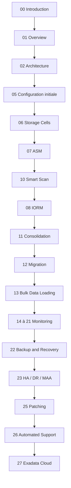

# Module 00 — Introduction au workshop Exadata

## 1. Objectif du module

Ce module introduit le parcours **Oracle Exadata Database Machine Administration Workshop**.

L’objectif est de comprendre le sens d’Exadata : ce n’est pas seulement une base Oracle plus rapide, mais une plateforme intégrée où Oracle Database, le stockage, le réseau, ASM, Grid Infrastructure et les outils Oracle sont conçus pour fonctionner ensemble.

À la fin de ce module, le lecteur doit être capable de :

- expliquer pourquoi Exadata existe ;
- comprendre ce qu’Exadata apporte en plus d’une architecture Oracle classique ;
- distinguer Oracle classique, Oracle RAC sur SAN et Oracle Exadata ;
- comprendre la différence entre une base seule, une plateforme consolidée et une approche multitenant ;
- identifier les grandes familles de composants étudiées dans le cours ;
- comprendre la logique de progression des modules ;
- adopter une méthode prudente d’analyse avant toute intervention.

---

## 2. Le sens d’Exadata

Le sens d’Exadata peut se résumer ainsi :

```text
Rapprocher le moteur Oracle Database du stockage,
réduire les I/O inutiles,
intégrer compute + storage + réseau + logiciels Oracle,
et fournir une plateforme optimisée pour les bases critiques.
```

Dans une architecture classique, le stockage renvoie principalement des blocs au serveur Oracle.  
Le serveur Oracle doit ensuite filtrer, joindre, agréger et traiter les données.

Dans Exadata, les **storage cells** peuvent participer au travail :

```text
filtrer certaines lignes
projeter certaines colonnes
réduire le volume transféré
utiliser la flash intelligemment
prioriser les workloads
fournir des métriques de diagnostic spécifiques
```

L’idée clé est donc :

```text
Oracle classique = la base travaille surtout côté serveur.
Exadata = la base et le stockage coopèrent.
```

---

## 3. Comparatif rapide : Oracle classique vs Exadata

| Sujet | Oracle classique sur serveur + SAN/NAS | Oracle Exadata |
|---|---|---|
| Nature de la plateforme | Assemblage de composants séparés : serveurs, stockage, réseau, outils. | Système intégré conçu et supporté comme un ensemble Oracle. |
| Serveurs de base | Serveurs Oracle physiques ou virtuels. | Database servers Exadata dédiés à Oracle Database. |
| Stockage | Baie SAN/NAS qui renvoie principalement des blocs. | Storage cells intelligentes avec Exadata System Software. |
| Traitement SQL | Principalement côté database server. | Certaines opérations peuvent être déportées vers les storage cells. |
| Smart Scan | Non disponible. | Disponible si les conditions techniques sont réunies. |
| Offload SQL | Non disponible ou très limité hors Exadata. | Filtrage, projection et réduction de données côté cells. |
| ASM | Possible, selon architecture. | Central dans le modèle Exadata. |
| Chaîne stockage | LUN / volumes / filesystem ou ASM selon design. | Physical disk → cell disk → grid disk → ASM disk → diskgroup. |
| Flash | Dépend de la baie ou du serveur. | Flash Cache et Flash Log intégrés aux storage cells. |
| IORM | Non disponible au niveau Exadata. | Priorisation I/O entre bases, PDB ou workloads. |
| Réseau interne | SAN, Ethernet, Fibre Channel selon architecture. | RoCE ou InfiniBand pour RAC, ASM et iDB. |
| Monitoring | Outils souvent séparés entre base, système, réseau, stockage. | Enterprise Manager, CellCLI, métriques Exadata, AHF, Exachk, TFA. |
| Support | Plusieurs fournisseurs ou équipes peuvent intervenir. | Plateforme Oracle engineered avec support intégré. |
| Consolidation | Possible mais dépend fortement du design. | Cas d’usage majeur avec IORM, RAC, ASM, monitoring et isolation. |
| Limite | Architecture plus hétérogène, diagnostic multi-équipes. | Puissant mais ne corrige pas automatiquement mauvais SQL ou mauvais modèle. |

À retenir :

```text
Le plus d’Exadata n’est pas seulement la puissance matérielle.
Le plus d’Exadata est l’intégration intelligente entre Oracle Database et le stockage.
```

---

## 4. Monotenant, multitenant et consolidation

Il faut distinguer trois idées.

### 4.1 Monotenant

Un environnement monotenant signifie qu’une plateforme ou un serveur est principalement dédié à une seule base, une seule application ou un seul grand périmètre.

```text
1 plateforme
→ 1 base principale
→ 1 application principale
```

Avantage :

- isolement simple ;
- moins de concurrence entre applications ;
- diagnostic plus direct.

Limite :

- moins de mutualisation ;
- coût potentiellement plus élevé ;
- ressources parfois sous-utilisées.

### 4.2 Multitenant Oracle

Dans Oracle Database, le mot **multitenant** désigne l’architecture CDB/PDB.

```text
CDB = Container Database
PDB = Pluggable Database
```

Une même CDB peut héberger plusieurs PDB :

```text
CDB_PROD
├── PDB_APP1
├── PDB_APP2
└── PDB_APP3
```

Cela permet de consolider plusieurs bases logiques dans une même architecture Oracle, avec des gains d’administration, de mutualisation et de standardisation.

### 4.3 Consolidation Exadata

Exadata est souvent utilisée comme plateforme de consolidation.

Elle peut héberger :

```text
plusieurs bases
plusieurs CDB
plusieurs PDB
plusieurs workloads
plusieurs environnements
plusieurs applications critiques ou non critiques
```

Exadata apporte alors plusieurs mécanismes utiles :

| Besoin en consolidation | Apport Exadata |
|---|---|
| Mutualiser plusieurs bases | Database servers, RAC, ASM et storage cells partagés. |
| Limiter les effets de voisin bruyant | IORM et Database Resource Manager. |
| Prioriser les workloads critiques | Plans de ressources I/O et services RAC. |
| Surveiller la plateforme complète | Enterprise Manager, CellCLI, AHF, Exachk, TFA. |
| Maintenir la performance | Flash Cache, Smart Scan, offload, réseau interne rapide. |
| Garder la résilience | ASM redundancy, RAC, Data Guard, MAA selon architecture. |

À retenir :

```text
Monotenant = une base ou application principale isolée.
Multitenant = CDB/PDB dans Oracle Database.
Consolidation Exadata = plusieurs bases/workloads sur une plateforme intégrée.
```

---

## 5. Ce qu’est Oracle Exadata Database Machine

Oracle Exadata Database Machine est une plateforme Oracle intégrée pour bases de données critiques.

Elle combine :

| Couche | Rôle |
|---|---|
| Database Servers | Hébergent Oracle Database, instances RAC, services, listeners, Grid Infrastructure et processus Oracle. |
| Storage Cells | Fournissent le stockage intelligent, les disques, la flash, CellCLI, Smart Scan, Storage Index, IORM et métriques cellule. |
| ASM | Présente les diskgroups Oracle à partir des grid disks exposés par les storage cells. |
| Grid Infrastructure | Gère cluster, ressources RAC, ASM, services et haute disponibilité locale. |
| Réseau interne | Transporte le trafic RAC, ASM et iDB entre database servers et storage cells. |
| Réseaux externes | Séparent les flux client, administration, sauvegarde et intégration datacenter. |
| Outils Oracle | Enterprise Manager, AHF, Exachk, ORAchk, TFA, OSWatcher, ASR, RMAN, Data Guard selon les sujets. |

---

## 6. Pourquoi commencer par une introduction

Un administrateur qui découvre Exadata peut être tenté de l’aborder comme une base Oracle classique hébergée sur des serveurs puissants.

C’est une erreur.

Exadata est un **système intégré**. Les performances, la disponibilité et les incidents doivent être compris en reliant plusieurs couches :

```text
Applications
→ Services Oracle / listeners
→ Database servers
→ Grid Infrastructure / RAC
→ ASM
→ Réseau interne RoCE ou InfiniBand
→ Storage cells
→ Flash / disques
→ Outils de monitoring et support
```

Un symptôme visible côté base peut provenir :

- d’un plan SQL ;
- d’un service RAC mal placé ;
- d’une contention ASM ;
- d’une storage cell saturée ;
- d’un problème réseau interne ;
- d’un défaut de flash, disque ou firmware ;
- d’une mauvaise fenêtre de sauvegarde ;
- d’un workload concurrent non maîtrisé.

Ce module pose donc la règle de base du cours :

```text
Sur Exadata, on ne conclut jamais à partir d’une seule couche.
On relie toujours architecture, workload, métriques et impact métier.
```

---

## 7. Ce que le workshop doit couvrir

Le workshop ne se limite pas à l’architecture générale.

Il couvre progressivement :

| Domaine | Ce que l’on doit comprendre |
|---|---|
| Overview | Positionnement d’Exadata, usages, composants et différences avec une architecture Oracle classique. |
| Architecture | Rôle des database servers, storage cells, ASM, Grid Infrastructure et réseau interne. |
| Configuration initiale | Choix de réseau, stockage, redondance, layout, diskgroups et décisions amont. |
| Storage Server | CellCLI, physical disks, cell disks, grid disks, flash cache, flash log, alertes et sécurité. |
| ASM | Chaîne physical disk → cell disk → grid disk → ASM disk → diskgroup → fichiers Oracle. |
| Smart Scan | Offload SQL, predicate filtering, column projection, Direct Path Read, Storage Index, HCC. |
| IORM | Priorisation I/O, consolidation, noisy neighbor, Database Resource Manager et workloads concurrents. |
| Migration | Choix entre RMAN, Data Pump, transportable tablespaces, Data Guard, GoldenGate selon contraintes. |
| Bulk Loading | Chargement massif, direct path, external tables, SQL*Loader, Data Pump, DBFS. |
| Monitoring | Enterprise Manager, CellCLI, AWR, ASH, métriques cells, réseau, serveur, flash, disque. |
| Backup / Recovery | RMAN, FRA, validation, restore test, recovery, RPO/RTO. |
| HA / DR / MAA | RAC, Data Guard, Active Data Guard, Broker, FSFO, continuité de service. |
| Maintenance / Patching | Patching database, Grid Infrastructure, OS, firmware, Exadata System Software, prechecks et rollback. |
| Support automatisé | AHF, Exachk, ORAchk, TFA, ASR, collecte de preuves et préparation d’un dossier support. |
| Cloud | Exadata on-premises, Exadata Database Service, Exadata Cloud@Customer et responsabilités associées. |

---

## 8. Méthode de travail du cours

Chaque module suit une logique simple :

```text
1. Comprendre le concept.
2. Identifier les composants concernés.
3. Comprendre les décisions de configuration.
4. Lire les commandes ou vues utiles.
5. Interpréter les résultats.
6. Identifier les erreurs fréquentes.
7. Appliquer le raisonnement à un scénario.
8. Produire une conclusion technique prudente.
```

Cette méthode doit être conservée dans tout le dépôt.

Le but n’est pas d’accumuler des commandes.  
Le but est de savoir expliquer **pourquoi** une commande est utilisée, **quelle couche** elle observe, **quelle preuve** elle fournit et **ce qu’elle ne permet pas de conclure**.

---

## 9. Lecture read-only et actions de changement

Le cours privilégie les commandes de lecture et de diagnostic.

Exemples de commandes de lecture :

```bash
crsctl stat res -t
srvctl status database -d <db_unique_name> -v
asmcmd lsdg
cellcli -e "list cell detail"
cellcli -e "list griddisk detail"
```

Exemples de vues de lecture :

```sql
select inst_id, instance_name, host_name, status
from gv$instance
order by inst_id;

select name, total_mb, free_mb, type, state
from v$asm_diskgroup
order by name;
```

Ces commandes servent à comprendre l’état de la plateforme.

Une action de changement doit être traitée autrement :

| Type d’action | Exigence |
|---|---|
| Modification de configuration | Runbook, validation équipe, sauvegarde de l’état initial, fenêtre de maintenance. |
| Patching | Prechecks, documentation version, plan de rollback, validation post-patch. |
| Changement IORM | Justification workload, matrice de priorité, validation métier/production. |
| Changement ASM/storage | Analyse de capacité, redondance, risque de rebalance, validation DBA/infrastructure. |
| Incident critique | Collecte de preuves, ouverture SR si nécessaire, traçabilité des décisions. |

---

## 10. Schéma global du parcours



Ce schéma montre la logique pédagogique :

```text
Comprendre le sens d’Exadata
→ comprendre l’architecture
→ comprendre le stockage
→ comprendre la performance
→ comprendre l’exploitation
→ comprendre la continuité
→ comprendre la maintenance
→ comprendre les variantes cloud
```

---

## 11. Exemple de situation réelle

Une équipe reprend l’exploitation d’un environnement Exadata après migration.

Avant toute intervention, elle doit répondre à des questions simples :

```text
Combien y a-t-il de database servers ?
Combien y a-t-il de storage cells ?
Quels diskgroups ASM existent ?
Quels services RAC portent les applications ?
Quelles bases ou PDB sont critiques ?
Est-on en monotenant, multitenant ou consolidation multi-workloads ?
Où passent les flux client, admin, backup et interconnect ?
Quels outils de supervision sont en place ?
Quels rapports Exachk / AHF sont disponibles ?
Quelle est la stratégie RMAN / Data Guard ?
Quelle est la dernière version patchée ?
```

Ces questions évitent de modifier une plateforme sans compréhension.

---

## 12. Erreurs fréquentes au démarrage

| Erreur | Pourquoi c’est dangereux | Bonne approche |
|---|---|---|
| Considérer Exadata comme un simple serveur Oracle | On ignore les storage cells, ASM, réseau interne et offload. | Lire la chaîne complète DB → ASM → Cell → réseau. |
| Diagnostiquer uniquement depuis la base | Certains symptômes viennent des cells, du réseau, de la flash ou d’ASM. | Croiser vues Oracle, CellCLI, AWR/ASH et monitoring. |
| Confondre multitenant et consolidation | Une CDB/PDB est un modèle database ; la consolidation Exadata est une stratégie plateforme. | Distinguer base, PDB, workload et plateforme. |
| Confondre performance et disponibilité | Une requête lente n’est pas forcément un problème HA/DR. | Séparer performance SQL, I/O, cluster, backup et DR. |
| Changer sans preuve | Une action non maîtrisée peut aggraver la situation. | Collecter des preuves read-only avant modification. |
| Oublier les responsabilités cloud | En cloud, certaines couches sont opérées différemment. | Identifier clairement le modèle de responsabilité. |

---

## 13. Bonnes pratiques de lecture du cours

Pour chaque module, appliquer la même grille :

| Question | Réponse attendue |
|---|---|
| Quel composant est étudié ? | Database server, storage cell, ASM, réseau, outil, backup, cloud, etc. |
| Quel problème ce composant résout-il ? | Performance, stockage, disponibilité, diagnostic, support, maintenance. |
| Quelle preuve peut-on lire ? | Vue SQL, commande CellCLI, AWR, ASH, EM, AHF, Exachk, TFA. |
| Quelle erreur faut-il éviter ? | Conclusion trop rapide, action destructive, diagnostic mono-couche. |
| Quel impact métier ? | Latence, disponibilité, RPO/RTO, capacité, coût, risque opérationnel. |

---

## 14. Exercice pratique

Vous arrivez dans une équipe DBA qui exploite un rack Exadata déjà en production.

Rédigez une note courte répondant aux points suivants :

1. Quelle est la différence entre Oracle classique et Exadata ?
2. Quels composants faut-il identifier en premier ?
3. L’environnement est-il monotenant, multitenant ou consolidé ?
4. Quelles commandes read-only peut-on lancer sans modifier la plateforme ?
5. Quelles informations faut-il demander à l’équipe production ?
6. Quelles erreurs faut-il éviter pendant la prise de connaissance ?
7. Quelle méthode adopter avant de proposer un changement ?

---

## 15. Corrigé indicatif

Une bonne réponse commence par la différence principale :

```text
Oracle classique lit principalement des blocs depuis un stockage externe.
Exadata combine database servers et storage cells intelligentes capables de participer au traitement.
```

Elle identifie ensuite les couches principales :

```text
Database servers
Storage cells
ASM diskgroups
Grid Infrastructure
Réseaux client / admin / backup / interne
Outils de monitoring
Stratégie backup / HA / DR
Version Exadata / Oracle / GI
```

Elle distingue aussi :

```text
Monotenant = un périmètre principal isolé.
Multitenant = architecture Oracle CDB/PDB.
Consolidation Exadata = plusieurs bases, PDB ou workloads sur une plateforme intégrée.
```

Les premières commandes doivent rester read-only :

```bash
crsctl stat res -t
srvctl status database -d <db_unique_name> -v
asmcmd lsdg
cellcli -e "list cell detail"
```

La note doit expliquer que l’on ne change pas une configuration Exadata sans :

```text
preuve technique
contexte de charge
validation d’équipe
runbook
fenêtre de maintenance
plan de retour arrière
```

Une bonne conclusion ne propose pas immédiatement une correction.  
Elle propose d’abord une cartographie, une collecte de métriques, une revue de l’état de santé et une priorisation des sujets.

---

## 16. À retenir

```text
À retenir
- Le sens d’Exadata est l’intégration Oracle Database + stockage intelligent + réseau rapide + ASM + Grid Infrastructure.
- Exadata n’est pas seulement une base Oracle rapide.
- Le plus d’Exadata est la coopération entre database servers et storage cells.
- Oracle classique renvoie surtout des blocs ; Exadata peut filtrer, projeter et réduire les données côté cells.
- Monotenant, multitenant et consolidation ne veulent pas dire la même chose.
- Le diagnostic Exadata doit relier database, cluster, ASM, storage cells, réseau et outils Oracle.
- Les commandes read-only servent à comprendre avant d’agir.
- Toute action de changement doit être séparée du diagnostic et encadrée par un runbook.
```

---

## 17. Références officielles

| Référence | Utilisation dans le module |
|---|---|
| [Oracle University — Exadata Database Machine Administration Workshop](https://education.oracle.com/exadata-database-machine-administration-workshop/courP_4599) | Cadre pédagogique général du workshop. |
| [Oracle Exadata Documentation](https://docs.oracle.com/en/engineered-systems/exadata-database-machine/) | Administration Exadata, Storage Server, CellCLI, maintenance et monitoring. |
| [Oracle Database Documentation](https://docs.oracle.com/en/database/) | Vues dynamiques, SQL, RMAN, Data Guard, AWR/ASH selon licences. |
| [Oracle Maximum Availability Architecture](https://www.oracle.com/database/technologies/high-availability/maa.html) | Principes HA/DR, Data Guard, sauvegarde et continuité de service. |
| [Oracle Autonomous Health Framework](https://docs.oracle.com/en/engineered-systems/health-diagnostics/autonomous-health-framework/) | AHF, Exachk, ORAchk, TFA et diagnostics automatisés. |
