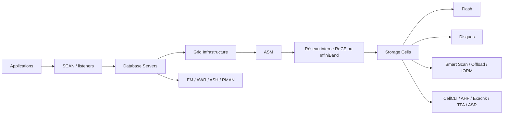

# Module 01 — Overview

## 1. Objectif du module


Ce module donne une vue d’ensemble d’**Oracle Exadata Database Machine**.

L’objectif est de comprendre pourquoi Exadata existe, quels problèmes elle cherche à résoudre, quels composants la composent et en quoi elle diffère d’une architecture Oracle classique basée sur serveurs séparés et stockage SAN/NAS.

À la fin de ce module, le lecteur doit être capable de :

- expliquer le positionnement d’Exadata ;
- identifier les grands composants de la plateforme ;
- distinguer database servers, storage cells, ASM, Grid Infrastructure et réseau interne ;
- expliquer la différence entre stockage classique et stockage intelligent Exadata ;
- comprendre les bénéfices principaux : scale-out, offload SQL, Smart Scan, Flash Cache, IORM, consolidation ;
- comprendre les limites : Exadata ne corrige pas automatiquement un mauvais SQL, un mauvais modèle de données ou une mauvaise architecture applicative ;
- lire une première cartographie d’environnement Exadata en mode read-only.

---

## 2. Pourquoi Exadata existe

Les bases Oracle critiques rencontrent souvent les mêmes contraintes :

```text
forte volumétrie
forte concurrence
besoin de faible latence
besoin de haut débit I/O
besoin de haute disponibilité
besoin de consolidation
besoin de diagnostic fiable
besoin de support intégré
```

Dans une architecture classique, on sépare généralement :

```text
Serveurs Oracle Database
→ Réseau SAN / NAS
→ Baie de stockage
→ Disques / Flash
```

Cette architecture peut fonctionner correctement, mais elle introduit plusieurs limites :

- le stockage est souvent passif ;
- les blocs remontent vers le serveur de base avant filtrage SQL ;
- les équipes base, système, réseau et stockage peuvent diagnostiquer séparément ;
- le dimensionnement dépend de nombreux composants hétérogènes ;
- la performance dépend fortement du design SAN, des chemins multipath, de la baie et du réseau ;
- la consolidation peut générer des effets de voisin bruyant entre applications.

Exadata répond à ces limites par une plateforme intégrée où Oracle Database, ASM, Grid Infrastructure, réseau interne et storage cells sont conçus pour fonctionner ensemble.

---

## 3. Définition simple d’Exadata

Oracle Exadata Database Machine est une plateforme intégrée optimisée pour Oracle Database.

Elle associe :

| Élément | Rôle |
|---|---|
| Database Servers | Exécutent Oracle Database, RAC, services, listeners et processus Oracle. |
| Storage Cells | Fournissent stockage intelligent, flash, disques, offload SQL, IORM, métriques et CellCLI. |
| ASM | Agrège les grid disks des cells en diskgroups Oracle. |
| Grid Infrastructure | Gère cluster, ASM, ressources, services et haute disponibilité locale. |
| Réseau interne | Transporte les échanges RAC, ASM et iDB entre database servers et storage cells. |
| Outils Oracle | Fournissent supervision, diagnostic, health checks, support automatisé et maintenance. |

La définition importante est donc :

```text
Exadata n’est pas seulement un serveur Oracle puissant.
Exadata est une architecture intégrée database + storage + réseau + logiciels Oracle optimisés.
```

---

## 4. Différence avec Oracle RAC sur SAN

Une base Oracle RAC sur SAN peut déjà offrir de la haute disponibilité locale.

Mais Exadata ajoute une couche essentielle : les **storage cells intelligentes**.

| Sujet | Oracle RAC sur SAN | Oracle Exadata |
|---|---|---|
| Calcul SQL | Instances Oracle sur serveurs RAC | Instances Oracle sur database servers Exadata |
| Stockage | Baie SAN/NAS externe | Storage cells Exadata intégrées |
| Intelligence stockage | Majoritairement côté base | Offload possible côté storage cells |
| ASM | Peut être utilisé | Central dans le modèle Exadata |
| Réseau interne | Interconnect RAC + réseau stockage séparé | RoCE / InfiniBand pour RAC, ASM et iDB |
| Filtrage SQL | Principalement côté database server | Certaines opérations peuvent être déportées vers les cells |
| Diagnostic | Souvent multi-équipes / multi-outils | CellCLI, métriques Exadata, EM, AHF, Exachk, TFA |
| Consolidation | Possible mais dépend du design | Prévue comme cas d’usage majeur avec IORM |
| Support | Dépend des composants séparés | Plateforme engineered Oracle supportée comme ensemble |

Le point clé :

```text
Dans RAC sur SAN, le stockage renvoie surtout des blocs.
Dans Exadata, les storage cells peuvent traiter une partie du travail avant de renvoyer les données.
```

---

## 5. Composants principaux

### 5.1 Database Servers

Les database servers hébergent :

- Oracle Database ;
- instances RAC ou single instance ;
- services applicatifs ;
- listeners ;
- processus Oracle ;
- Grid Infrastructure ;
- ASM instances ;
- agents de supervision.

Ils exécutent le SQL, gèrent les sessions, les plans, la mémoire Oracle et la logique transactionnelle.

### 5.2 Storage Cells

Les storage cells hébergent :

- Exadata System Software ;
- CellCLI ;
- disques physiques ;
- flash devices ;
- cell disks ;
- grid disks ;
- Flash Cache ;
- Flash Log ;
- Smart Scan ;
- Storage Index ;
- IORM ;
- métriques et alertes cellule.

Elles ne sont pas de simples tiroirs de disques.  
Elles participent à la performance et au diagnostic.

### 5.3 ASM

ASM présente les fichiers Oracle à travers des diskgroups.

Sur Exadata, la chaîne logique est :

```text
Physical Disk / Flash
→ Cell Disk
→ Grid Disk
→ ASM Disk
→ ASM Diskgroup
→ Datafiles / Redo / Controlfiles / FRA
```

ASM permet de répartir les données sur plusieurs cells et d’assurer redondance, équilibre et rebalance.

### 5.4 Grid Infrastructure

Grid Infrastructure fournit :

- Oracle Clusterware ;
- ressources cluster ;
- services RAC ;
- VIP / SCAN ;
- gestion ASM ;
- haute disponibilité locale ;
- placement des services.

### 5.5 Réseau interne

Le réseau interne Exadata repose selon les générations sur **InfiniBand** ou **RoCE**.

Il transporte notamment :

- trafic RAC ;
- trafic ASM ;
- trafic iDB entre database servers et storage cells ;
- échanges nécessaires aux fonctions Exadata.

Une latence ou erreur sur ce réseau peut avoir un impact direct sur la performance et la disponibilité.

---

## 6. Capacités clés d’Exadata

### 6.1 Smart Scan

Smart Scan permet de déporter certaines opérations SQL vers les storage cells.

Les cells peuvent appliquer :

- predicate filtering ;
- column projection ;
- réduction du volume retourné ;
- lecture optimisée de grands scans ;
- intégration avec Storage Index et HCC selon les cas.

### 6.2 Offload SQL

L’offload SQL consiste à déplacer une partie du travail depuis les database servers vers les storage cells.

Ce mécanisme réduit le volume de données transféré lorsque les conditions techniques sont réunies.

### 6.3 Flash Cache

Flash Cache améliore les performances en servant des données depuis la flash plutôt que depuis les disques.

Elle est particulièrement importante pour les blocs chauds et les charges sensibles à la latence.

### 6.4 Flash Log

Flash Log améliore la latence d’écriture redo dans certains scénarios en s’appuyant sur la flash des storage cells.

### 6.5 Storage Index

Storage Index permet aux cells d’éviter certaines lectures lorsque les métadonnées min/max indiquent qu’une région de stockage ne peut pas contenir les données recherchées.

Ce n’est pas un index Oracle classique.

### 6.6 IORM

IORM, ou I/O Resource Management, permet de gérer les priorités I/O entre workloads concurrents.

Il est important en contexte de consolidation :

```text
OLTP critique
reporting
batch
sauvegarde
PDB de test
bases moins prioritaires
```

### 6.7 HCC

Hybrid Columnar Compression est une compression adaptée à certains usages analytiques et historiques, souvent intéressante sur Exadata pour réduire stockage et I/O.

---

## 7. Workloads typiques

Exadata est utilisée pour plusieurs familles de workloads :

| Workload | Exemple | Intérêt Exadata |
|---|---|---|
| OLTP critique | Paiement, réservation, facturation | Latence, HA locale, flash, consolidation maîtrisée. |
| Décisionnel | Reporting, data warehouse | Smart Scan, offload, HCC, débit I/O. |
| Consolidation | Plusieurs bases ou PDB | Mutualisation, IORM, supervision intégrée. |
| Batch massif | Chargements, traitements nocturnes | Débit, direct path, parallélisme, cells. |
| Plateforme hybride | Mix OLTP + reporting | Priorisation et isolation des workloads. |
| Environnements cloud | Exadata Database Service / Cloud@Customer | Même socle technique avec modèle de responsabilité différent. |

---

## 8. Ce qu’Exadata ne fait pas automatiquement

Exadata est puissante, mais elle ne remplace pas les bonnes pratiques Oracle.

Elle ne corrige pas automatiquement :

- un modèle de données mal conçu ;
- des statistiques obsolètes ;
- une requête SQL mal écrite ;
- un index manquant ou inutile ;
- un mauvais partitionnement ;
- une mauvaise stratégie de services RAC ;
- une mauvaise fenêtre de batch ;
- une sauvegarde mal planifiée ;
- une absence de gouvernance IORM ;
- un monitoring incomplet ;
- une architecture applicative trop bavarde.

Règle importante :

```text
Exadata accélère certains chemins bien conçus.
Elle ne transforme pas automatiquement une mauvaise conception en bonne architecture.
```

---

## 9. Première cartographie read-only

Avant de diagnostiquer ou modifier une plateforme Exadata, il faut savoir la cartographier.

### 9.1 Côté cluster et database servers

```bash
crsctl stat res -t
olsnodes -n
srvctl config database
srvctl status database -d <db_unique_name> -v
```

### 9.2 Côté instances Oracle

```sql
select inst_id, instance_name, host_name, status
from gv$instance
order by inst_id;

select name, value
from v$parameter
where name in ('db_name','db_unique_name','cluster_database');
```

### 9.3 Côté ASM

```bash
asmcmd lsdg
asmcmd lsdsk -p
```

```sql
select name, total_mb, free_mb, type, state
from v$asm_diskgroup
order by name;
```

### 9.4 Côté Storage Cells

```bash
cellcli -e "list cell detail"
cellcli -e "list physicaldisk"
cellcli -e "list celldisk"
cellcli -e "list griddisk"
cellcli -e "list alert history"
```

Ces commandes ne suffisent pas à tout diagnostiquer, mais elles donnent une première vision de la plateforme.

---

## 10. Schéma d’ensemble



---

## 11. Exemple concret

Une DSI compare deux solutions pour une plateforme décisionnelle critique :

```text
Option A : Oracle RAC sur serveurs classiques + SAN
Option B : Oracle Exadata
```

La comparaison ne doit pas seulement regarder le nombre de CPU ou la capacité disque.

Elle doit comparer :

| Critère | Question à poser |
|---|---|
| Performance SQL | Les requêtes font-elles de grands scans ? Smart Scan peut-il aider ? |
| I/O | Le goulot est-il côté serveur, stockage, réseau ou SQL ? |
| Disponibilité | RAC suffit-il ou faut-il Data Guard / MAA ? |
| Consolidation | Plusieurs bases ou workloads vont-ils partager la plateforme ? |
| Monitoring | Les équipes auront-elles les métriques nécessaires ? |
| Backup | Les fenêtres RMAN sont-elles compatibles avec les SLA ? |
| Support | Qui diagnostique quoi en cas d’incident ? |
| Cloud | Le modèle on-premises ou Cloud@Customer change-t-il les responsabilités ? |

---

## 12. Erreurs fréquentes

| Erreur | Conséquence | Correction |
|---|---|---|
| Réduire Exadata à Smart Scan | On ignore ASM, RAC, flash, IORM, monitoring, HA/DR. | Lire l’ensemble de la plateforme. |
| Comparer seulement CPU/RAM | On oublie stockage intelligent, réseau interne, offload et support intégré. | Comparer les flux complets. |
| Penser que tout SQL sera offloadé | Certains accès ne sont pas éligibles. | Vérifier plans, statistiques et bytes offload. |
| Oublier IORM en consolidation | Un workload peut dégrader les autres. | Concevoir une politique de priorisation. |
| Lire uniquement les vues database | Les cells et le réseau peuvent porter la cause. | Croiser database, ASM, CellCLI, AWR/ASH et monitoring. |
| Confondre HA locale et DR | RAC ne remplace pas Data Guard. | Séparer disponibilité locale, sauvegarde et reprise après sinistre. |

---

## 13. Bonnes pratiques

| Bonne pratique | Application |
|---|---|
| Commencer par la cartographie | Identifier DB servers, cells, diskgroups, services, réseaux et versions. |
| Toujours relier SQL et stockage | Plan SQL, ASM, cells, flash, interconnect, métriques. |
| Séparer performance, disponibilité et support | Chaque sujet a ses preuves et ses outils. |
| Utiliser les commandes read-only avant toute action | Comprendre avant de modifier. |
| Documenter les hypothèses | Dire ce qui est prouvé, probable ou inconnu. |
| Prévoir les responsabilités | Sur cloud ou Cloud@Customer, certaines couches sont gérées différemment. |

---

## 14. Exercice pratique

Vous devez présenter Exadata à une équipe qui connaît Oracle RAC sur SAN mais découvre Exadata.

Rédigez une synthèse expliquant :

1. Les trois différences majeures entre RAC sur SAN et Exadata.
2. Le rôle des database servers.
3. Le rôle des storage cells.
4. L’intérêt d’ASM dans l’architecture.
5. L’intérêt de Smart Scan.
6. Pourquoi IORM devient important en consolidation.
7. Une limite importante d’Exadata.

---

## 15. Corrigé indicatif

Une bonne réponse explique d’abord que RAC sur SAN et Exadata peuvent tous deux exécuter Oracle RAC, mais qu’Exadata ajoute un stockage intelligent étroitement intégré à Oracle Database.

Les trois différences majeures sont :

```text
1. Storage cells intelligentes au lieu d’un stockage passif.
2. Offload SQL possible avec Smart Scan.
3. Supervision et support intégrés autour de la plateforme engineered.
```

Les database servers exécutent les instances, services, listeners, processus Oracle et Grid Infrastructure.

Les storage cells exposent le stockage via cell disks et grid disks, gèrent flash, disques, métriques, alertes et fonctions Exadata comme Smart Scan, Storage Index et IORM.

ASM assemble les grid disks en diskgroups et distribue les fichiers Oracle sur les cells.

Smart Scan est utile quand une requête lit un grand volume mais ne retourne qu’une partie des lignes ou colonnes.

IORM devient important lorsque plusieurs bases, PDB ou workloads partagent les mêmes cells.

La limite principale est qu’Exadata n’améliore pas automatiquement toute requête : le modèle de données, le plan SQL, les statistiques, la sélectivité et les conditions d’offload restent déterminants.

---

## 16. À retenir

```text
À retenir
- Exadata est une plateforme intégrée database + storage + réseau + logiciels Oracle.
- Les database servers exécutent Oracle Database ; les storage cells fournissent un stockage intelligent.
- ASM relie les grid disks Exadata aux fichiers Oracle.
- Smart Scan peut réduire le volume retourné aux database servers.
- IORM protège les workloads critiques en environnement consolidé.
- Exadata ne remplace pas l’analyse SQL, le bon design applicatif et les bonnes pratiques d’exploitation.
```

---

## 17. Références officielles

| Référence | Utilisation dans le module |
|---|---|
| [Oracle University — Exadata Database Machine Administration Workshop](https://education.oracle.com/exadata-database-machine-administration-workshop/courP_4599) | Cadre pédagogique général du workshop. |
| [Oracle Exadata Documentation](https://docs.oracle.com/en/engineered-systems/exadata-database-machine/) | Documentation d’administration Exadata. |
| [Oracle Exadata Database Machine System Overview](https://docs.oracle.com/en/engineered-systems/exadata-database-machine/) | Vue d’ensemble architecture et composants Exadata. |
| [Oracle Database Documentation](https://docs.oracle.com/en/database/) | Vues dynamiques, SQL, RAC, ASM, RMAN, Data Guard, AWR/ASH selon licences. |
| [Oracle Maximum Availability Architecture](https://www.oracle.com/database/technologies/high-availability/maa.html) | Principes de haute disponibilité et continuité Oracle. |
