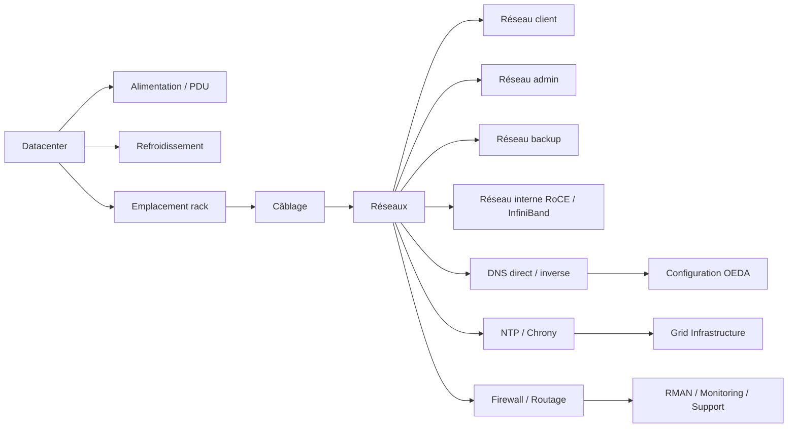

# Module 04 — Site planning et intégration datacenter

## 1. Objectif du module

Ce module explique comment préparer l’intégration d’un rack Oracle Exadata dans un datacenter.

L’objectif est de comprendre que le succès d’un déploiement Exadata ne commence pas avec Oracle Database, mais avec la préparation des prérequis physiques, réseau, sécurité, DNS, NTP, sauvegarde, supervision et exploitation.

À la fin de ce module, le lecteur doit être capable de :

- identifier les prérequis datacenter d’un rack Exadata ;
- distinguer alimentation, câblage, réseau, DNS, NTP, sécurité et flux ;
- comprendre les réseaux client, administration, backup et interne ;
- expliquer pourquoi DNS direct/inverse et synchronisation temps sont critiques ;
- préparer une check-list d’intégration ;
- comprendre les impacts d’une erreur réseau ou datacenter sur RAC, ASM, RMAN, Data Guard et monitoring ;
- lire les premières vérifications read-only sans modifier l’environnement.

---

## 2. Pourquoi le site planning est critique

Une plateforme Exadata peut être correctement configurée côté Oracle, mais mal fonctionner si l’intégration datacenter est mauvaise.

Les erreurs de préparation peuvent provoquer :

```text
échec d’installation
problèmes SCAN / listener
latence réseau
problèmes RAC
échec backup RMAN
supervision incomplète
problèmes de support Oracle
chronologie incident incohérente
difficulté de bascule Data Guard
```

Exadata est un système intégré. Le datacenter doit donc fournir un socle stable :

```text
alimentation
rack / emplacement
refroidissement
câblage
VLAN
IP
DNS
NTP / chrony
routage
firewall
backup
supervision
sécurité
```

À retenir :

```text
Avant d’installer Exadata, il faut valider le terrain datacenter.
Une erreur réseau ou DNS peut devenir plus tard un faux problème Oracle.
```

---

## 3. Vue d’ensemble de l’intégration datacenter

L’intégration Exadata se lit comme une chaîne :

```text
Datacenter
→ rack / alimentation / refroidissement
→ câblage
→ réseaux client / admin / backup / interne
→ DNS / NTP / routage / firewall
→ configuration initiale
→ Oracle Grid Infrastructure / ASM / Database
→ monitoring / backup / support
```

Schéma logique :



---

## 4. Composants physiques à préparer

| Composant | Ce qu’il faut préparer | Risque si mal préparé |
|---|---|---|
| Rack Exadata | Emplacement, poids, accès, contraintes datacenter | Livraison impossible ou exploitation difficile |
| Alimentation | PDU, redondance électrique, circuits séparés | Perte de résilience électrique |
| Refroidissement | Capacité de refroidissement, flux air chaud/froid | Surchauffe, alertes matérielles |
| Câblage | Client, admin, backup, interconnect si nécessaire | Erreurs de connectivité |
| Switchs datacenter | VLAN, ports, trunk/access, MTU, routage | Latence, paquets perdus, réseau indisponible |
| Serveurs DNS | Résolution directe et inverse | Problèmes SCAN, installation, support |
| Serveurs NTP/Chrony | Synchronisation temps | Logs incohérents, problèmes cluster |
| Firewall | Flux applicatifs, admin, backup, monitoring, support | Connexion bloquée ou supervision incomplète |
| Infrastructure backup | Cible RMAN, ZDLRA, média manager, réseau backup | Sauvegarde lente ou impossible |
| Supervision | EM, agents, SNMP, alerting, journaux | Incidents non détectés |

---

## 5. Les réseaux Exadata

Une plateforme Exadata distingue plusieurs réseaux.

| Réseau | Fonction | Exemple de flux |
|---|---|---|
| Client | Connexions applicatives vers Oracle | Applications → SCAN / listeners |
| Administration | Exploitation et gestion | SSH, EM agent, supervision, accès admin |
| Backup | Sauvegarde et restauration | RMAN vers ZDLRA, NFS, appliance ou média manager |
| Interne RoCE / InfiniBand | Communication interne Exadata | RAC, ASM, iDB entre DB servers et Storage Cells |
| Data Guard | Transport redo vers standby | Primary → Standby |
| Support / monitoring | Diagnostic et remontée d’état | AHF, Exachk, TFA, ASR, Enterprise Manager |

Le réseau interne RoCE / InfiniBand est particulier : il est au cœur de la communication entre Database Servers et Storage Cells.

Il transporte :

```text
trafic RAC
trafic ASM
protocole iDB
demandes I/O vers Storage Cells
retour des blocs ou résultats filtrés
```

---

## 6. Plan IP

Le plan IP est un document central.

Il doit préciser :

```text
noms des Database Servers
noms des Storage Cells
adresses client
adresses administration
adresses backup
adresses SCAN
VIP RAC
adresses internes si nécessaires
passerelles
masques
VLAN
routes
DNS direct et inverse
```

Exemple de tableau à préparer :

| Élément | Nom | IP | Réseau | VLAN | Usage |
|---|---|---|---|---|---|
| DB Server 1 | exa-db01 | x.x.x.x | client | VLAN_CLIENT | Connexions applicatives |
| DB Server 1 admin | exa-db01-mgmt | x.x.x.x | admin | VLAN_ADMIN | Administration |
| SCAN 1 | exa-scan01 | x.x.x.x | client | VLAN_CLIENT | Connexion RAC |
| Storage Cell 1 | exa-cell01 | x.x.x.x | admin/interne | selon design | CellCLI / Exadata |
| Backup | exa-db01-bkp | x.x.x.x | backup | VLAN_BACKUP | RMAN |

À retenir :

```text
Une incohérence IP/DNS peut bloquer l’installation ou créer des incidents complexes.
```

---

## 7. DNS direct et inverse

Le DNS est critique pour Exadata, RAC et les outils Oracle.

### 7.1 DNS direct

DNS direct :

```text
nom → adresse IP
```

Exemple :

```text
exa-scan01.domaine.local → 10.10.10.21
```

### 7.2 DNS inverse

DNS inverse :

```text
adresse IP → nom
```

Exemple :

```text
10.10.10.21 → exa-scan01.domaine.local
```

### 7.3 Pourquoi c’est important

Un problème DNS peut provoquer :

```text
échec d’installation Grid Infrastructure
problème SCAN
problème listener
connexion lente ou impossible
erreur de validation OEDA/OECA
diagnostic support incomplet
```

### 7.4 Vérifications read-only

```bash
nslookup exa-scan01.domaine.local
nslookup 10.10.10.21
dig exa-scan01.domaine.local
dig -x 10.10.10.21
getent hosts exa-scan01.domaine.local
```

---

## 8. NTP / Chrony et synchronisation temps

La synchronisation temps est indispensable.

Exadata, RAC, Data Guard, monitoring et support dépendent de timestamps cohérents.

### Risques si le temps est incohérent

```text
logs impossibles à corréler
timeline incident fausse
problèmes de cluster
diagnostic Data Guard difficile
écart entre événements database, OS, cell et monitoring
```

### Vérifications read-only

```bash
timedatectl
chronyc tracking
chronyc sources -v
ntpq -p
date
```

### Règle

```text
Tous les composants doivent utiliser une source temps fiable et cohérente.
```

---

## 9. Firewall et flux à prévoir

Les flux doivent être préparés avant l’installation.

| Flux | Sens | Pourquoi |
|---|---|---|
| Application → SCAN/listeners | Entrant vers Exadata | Connexions SQL |
| DBA/Admin → DB servers | Entrant admin | SSH, exploitation |
| EM → agents | Supervision | Monitoring Oracle |
| DB servers → backup target | Sortant backup | RMAN, ZDLRA, média manager |
| DB primary → standby | Sortant DR | Data Guard redo transport |
| DB servers / cells → support tools | Selon politique | AHF, ASR, collecte support |
| NTP/DNS | Sortant/infrastructure | Temps et résolution |

Une règle firewall manquante peut donner l’impression d’un problème Oracle alors que la cause est réseau.

---

## 10. Backup, ZDLRA et réseau backup

Le réseau backup doit être prévu dès le site planning.

Il peut servir à :

```text
RMAN vers disque
RMAN vers ZDLRA
RMAN vers média manager
restauration
validation de sauvegarde
duplication
```

### ZDLRA

ZDLRA, ou Zero Data Loss Recovery Appliance, est une appliance Oracle de sauvegarde/recovery.

Elle n’est pas une Storage Cell Exadata.

Elle se place comme cible de sauvegarde/recovery :

```text
Exadata Database
→ RMAN / redo
→ ZDLRA
→ restauration / recovery
```

### Points à prévoir

```text
débit réseau backup
fenêtre de sauvegarde
routage vers ZDLRA ou cible backup
firewall
nom DNS cible
authentification
stratégie de restauration
tests restore validate
```

---

## 11. Data Guard et réseau DR

Data Guard doit être pensé dès l’intégration réseau.

Il transporte les redo de la base primaire vers la standby.

```text
Base primaire Exadata
→ redo transport
→ réseau DR
→ base standby
```

Active Data Guard permet en plus d’ouvrir la standby en lecture pendant que la réplication continue.

### Points à prévoir

```text
IP / DNS de la standby
ports listener
latence réseau intersite
débit redo
routage
firewall
mode de protection
RPO / RTO
surveillance du lag
```

### Vérifications read-only côté base

```sql
select database_role, open_mode, protection_mode, switchover_status
from v$database;

select name, value, unit
from v$dataguard_stats;
```

---

## 12. Sécurité et accès

La sécurité doit être cadrée avant l’exploitation.

À prévoir :

```text
comptes d’administration
bastion ou rebond
SSH
rotation des clés
séparation des rôles DBA / système / réseau
accès CellCLI
accès Enterprise Manager
journalisation
durcissement OS selon politique
accès support Oracle selon règles internes
```

Un accès mal défini peut bloquer un incident critique.

---

## 13. Supervision et support

La supervision doit couvrir plusieurs couches :

```text
Database Servers
Storage Cells
ASM
Grid Infrastructure
réseau
flash / disques
backup
Data Guard
OS
firmware
alertes Oracle
```

Outils possibles :

```text
Enterprise Manager Cloud Control
CellCLI
AHF
Exachk
ORAchk
TFA
OSWatcher
ASR
AWR / ASH
journaux OS
```

À retenir :

```text
Superviser uniquement Oracle Database ne suffit pas.
Il faut superviser l’ensemble Exadata.
```

---

## 14. Check-list d’intégration datacenter

| Domaine | Question de contrôle |
|---|---|
| Rack | Emplacement, poids, accès et contraintes validés ? |
| Alimentation | Redondance électrique validée ? |
| Refroidissement | Capacité thermique suffisante ? |
| Réseau client | VLAN, IP, SCAN et listeners validés ? |
| Réseau admin | SSH, supervision, accès exploitation validés ? |
| Réseau backup | Débit et cible backup validés ? |
| DNS | Direct et inverse cohérents ? |
| NTP/Chrony | Source temps commune validée ? |
| Firewall | Flux applicatifs, admin, backup, DR, supervision ouverts ? |
| Data Guard | Réseau DR, latence et débit redo validés ? |
| ZDLRA / backup | Cible, routage et tests restore prévus ? |
| Monitoring | EM, AHF, Exachk, alerting prévus ? |
| Sécurité | Accès, rôles, bastion et journalisation validés ? |
| Documentation | Worksheet, plan IP, flux et contacts disponibles ? |

---

## 15. Commandes read-only utiles

### Réseau

```bash
ip addr
ip route
ping <gateway>
ping <scan_name>
traceroute <target>
ss -tulpen
```

### DNS

```bash
nslookup <hostname>
nslookup <ip>
dig <hostname>
dig -x <ip>
getent hosts <hostname>
```

### Temps

```bash
timedatectl
chronyc tracking
chronyc sources -v
date
```

### Cluster

```bash
crsctl stat res -t
olsnodes -n
srvctl config scan
srvctl status scan
srvctl status listener
```

### Storage Cells

```bash
cellcli -e "list cell detail"
cellcli -e "list alert history"
```

### Backup / Data Guard

```sql
select database_role, open_mode, protection_mode
from v$database;

select name, value, unit
from v$dataguard_stats;
```

---

## 16. Erreurs fréquentes

| Erreur | Conséquence | Correction |
|---|---|---|
| DNS inverse absent | Installation ou diagnostic difficile | Valider direct et inverse |
| NTP non synchronisé | Logs incohérents, suspicion cluster | Vérifier chrony/NTP avant déploiement |
| VLAN backup oublié | Sauvegardes lentes ou impossibles | Prévoir réseau backup dédié |
| Flux Data Guard non ouverts | Redo transport bloqué | Valider ports, routage et firewall |
| Supervision limitée à la base | Incidents cells ou réseau non vus | Superviser DB, cells, ASM, réseau |
| Plan IP incomplet | Confusion installation/exploitation | Maintenir worksheet validée |
| Oublier ZDLRA | Backup/recovery non anticipé | Prévoir cible, débit, tests restore |
| Mélanger admin et client | Risque sécurité/exploitation | Séparer les réseaux selon design |

---

## 17. Exercice pratique

Un rack Exadata doit être intégré dans un datacenter.

La date de mise en production est proche, mais l’équipe découvre que :

```text
les VLAN backup ne sont pas prêts
le DNS inverse n’est pas complet
le firewall Data Guard n’est pas ouvert
la supervision Enterprise Manager n’est pas encore validée
```

Répondez aux questions :

1. Quels risques ces problèmes créent-ils ?
2. Quel impact possible sur RAC, RMAN, Data Guard et monitoring ?
3. Quelles vérifications read-only lancer ?
4. Quels documents doivent être mis à jour ?
5. Quelle recommandation formuler avant mise en production ?

---

## 18. Corrigé indicatif

Les VLAN backup non prêts peuvent bloquer ou ralentir RMAN, ZDLRA, restauration et validation de sauvegarde.

Le DNS inverse incomplet peut perturber l’installation, les vérifications Oracle, SCAN, listeners ou les diagnostics support.

Le firewall Data Guard non ouvert peut bloquer le transport redo vers la standby, donc augmenter le risque RPO/RTO.

La supervision non validée peut empêcher la détection rapide des alertes database, cells, ASM, réseau ou backup.

Vérifications utiles :

```bash
nslookup <hostname>
nslookup <ip>
chronyc tracking
ip route
ping <gateway>
srvctl status scan
crsctl stat res -t
```

Recommandation prudente :

```text
Ne pas valider la mise en production tant que les prérequis réseau, DNS,
backup, Data Guard et supervision ne sont pas contrôlés et documentés.
```

---

## 19. À retenir

```text
À retenir
- Le site planning prépare le terrain avant Oracle Database.
- Exadata dépend fortement de l’intégration datacenter.
- Les réseaux client, admin, backup, interne et DR doivent être séparés et validés.
- DNS direct/inverse et NTP/chrony sont critiques.
- Data Guard et ZDLRA doivent être prévus dès le design réseau.
- Une erreur datacenter peut apparaître plus tard comme un faux problème Oracle.
- La mise en production doit attendre la validation des prérequis.
```

---

## 20. Références officielles

| Référence | Utilisation dans le module |
|---|---|
| [Oracle Exadata Documentation](https://docs.oracle.com/en/engineered-systems/exadata-database-machine/) | Installation, administration, réseau, monitoring et maintenance Exadata. |
| [Oracle Exadata Database Machine Owner's Guide](https://docs.oracle.com/en/engineered-systems/exadata-database-machine/) | Contraintes physiques, rack, alimentation, datacenter. |
| [Oracle Grid Infrastructure Documentation](https://docs.oracle.com/en/database/) | SCAN, cluster, réseau, DNS, ressources RAC. |
| [Oracle Data Guard Documentation](https://docs.oracle.com/en/database/) | Réplication, redo transport, standby, switchover/failover. |
| [Oracle Zero Data Loss Recovery Appliance Documentation](https://docs.oracle.com/en/engineered-systems/zero-data-loss-recovery-appliance/) | ZDLRA, backup, recovery et intégration RMAN. |
