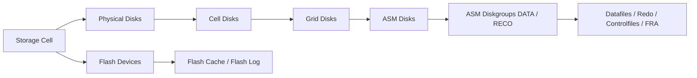

# Module 06 — Exadata Storage Server Configuration

## 1. Objectif du module

Ce module explique la configuration et la lecture opérationnelle des **Exadata Storage Servers**, aussi appelés **Storage Cells**.

L’objectif est de comprendre que les Storage Cells ne sont pas de simples tiroirs de disques. Elles contiennent du matériel, du logiciel Exadata, des objets de stockage, de la flash, des métriques, des alertes et des fonctions d’optimisation.

À la fin de ce module, le lecteur doit être capable de :

- expliquer le rôle d’une Storage Cell ;
- distinguer physical disk, cell disk et grid disk ;
- comprendre comment ASM consomme les grid disks ;
- comprendre le rôle de Flash Cache et Flash Log ;
- lire les alertes et métriques CellCLI ;
- comprendre l’impact d’une alerte disque ;
- relier un symptôme base de données à une cause possible côté cell ;
- utiliser des commandes read-only de diagnostic ;
- éviter de confondre Storage Cell, ASM et baie SAN classique.

---

## 2. Pourquoi les Storage Cells sont importantes

Dans Oracle Exadata, les Storage Cells forment la couche de stockage intelligente.

Elles ne font pas seulement du stockage. Elles participent aussi à :

```text
lecture des données
écriture des données
gestion des disques
gestion de la flash
présentation des grid disks à ASM
Smart Scan
Offload SQL
Storage Index
Flash Cache
Flash Log
IORM
métriques
alertes
diagnostic
```

Dans une architecture classique, le stockage renvoie généralement des blocs au serveur Oracle.

Dans Exadata, la Storage Cell peut renvoyer :

```text
des blocs
ou des résultats filtrés
ou un volume réduit de données
```

selon le type de requête et les conditions d’éligibilité.

À retenir :

```text
Une Storage Cell = serveur de stockage intelligent Exadata.
Elle contient CPU, mémoire, disques, flash, logiciel Exadata et fonctions d’optimisation.
```

---

## 3. Vue d’ensemble d’une Storage Cell

Une Storage Cell contient plusieurs couches :

```text
Storage Cell physique
→ Physical Disks / Flash Devices
→ Cell Disks
→ Grid Disks
→ ASM Disks
→ ASM Diskgroups
→ Fichiers Oracle
```

Schéma logique :



---

## 4. Composants physiques d’une Storage Cell

| Composant | Rôle |
|---|---|
| CPU | Exécute Exadata System Software et certaines fonctions d’offload |
| Mémoire | Utilisée par le système cell et les traitements internes |
| Disques physiques | Fournissent la capacité persistante |
| Flash devices | Fournissent accélération et faible latence |
| Interfaces réseau | Connectent la cell au réseau interne RoCE / InfiniBand et administration |
| Alimentation / matériel | Support physique de la disponibilité |
| Contrôleurs / firmware | Couche matérielle de gestion des périphériques |

À retenir :

```text
La cell a sa propre puissance de calcul.
C’est cette intelligence locale qui permet Smart Scan, IORM et les métriques cell.
```

---

## 5. Composants logiciels d’une Storage Cell

| Logiciel / fonction | Rôle |
|---|---|
| Exadata System Software | Logiciel principal de la Storage Cell |
| CellCLI | Interface d’administration et diagnostic cell |
| MS / Management Server | Gestion et monitoring de la cell |
| RS / Restart Server | Surveillance et redémarrage de services |
| CELLSRV | Service principal de traitement I/O Exadata |
| Smart Scan | Filtrage/projection possible côté cell |
| Offload SQL | Déport partiel du traitement SQL |
| Storage Index | Évite certaines lectures inutiles |
| Flash Cache | Cache flash pour lectures |
| Flash Log | Accélération de certaines écritures redo |
| IORM | Gestion de priorité I/O |
| Alerting | Alertes matérielles et logicielles |
| Metrics | Mesures de performance et état |

---

## 6. Physical Disk

### 6.1 Définition

Un **Physical Disk** est un disque physique réel présent dans une Storage Cell.

Il peut s’agir selon modèle :

```text
disque dur capacité
disque haute performance
device flash / NVMe selon génération
```

### 6.2 Rôle

Le physical disk fournit le support matériel.

Il est à la base de la chaîne de stockage.

```text
Physical Disk
→ Cell Disk
→ Grid Disk
→ ASM Disk
→ Diskgroup ASM
```

### 6.3 À surveiller

```text
état du disque
erreurs matérielles
predictive failure
latence
capacité
remplacement
rebuild / rebalance
```

### 6.4 Commandes utiles

```bash
cellcli -e "list physicaldisk"
cellcli -e "list physicaldisk detail"
```

---

## 7. Cell Disk

### 7.1 Définition

Un **Cell Disk** est un objet logique créé dans la Storage Cell à partir d’un physical disk.

Il représente la manière dont Exadata expose le disque physique à la couche suivante.

### 7.2 Rôle

Le cell disk sert de base pour créer des grid disks.

```text
Physical Disk → Cell Disk → Grid Disk
```

### 7.3 À retenir

```text
Le cell disk appartient à la Storage Cell.
Il n’est pas encore directement un diskgroup ASM.
```

### 7.4 Commandes utiles

```bash
cellcli -e "list celldisk"
cellcli -e "list celldisk detail"
```

---

## 8. Grid Disk

### 8.1 Définition

Un **Grid Disk** est une portion de cell disk présentée à ASM.

ASM voit ensuite ces grid disks comme des ASM disks.

### 8.2 Rôle

Le grid disk est le pont entre la Storage Cell et ASM.

```text
Cell Disk → Grid Disk → ASM Disk → Diskgroup
```

### 8.3 Exemple

Une Storage Cell peut fournir des grid disks pour plusieurs usages :

```text
DATA
RECO
DBFS
autres diskgroups selon design
```

### 8.4 À surveiller

```text
status
asmmodestatus
asmdeactivationoutcome
taille
appartenance à un diskgroup
état attendu par ASM
```

### 8.5 Commandes utiles

```bash
cellcli -e "list griddisk"
cellcli -e "list griddisk detail"
cellcli -e "list griddisk attributes name,status,asmmodestatus,asmdeactivationoutcome,size"
```

---

## 9. Relation avec ASM

ASM consomme les grid disks fournis par les Storage Cells.

Chaîne complète :

```text
Physical Disk
→ Cell Disk
→ Grid Disk
→ ASM Disk
→ ASM Diskgroup DATA / RECO
→ Fichiers Oracle
```

Exemple :

```text
DATA = fichiers de données principaux
RECO = recovery area, archivelogs, flashback logs selon design
```

ASM gère :

```text
redondance
failure groups
répartition des extents
rebalance
capacité utilisable
état des disques ASM
```

Une alerte dans une Storage Cell peut donc avoir un impact visible dans ASM.

---

## 10. Flash Cache

### 10.1 Définition

Flash Cache est une couche flash située dans les Storage Cells.

Elle sert à accélérer certaines lectures.

### 10.2 Rôle

Flash Cache peut améliorer :

```text
lectures fréquentes
blocs chauds
workloads OLTP
charges mixtes
latence de lecture
```

### 10.3 Différence avec Smart Scan

| Sujet | Flash Cache | Smart Scan |
|---|---|---|
| But | Lire plus vite | Renvoyer moins de données |
| Où ? | Storage Cells | Storage Cells |
| Usage typique | Blocs chauds | Grands scans éligibles |
| Gain | Latence / débit | Réduction de volume transféré |

---

## 11. Flash Log

### 11.1 Définition

Flash Log utilise la flash des Storage Cells pour aider certaines écritures redo.

### 11.2 Rôle

Il peut réduire la latence liée aux écritures redo dans certains scénarios.

À surveiller côté base :

```text
log file sync
log file parallel write
temps de commit
activité redo
```

À surveiller côté cell :

```text
état flash
métriques flash
alertes flash
```

---

## 12. Alertes Storage Cell

Les Storage Cells produisent des alertes.

Exemples :

```text
disque en predictive failure
flash device en erreur
problème de température
problème réseau
problème de service cell
problème de capacité
griddisk offline
cell disk dégradé
```

### Commandes utiles

```bash
cellcli -e "list alert history"
cellcli -e "list alerthistory"
cellcli -e "list cell detail"
```

Selon version, la syntaxe peut varier légèrement.

### Méthode

```text
1. Lire l’alerte.
2. Identifier le composant.
3. Relier physical disk / cell disk / grid disk / ASM.
4. Vérifier l’impact côté ASM.
5. Vérifier l’impact côté database.
6. Ne pas conclure uniquement sur l’alerte brute.
```

---

## 13. Métriques Storage Cell

Les métriques cells sont essentielles pour diagnostiquer les I/O.

Exemples de familles de métriques :

```text
I/O disque
I/O flash
latence
débit
utilisation
erreurs
IORM
offload
Smart Scan
réseau interne
```

### Commandes utiles

```bash
cellcli -e "list metriccurrent"
cellcli -e "list metriccurrent where objectType = 'CELL'"
cellcli -e "list metriccurrent attributes name,metricValue,metricObjectName"
```

### À retenir

```text
Une métrique cell doit être interprétée avec le contexte :
heure, workload, base concernée, SQL concerné, état ASM, état réseau.
```

---

## 14. Diagnostic d’une alerte disque

### Situation

Une alerte indique un problème sur un disque physique.

### Chaîne à reconstituer

```text
Physical Disk en alerte
→ Cell Disk associé
→ Grid Disk associé
→ ASM Disk correspondant
→ Diskgroup impacté
→ Fichiers Oracle potentiellement concernés
```

### Commandes possibles

```bash
cellcli -e "list physicaldisk detail"
cellcli -e "list celldisk detail"
cellcli -e "list griddisk attributes name,status,asmmodestatus,asmdeactivationoutcome"
asmcmd lsdg
asmcmd lsdsk -p
```

### Question à se poser

```text
Le diskgroup ASM conserve-t-il sa redondance ?
Un rebalance est-il en cours ?
Une base est-elle impactée ?
La performance I/O est-elle dégradée ?
```

---

## 15. Diagnostic d’une lenteur I/O

Une lenteur I/O vue côté base peut venir :

```text
du SQL
du plan d’exécution
de Smart Scan absent
d’une Storage Cell saturée
d’un disque ou flash en erreur
d’un rebalance ASM
d’un problème réseau interne
d’un workload concurrent
d’une politique IORM
```

Méthode :

```text
1. Identifier SQL_ID ou workload.
2. Lire AWR / ASH / wait events.
3. Vérifier les événements cell.
4. Vérifier ASM.
5. Vérifier CellCLI.
6. Vérifier alertes et métriques cell.
7. Croiser les couches avant conclusion.
```

---

## 16. Commandes read-only utiles

### 16.1 Inventaire cell

```bash
cellcli -e "list cell"
cellcli -e "list cell detail"
```

### 16.2 Physical disks

```bash
cellcli -e "list physicaldisk"
cellcli -e "list physicaldisk detail"
```

### 16.3 Cell disks

```bash
cellcli -e "list celldisk"
cellcli -e "list celldisk detail"
```

### 16.4 Grid disks

```bash
cellcli -e "list griddisk"
cellcli -e "list griddisk detail"
cellcli -e "list griddisk attributes name,status,asmmodestatus,asmdeactivationoutcome,size"
```

### 16.5 Flash

```bash
cellcli -e "list flashcache"
cellcli -e "list flashcache detail"
```

### 16.6 Alertes

```bash
cellcli -e "list alert history"
cellcli -e "list alerthistory"
```

### 16.7 Métriques

```bash
cellcli -e "list metriccurrent"
cellcli -e "list metriccurrent attributes name,metricValue,metricObjectName"
```

### 16.8 ASM côté Database Server

```bash
asmcmd lsdg
asmcmd lsdsk -p
```

```sql
select name, total_mb, free_mb, type, state
from v$asm_diskgroup
order by name;
```

---

## 17. Erreurs fréquentes

| Erreur | Pourquoi c’est dangereux | Correction |
|---|---|---|
| Voir la cell comme une baie SAN | On ignore Smart Scan, flash, IORM et métriques | Lire CellCLI et comprendre la chaîne Exadata |
| Confondre physical disk et grid disk | Mauvais diagnostic d’impact | Reconstituer physical → cell → grid → ASM |
| Conclure sur une alerte seule | L’impact réel peut être différent | Vérifier ASM, DB, métriques et redondance |
| Ignorer ASM | Les grid disks sont consommés par ASM | Lire `asmcmd lsdg` et `asmcmd lsdsk -p` |
| Ignorer le réseau interne | Une lenteur cell peut être liée au fabric | Croiser wait events, CellCLI et réseau |
| Modifier sans runbook | Risque de perte de service | Diagnostic read-only puis procédure validée |
| Confondre Flash Cache et Flash Log | Diagnostic erroné lecture/écriture | Séparer lecture et redo |

---

## 18. Exercice pratique

Une alerte apparaît sur une Storage Cell :

```text
Un physical disk est signalé en predictive failure.
```

Répondez aux questions :

1. Quel est le premier composant concerné ?
2. Quelle chaîne devez-vous reconstituer ?
3. Quels objets CellCLI devez-vous lire ?
4. Que faut-il vérifier côté ASM ?
5. Quels risques existent pour DATA ou RECO ?
6. Quelle conclusion prudente formuler ?
7. Quelle action ne faut-il pas faire sans runbook ?

---

## 19. Corrigé indicatif

Le premier composant concerné est le physical disk.

La chaîne à reconstituer est :

```text
Physical Disk
→ Cell Disk
→ Grid Disk
→ ASM Disk
→ Diskgroup DATA ou RECO
→ Fichiers Oracle
```

Objets CellCLI à lire :

```text
physicaldisk
celldisk
griddisk
alert history
metriccurrent
cell detail
```

Côté ASM, il faut vérifier :

```text
état du diskgroup
capacité libre
redondance
failure groups
rebalance éventuel
disques offline
```

Commandes possibles :

```bash
cellcli -e "list physicaldisk detail"
cellcli -e "list celldisk detail"
cellcli -e "list griddisk attributes name,status,asmmodestatus,asmdeactivationoutcome"
asmcmd lsdg
asmcmd lsdsk -p
```

Conclusion prudente :

```text
L’alerte indique un risque matériel sur une cell.
On ne conclut pas à une perte de données sans vérifier ASM, la redondance,
les grid disks associés et l’état des bases.
Toute action de remplacement ou de désactivation doit suivre la procédure Oracle ou interne.
```

---

## 20. À retenir

```text
À retenir
- Une Storage Cell est un serveur de stockage intelligent.
- Elle contient CPU, mémoire, disques, flash et Exadata System Software.
- La chaîne clé est physical disk → cell disk → grid disk → ASM disk → diskgroup.
- ASM consomme les grid disks fournis par les cells.
- Flash Cache accélère certaines lectures.
- Flash Log aide certaines écritures redo.
- CellCLI est l’outil principal de lecture côté cell.
- Une alerte cell doit toujours être reliée à ASM et à l’impact database.
- Ne jamais modifier une cell sans procédure validée.
```

---

## 21. Références officielles

| Référence | Utilisation dans le module |
|---|---|
| [Oracle Exadata Documentation](https://docs.oracle.com/en/engineered-systems/exadata-database-machine/) | Storage Cells, CellCLI, administration et monitoring. |
| [Oracle Exadata System Software Documentation](https://docs.oracle.com/en/engineered-systems/exadata-database-machine/sagug/) | Cell disks, grid disks, flash, metrics, alerts. |
| [Oracle ASM Documentation](https://docs.oracle.com/en/database/) | Diskgroups, ASM disks, redondance, rebalance. |
| [Oracle Database Documentation](https://docs.oracle.com/en/database/) | Vues dynamiques, performance, wait events, AWR/ASH. |
