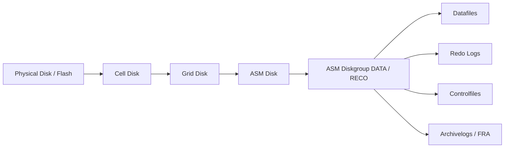

# Module 07 — ASM et modèle de stockage Exadata

## 1. Objectif du module

Ce module explique comment **ASM** consomme le stockage fourni par les **Storage Cells Exadata**.

L’objectif est de comprendre la chaîne complète entre le disque physique dans une cell et les fichiers Oracle utilisés par la base.

À la fin de ce module, le lecteur doit être capable de :

- expliquer le rôle d’ASM dans Exadata ;
- distinguer physical disk, cell disk, grid disk, ASM disk et diskgroup ;
- comprendre les diskgroups DATA et RECO ;
- comprendre la notion de failure group ;
- comprendre la redondance ASM ;
- comprendre le rebalance ASM ;
- relier une alerte Storage Cell à un impact ASM ;
- lire les commandes ASM et CellCLI utiles ;
- éviter de raisonner seulement en capacité brute.

---

## 2. Pourquoi ASM est central dans Exadata

Dans Exadata, les Storage Cells fournissent les ressources de stockage, mais c’est **ASM** qui organise ces ressources pour Oracle Database.

La chaîne est :

```text
Physical Disk / Flash
→ Cell Disk
→ Grid Disk
→ ASM Disk
→ ASM Diskgroup
→ Fichiers Oracle
```

ASM est donc le lien entre :

```text
la couche physique Exadata
et
la couche Oracle Database
```

Sans ASM, Oracle Database ne consomme pas directement les physical disks des Storage Cells.

À retenir :

```text
Les Storage Cells fournissent des grid disks.
ASM les transforme en diskgroups Oracle utilisables par les bases.
```

---

## 3. Vue d’ensemble du modèle de stockage

Schéma logique :



Lecture simple :

```text
1. Le disque physique existe dans la Storage Cell.
2. Exadata crée un Cell Disk.
3. Le Cell Disk est découpé en Grid Disks.
4. ASM voit les Grid Disks comme des ASM Disks.
5. ASM regroupe ces disques dans des Diskgroups.
6. Oracle Database stocke ses fichiers dans ces Diskgroups.
```

---

## 4. Physical Disk

### 4.1 Définition

Un **Physical Disk** est le support matériel réel dans une Storage Cell.

Il peut être :

```text
disque dur
flash device
NVMe selon génération
```

### 4.2 Rôle

Il fournit la capacité physique ou la performance flash.

### 4.3 Risques

Un problème de physical disk peut provoquer :

```text
alerte cell
dégradation de performance
reconstruction
rebalance ASM
risque de perte de redondance si plusieurs pannes
```

---

## 5. Cell Disk

### 5.1 Définition

Un **Cell Disk** est un objet logique créé à partir d’un physical disk dans une Storage Cell.

### 5.2 Rôle

Il permet à Exadata de gérer le disque physique avant de le présenter sous forme de grid disks.

Chaîne :

```text
Physical Disk → Cell Disk
```

### 5.3 À retenir

```text
Le Cell Disk appartient encore au monde Storage Cell.
Il n’est pas directement consommé par Oracle Database.
```

---

## 6. Grid Disk

### 6.1 Définition

Un **Grid Disk** est une portion de Cell Disk présentée à ASM.

### 6.2 Rôle

Le Grid Disk est le point de passage vers ASM.

Chaîne :

```text
Cell Disk → Grid Disk → ASM Disk
```

### 6.3 Exemples

On peut avoir des grid disks associés à :

```text
DATA
RECO
DBFS
autres diskgroups selon design
```

### 6.4 Attributs importants

| Attribut | Sens |
|---|---|
| name | Nom du grid disk |
| size | Taille |
| status | État côté cell |
| asmmodestatus | État vu pour ASM |
| asmdeactivationoutcome | Résultat attendu si désactivation |
| cell | Cell propriétaire |

---

## 7. ASM Disk

### 7.1 Définition

Un **ASM Disk** est le disque vu par ASM.

Dans Exadata, il correspond généralement à un grid disk présenté depuis une Storage Cell.

### 7.2 Rôle

ASM utilise les ASM disks pour créer des diskgroups.

```text
Grid Disk → ASM Disk → Diskgroup
```

### 7.3 À surveiller

```text
état du disque ASM
appartenance au diskgroup
mode mount
offline / online
rebalance
failure group
```

---

## 8. ASM Diskgroup

### 8.1 Définition

Un **ASM Diskgroup** est un groupe logique de disques ASM.

Oracle Database y stocke ses fichiers.

### 8.2 Exemples fréquents

| Diskgroup | Usage typique |
|---|---|
| DATA | Datafiles, tempfiles, controlfiles selon design |
| RECO | FRA, archivelogs, flashback logs, backups locaux selon design |
| DBFS | DBFS ou usages spécifiques selon architecture |

### 8.3 Rôle

Le diskgroup fournit :

```text
capacité utilisable
redondance
répartition des extents
équilibrage
support des fichiers Oracle
```

---

## 9. DATA

Le diskgroup **DATA** contient généralement les fichiers principaux de la base.

Exemples :

```text
datafiles
tempfiles
certains controlfiles selon design
```

DATA est critique pour le fonctionnement de la base.

À vérifier :

```text
capacité totale
capacité libre
redondance
état mounted
failure groups
rebalance éventuel
```

---

## 10. RECO

Le diskgroup **RECO** contient souvent la zone de récupération Oracle.

Exemples :

```text
archivelogs
flashback logs
controlfile backups
FRA
backups locaux selon design
```

RECO est critique pour :

```text
recovery
flashback
Data Guard
archivelogs
fenêtre de restauration
```

Un RECO plein peut provoquer des incidents importants :

```text
archivelogs bloqués
base suspendue ou ralentie
Data Guard impacté
sauvegarde impossible
```

---

## 11. Failure Groups

### 11.1 Définition

Un **failure group** représente un domaine de panne pour ASM.

Dans Exadata, les failure groups sont généralement liés aux Storage Cells.

Objectif :

```text
éviter que deux copies ASM soient placées sur le même domaine de panne
```

### 11.2 Exemple

Si ASM utilise une redondance normale, il doit placer deux copies sur des failure groups différents.

```text
Copie 1 → Cell 1
Copie 2 → Cell 2
```

### 11.3 Pourquoi c’est important

La redondance ASM n’est pas seulement une question de capacité.

Elle dépend de la bonne distribution sur les failure groups.

À retenir :

```text
Une capacité libre élevée ne garantit pas une redondance saine.
Il faut vérifier les failure groups.
```

---

## 12. Redondance ASM

ASM peut utiliser différents niveaux de redondance selon design.

| Type | Sens |
|---|---|
| External | Pas de mirroring ASM |
| Normal | Deux copies ASM |
| High | Trois copies ASM |

Dans Exadata, le choix dépend de :

```text
design Oracle
nombre de Storage Cells
criticité
capacité utile
politique de disponibilité
```

Erreur fréquente :

```text
regarder seulement la capacité brute sans intégrer la redondance.
```

---

## 13. Rebalance ASM

### 13.1 Définition

Le **rebalance ASM** redistribue les extents entre disques ASM.

Il peut se produire après :

```text
ajout de disque
retrait de disque
retour d’un disque
remplacement matériel
changement de capacité
déséquilibre
```

### 13.2 Effet

Le rebalance consomme des ressources I/O.

Il peut influencer :

```text
performance
durée de maintenance
latence I/O
charge Storage Cells
fenêtre de remplacement
```

### 13.3 À surveiller

```sql
select group_number, operation, state, power, actual, sofar, est_work, est_rate, est_minutes
from v$asm_operation;
```

---

## 14. Capacité brute vs capacité utilisable

Il faut distinguer :

```text
capacité brute
capacité après redondance
capacité libre
capacité réellement utilisable
capacité nécessaire pour rebalance
capacité nécessaire pour croissance
capacité nécessaire pour recovery
```

Exemple :

```text
Un diskgroup peut afficher de l’espace libre,
mais ne pas avoir assez de marge pour absorber une panne,
un rebalance ou une croissance rapide.
```

À retenir :

```text
La vraie question n’est pas seulement :
Combien de Go libres ?

La vraie question est :
Combien de capacité utilisable reste-t-il avec la redondance et le risque de panne ?
```

---

## 15. Lien entre ASM et Data Guard

ASM stocke les fichiers utilisés par la base primaire ou standby.

Data Guard dépend donc indirectement d’ASM.

Points à vérifier :

```text
DATA disponible
RECO disponible
archivelogs générés
FRA suffisante
standby redo logs selon design
capacité pour flashback si utilisé
```

Un RECO saturé peut impacter Data Guard.

---

## 16. Lien entre ASM et ZDLRA / RMAN

RMAN lit les fichiers Oracle stockés dans ASM.

Selon l’architecture, RMAN écrit vers :

```text
RECO
disque externe
média manager
ZDLRA
```

ZDLRA n’est pas un diskgroup ASM.

C’est une cible de sauvegarde/recovery externe.

Flux :

```text
Fichiers Oracle dans ASM
→ RMAN
→ réseau backup
→ ZDLRA ou cible backup
```

---

## 17. Commandes read-only utiles

### 17.1 ASM — vue globale

```bash
asmcmd lsdg
asmcmd lsdsk -p
```

```sql
select name, total_mb, free_mb, usable_file_mb, type, state
from v$asm_diskgroup
order by name;
```

### 17.2 ASM — disques

```sql
select group_number, disk_number, name, path, mount_status, header_status, mode_status, state
from v$asm_disk
order by group_number, disk_number;
```

### 17.3 ASM — failure groups

```sql
select group_number, failgroup, count(*) as nb_disks
from v$asm_disk
group by group_number, failgroup
order by group_number, failgroup;
```

### 17.4 ASM — rebalance

```sql
select group_number, operation, state, power, actual, sofar, est_work, est_rate, est_minutes
from v$asm_operation;
```

### 17.5 CellCLI — grid disks

```bash
cellcli -e "list griddisk"
cellcli -e "list griddisk attributes name,status,asmmodestatus,asmdeactivationoutcome,size"
```

### 17.6 CellCLI — disques physiques et cell disks

```bash
cellcli -e "list physicaldisk"
cellcli -e "list celldisk"
cellcli -e "list physicaldisk detail"
cellcli -e "list celldisk detail"
```

### 17.7 CellCLI — alertes

```bash
cellcli -e "list alert history"
cellcli -e "list cell detail"
```

---

## 18. Méthode de diagnostic ASM / Exadata

### Situation

Une alerte Storage Cell apparaît ou une base signale une lenteur I/O.

### Méthode

```text
1. Identifier la cell concernée.
2. Identifier le physical disk concerné si alerte disque.
3. Trouver le cell disk.
4. Trouver le grid disk.
5. Vérifier l’ASM disk correspondant.
6. Vérifier le diskgroup DATA ou RECO.
7. Vérifier redondance et failure groups.
8. Vérifier rebalance.
9. Vérifier impact base ou backup.
10. Conclure seulement après croisement des couches.
```

---

## 19. Erreurs fréquentes

| Erreur | Pourquoi c’est dangereux | Correction |
|---|---|---|
| Confondre grid disk et diskgroup | Mauvaise lecture de l’impact | Reconstituer la chaîne complète |
| Regarder seulement free_mb | Capacité utilisable peut être différente | Lire usable_file_mb et redondance |
| Ignorer failure groups | Redondance mal interprétée | Vérifier distribution par cell |
| Oublier RECO | Archivelogs et recovery peuvent bloquer | Surveiller DATA et RECO |
| Ignorer rebalance | Performance temporairement impactée | Lire v$asm_operation |
| Croire qu’une alerte cell = panne base | L’impact dépend d’ASM et redondance | Vérifier cell, grid disk, ASM et base |
| Modifier sans procédure | Risque de perte de disponibilité | Utiliser un runbook validé |

---

## 20. Exercice pratique

Une alerte apparaît sur un grid disk associé au diskgroup DATA.

L’équipe veut savoir si la base reste protégée et si un rebalance est en cours.

Répondez aux questions :

1. Quelle chaîne faut-il reconstituer ?
2. Quelles commandes CellCLI utiliser ?
3. Quelles vues ASM lire ?
4. Quelle différence entre `free_mb` et `usable_file_mb` ?
5. Pourquoi les failure groups sont importants ?
6. Quel impact possible sur la performance ?
7. Quelle conclusion prudente formuler ?

---

## 21. Corrigé indicatif

La chaîne à reconstituer est :

```text
Physical Disk
→ Cell Disk
→ Grid Disk
→ ASM Disk
→ Diskgroup DATA
→ Fichiers Oracle
```

Commandes CellCLI :

```bash
cellcli -e "list griddisk attributes name,status,asmmodestatus,asmdeactivationoutcome,size"
cellcli -e "list physicaldisk detail"
cellcli -e "list celldisk detail"
cellcli -e "list alert history"
```

Vues ASM :

```sql
select name, total_mb, free_mb, usable_file_mb, type, state
from v$asm_diskgroup;

select group_number, failgroup, count(*)
from v$asm_disk
group by group_number, failgroup;

select group_number, operation, state, power, est_minutes
from v$asm_operation;
```

`free_mb` indique l’espace libre brut dans le diskgroup.

`usable_file_mb` donne une vision plus utile de l’espace disponible en tenant compte de la redondance ASM.

Les failure groups sont importants car ASM doit placer les copies sur des domaines de panne différents.

Conclusion prudente :

```text
On ne conclut pas uniquement sur l’alerte grid disk.
Il faut vérifier la redondance ASM, les failure groups, la capacité utilisable,
le rebalance éventuel et l’impact visible sur la base.
```

---

## 22. À retenir

```text
À retenir
- ASM est la couche qui transforme les grid disks en stockage Oracle.
- La chaîne clé est physical disk → cell disk → grid disk → ASM disk → diskgroup.
- DATA contient principalement les fichiers de données.
- RECO contient souvent la recovery area, archivelogs et flashback logs.
- Les failure groups protègent contre les domaines de panne.
- Le rebalance ASM peut consommer des I/O.
- La capacité utile dépend de la redondance, pas seulement du brut.
- Une alerte Storage Cell doit toujours être reliée à ASM.
```

---

## 23. Références officielles

| Référence | Utilisation dans le module |
|---|---|
| [Oracle ASM Documentation](https://docs.oracle.com/en/database/) | Diskgroups, ASM disks, redondance, failure groups, rebalance. |
| [Oracle Exadata Documentation](https://docs.oracle.com/en/engineered-systems/exadata-database-machine/) | Storage Cells, grid disks, Exadata System Software. |
| [Oracle Exadata System Software Documentation](https://docs.oracle.com/en/engineered-systems/exadata-database-machine/sagug/) | CellCLI, physical disks, cell disks, grid disks, metrics et alerts. |
| [Oracle Database Documentation](https://docs.oracle.com/en/database/) | Vues dynamiques ASM, RMAN, Data Guard, performance. |
