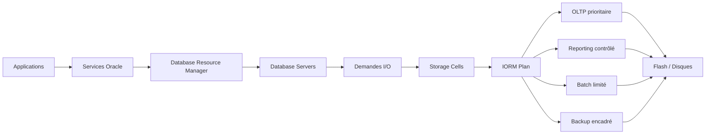

# Module 08 — IORM

## 1. Objectif du module

Ce module explique **IORM**, c’est-à-dire **I/O Resource Management**, dans Oracle Exadata.

L’objectif est de comprendre comment Exadata peut prioriser les ressources d’entrée/sortie entre plusieurs bases, PDB, services ou workloads qui partagent les mêmes Storage Cells.

À la fin de ce module, le lecteur doit être capable de :

- expliquer le rôle d’IORM ;
- comprendre pourquoi IORM est important dans une plateforme consolidée ;
- distinguer IORM et Database Resource Manager ;
- comprendre où IORM agit dans l’architecture Exadata ;
- identifier les workloads critiques et secondaires ;
- concevoir une matrice workload / priorité / justification ;
- diagnostiquer un cas de noisy neighbor ;
- lire les métriques utiles avant toute modification ;
- éviter de configurer une priorité sans preuve métier et technique.

---

## 2. Pourquoi IORM est important

Exadata est souvent utilisée comme plateforme consolidée.

Une même infrastructure peut héberger :

```text
plusieurs bases de données
plusieurs PDB
plusieurs applications
plusieurs environnements
plusieurs workloads
plusieurs niveaux de criticité
```

Cette consolidation est utile, mais elle crée un risque :

```text
un workload très consommateur peut dégrader les autres workloads.
```

Exemples :

```text
un reporting volumineux ralentit l’OLTP
un batch nocturne déborde sur la journée
une sauvegarde RMAN consomme trop d’I/O
une PDB de test perturbe une PDB de production
une requête analytique scanne trop de données
```

IORM permet aux Storage Cells d’arbitrer les ressources I/O lorsque plusieurs workloads sont concurrents.

À retenir :

```text
IORM ne sert pas à accélérer une requête isolée.
IORM sert à protéger les workloads prioritaires quand les I/O sont partagées.
```

---

## 3. Définition simple d’IORM

IORM est un mécanisme Exadata de gestion des ressources I/O.

Il agit dans les **Storage Cells**.

Son rôle est de répartir les ressources disque et flash entre plusieurs workloads selon une politique définie.

```text
Database Servers
→ demandes I/O concurrentes
→ Storage Cells
→ application du plan IORM
→ priorisation selon criticité
```

IORM répond à une question simple :

```text
Quand tout le monde demande des I/O en même temps,
qui doit passer en premier ?
```

---

## 4. IORM n’est pas un mécanisme magique

IORM ne corrige pas :

```text
un mauvais SQL
un mauvais plan d’exécution
des statistiques obsolètes
un modèle de données mal conçu
une requête qui lit trop
un manque de capacité globale
une panne matérielle
une mauvaise configuration réseau
```

IORM contrôle la concurrence I/O.

Il ne remplace pas :

```text
l’optimisation SQL
le dimensionnement
la gouvernance applicative
la supervision
le tuning database
les bonnes pratiques RMAN
```

---

## 5. Architecture IORM

IORM agit dans les Storage Cells, au plus près des disques et de la flash.

Schéma logique :



Lecture :

```text
1. L’application se connecte à un service.
2. Oracle Database peut classifier la session.
3. Le Database Server émet des demandes I/O.
4. Les Storage Cells reçoivent les demandes concurrentes.
5. IORM applique une politique de priorité.
6. Les ressources flash/disque sont partagées selon cette politique.
```

---

## 6. IORM vs Database Resource Manager

IORM et Database Resource Manager sont complémentaires.

| Sujet | Database Resource Manager | IORM |
|---|---|---|
| Où agit-il ? | Dans Oracle Database | Dans les Storage Cells |
| Ressource principale | Sessions, CPU, parallélisme, consumer groups | I/O disque et flash |
| Niveau | Base / PDB / sessions | Stockage Exadata |
| But | Classifier et contrôler les sessions | Prioriser les I/O |
| Exemple | Mettre le reporting dans un consumer group | Donner moins d’I/O au reporting en concurrence |
| Composant | Database Server | Storage Cell |

À retenir :

```text
Database Resource Manager classe les sessions côté base.
IORM arbitre les I/O côté Storage Cell.
Les deux peuvent fonctionner ensemble.
```

---

## 7. Notion de workload

Un workload est une charge applicative identifiable.

Exemples :

| Workload | Caractéristiques | Sensibilité |
|---|---|---|
| OLTP critique | Transactions courtes, commits fréquents | Latence |
| Reporting | Scans, agrégations, lectures volumineuses | Débit |
| Batch | Traitements planifiés, volumes importants | Fenêtre d’exécution |
| Backup RMAN | Lecture massive, écriture vers cible | Débit et fenêtre backup |
| Test / Dev | Non critique | Priorité basse |
| Maintenance | Rebuild, purge, chargements | Planification |

IORM devient utile lorsque ces workloads partagent les mêmes Storage Cells.

---

## 8. Noisy Neighbor

### 8.1 Définition

Un **noisy neighbor** est un workload qui consomme beaucoup de ressources partagées et dégrade les autres.

Exemple :

```text
Une requête reporting scanne plusieurs téraoctets.
Elle consomme beaucoup d’I/O.
L’application OLTP critique voit sa latence augmenter.
```

### 8.2 Symptômes possibles

```text
hausse de latence I/O
attentes cell plus élevées
dégradation OLTP
batch plus long
sauvegarde qui dépasse sa fenêtre
plaintes applicatives simultanées
```

### 8.3 Diagnostic

On ne conclut pas directement à un noisy neighbor.

Il faut vérifier :

```text
qui consomme
quand
sur quelles bases ou PDB
avec quels SQL_ID
avec quels événements d’attente
sur quelles Storage Cells
avec quelle politique IORM active
```

---

## 9. IORM Plan

Un IORM Plan décrit comment les ressources I/O doivent être réparties.

Il peut refléter :

```text
criticité métier
SLA
fenêtre batch
priorité OLTP
priorité reporting
environnements prod / non-prod
bases critiques / non critiques
PDB critiques / non critiques
backup contrôlé
```

Exemple de logique :

| Workload | Priorité | Justification |
|---|---|---|
| Paiement OLTP | Haute | Transaction temps réel, impact métier direct |
| Core banking | Haute | Criticité production |
| Reporting journée | Moyenne | Important mais moins sensible que l’OLTP |
| Batch nuit | Moyenne / basse selon horaire | Peut utiliser capacité libre hors pic |
| Backup RMAN | Contrôlée | Nécessaire mais ne doit pas saturer l’OLTP |
| Test / Dev | Basse | Non critique |

---

## 10. Category Plan et Database Plan

### 10.1 Category Plan

Un Category Plan classe les workloads par catégories.

Exemples :

```text
OLTP
REPORTING
BATCH
BACKUP
TEST
```

Avantage :

```text
La politique est alignée sur la nature de la charge.
```

### 10.2 Database Plan

Un Database Plan répartit les ressources entre bases.

Exemples :

```text
PROD_PAYMENT prioritaire
PROD_DWH contrôlé
RECETTE basse priorité
DEV basse priorité
```

Avantage :

```text
La politique est alignée sur les bases ou environnements.
```

### 10.3 Choix

Le choix dépend de l’architecture.

```text
Si les bases ont une criticité claire : Database Plan.
Si les workloads sont mieux décrits par usage : Category Plan.
Si plusieurs PDB partagent une base : gouvernance PDB / services / consumer groups à prévoir.
```

---

## 11. Matrice workload / priorité / justification

Avant toute configuration IORM, il faut produire une matrice.

Exemple :

| Workload | Base / PDB / Service | Période | Criticité | Priorité I/O | Justification | Preuve attendue |
|---|---|---|---|---|---|---|
| OLTP paiement | PAYPROD / svc_pay | 24/7 | Très haute | Haute | Transactions clients | Latence I/O, ASH, SLA |
| Reporting | DWH / svc_rep | Journée | Moyenne | Moyenne | Décisionnel | SQL_ID, scans, débit |
| Batch chargement | DWH / svc_batch | Nuit | Moyenne | Moyenne nuit / basse jour | Fenêtre batch | Durée batch, I/O |
| Backup RMAN | Toutes bases | Nuit | Haute mais contrôlée | Encadrée | Recovery | Débit backup, fenêtre |
| Test | PDB_TEST | Journée | Basse | Basse | Non critique | Consommation I/O |

À retenir :

```text
Une politique IORM doit être justifiée.
On ne met pas une priorité haute simplement parce qu’une équipe la demande.
```

---

## 12. Métriques et preuves à collecter

Avant de proposer une politique IORM, il faut collecter des preuves.

### 12.1 Côté base

```sql
select event, total_waits, time_waited
from v$system_event
where event like 'cell%'
order by time_waited desc;
```

```sql
select inst_id, sql_id, event, count(*)
from gv$active_session_history
where event like 'cell%'
group by inst_id, sql_id, event
order by count(*) desc;
```

### 12.2 Côté SQL

```sql
select *
from table(dbms_xplan.display_cursor(null, null, 'ALLSTATS LAST +PREDICATE'));
```

À lire :

```text
SQL_ID
plan d’exécution
TABLE ACCESS STORAGE FULL
bytes lus
bytes retournés
attentes cell
```

### 12.3 Côté Storage Cells

```bash
cellcli -e "list metriccurrent"
cellcli -e "list metriccurrent where objectType = 'CELL'"
cellcli -e "list cell detail"
```

### 12.4 Côté IORM

Selon version et configuration :

```bash
cellcli -e "list iormplan"
cellcli -e "list iormplan detail"
```

À vérifier :

```text
plan actif ou non
catégories
bases concernées
priorités
limites
objectifs
```

---

## 13. Méthode de diagnostic noisy neighbor

### Étape 1 — Identifier la période

```text
Quand la dégradation apparaît-elle ?
Pendant batch ?
Pendant reporting ?
Pendant backup ?
Pendant pic OLTP ?
```

### Étape 2 — Identifier les consommateurs

```text
SQL_ID
service
module
base
PDB
consumer group
workload RMAN
```

### Étape 3 — Lire les attentes

```text
cell smart table scan
cell single block physical read
cell multiblock physical read
log file sync
log file parallel write
```

### Étape 4 — Lire les cells

```text
métriques I/O
latence
débit
utilisation flash/disque
alertes
```

### Étape 5 — Vérifier le plan IORM

```text
IORM actif ?
plan adapté ?
workload correctement classé ?
priorités cohérentes ?
```

### Étape 6 — Conclure prudemment

```text
Ce qui est prouvé
Ce qui reste incertain
Ce qui doit être testé
Ce qui demande validation CAB/runbook
```

---

## 14. Exemple concret

### Situation

Une application de paiement ralentit entre 9h et 10h.

Dans la même période, un reporting lit de gros volumes sur la même plateforme Exadata.

### Mauvaise conclusion

```text
Le reporting ralentit le paiement, il faut le couper.
```

### Bonne démarche

```text
1. Identifier les SQL_ID du reporting.
2. Vérifier les attentes cell côté paiement.
3. Vérifier les métriques cells.
4. Vérifier si IORM est actif.
5. Vérifier les services et consumer groups.
6. Vérifier la fenêtre réelle du reporting.
7. Proposer une priorité I/O si la concurrence est prouvée.
```

### Conclusion prudente

```text
Les métriques montrent une concurrence I/O entre le reporting et l’OLTP
sur la même période. Une politique IORM peut être proposée pour protéger
l’OLTP pendant les heures ouvrées, sans interdire le reporting.
```

---

## 15. Ce qu’IORM apporte

| Problème | Apport IORM |
|---|---|
| Reporting consomme trop en journée | Reporting ralenti si OLTP concurrent |
| Backup dépasse sur heures ouvrées | Backup contrôlé pendant pic métier |
| Test/dev perturbe prod | Priorité basse aux environnements non critiques |
| Plusieurs bases partagent les cells | Répartition par criticité |
| Consolidation PDB | Priorisation selon services ou catégories |
| Noisy neighbor | Encadrement des workloads consommateurs |

---

## 16. Limites d’IORM

IORM ne suffit pas si :

```text
la plateforme est sous-dimensionnée
le SQL est très mal écrit
la requête lit inutilement trop de données
la politique métier est absente
les services ne permettent pas d’identifier les workloads
les sessions ne sont pas classées correctement
les sauvegardes sont mal planifiées
les métriques ne prouvent pas une concurrence I/O
```

À retenir :

```text
IORM est un outil de gouvernance I/O.
Il ne remplace pas l’analyse de performance.
```

---

## 17. Bonnes pratiques

| Bonne pratique | Application |
|---|---|
| Partir du métier | Classer les workloads selon criticité réelle |
| Mesurer avant de changer | AWR, ASH, CellCLI, métriques I/O |
| Identifier les services | Services RAC clairs par application |
| Séparer OLTP / reporting / batch | Matrice workload propre |
| Protéger sans bloquer | IORM limite ou priorise, il ne doit pas casser l’exploitation |
| Documenter la politique | Justification, période, owner, preuve |
| Tester progressivement | Éviter un changement brutal |
| Revoir régulièrement | La charge évolue |

---

## 18. Commandes read-only utiles

### 18.1 Lire les événements cell

```sql
select event, total_waits, time_waited
from v$system_event
where event like 'cell%'
order by time_waited desc;
```

### 18.2 Identifier les SQL consommateurs

```sql
select inst_id, sql_id, event, count(*) as samples
from gv$active_session_history
where event like 'cell%'
group by inst_id, sql_id, event
order by samples desc;
```

### 18.3 Lire les services

```sql
select inst_id, name, network_name
from gv$services
order by inst_id, name;
```

### 18.4 Lire les métriques cells

```bash
cellcli -e "list metriccurrent"
cellcli -e "list metriccurrent where objectType = 'CELL'"
```

### 18.5 Lire le plan IORM

```bash
cellcli -e "list iormplan"
cellcli -e "list iormplan detail"
```

### 18.6 Lire les alertes cells

```bash
cellcli -e "list alert history"
```

---

## 19. Erreurs fréquentes

| Erreur | Pourquoi c’est dangereux | Correction |
|---|---|---|
| Mettre tout en priorité haute | Plus aucune priorité réelle | Classer selon criticité |
| Configurer sans métriques | Décision non prouvée | Collecter AWR/ASH/CellCLI |
| Confondre DBRM et IORM | Mauvais niveau d’action | DBRM côté base, IORM côté cell |
| Couper les workloads secondaires | Risque métier ou backup | Contrôler plutôt que bloquer |
| Ignorer les services RAC | Workloads mal identifiés | Définir services par application |
| Penser qu’IORM optimise le SQL | IORM ne réécrit pas la requête | Optimiser SQL séparément |
| Oublier la période | Priorité différente jour/nuit | Documenter fenêtres |

---

## 20. Exercice pratique

Une plateforme Exadata héberge :

```text
PAYPROD : application paiement OLTP critique
DWHREP : reporting décisionnel
BATCHFIN : batch financier de nuit
RMAN : sauvegarde quotidienne
PDB_TEST : environnement de test
```

Entre 9h et 11h, PAYPROD ralentit.  
Dans la même période, DWHREP exécute plusieurs scans volumineux.

Répondez :

1. Pourquoi IORM peut être utile ?
2. Quelles preuves faut-il collecter avant de proposer un plan ?
3. Comment distinguer IORM et Database Resource Manager ?
4. Quelle matrice workload / priorité proposer ?
5. Quelle conclusion prudente formuler ?

---

## 21. Corrigé indicatif

IORM peut être utile parce que plusieurs workloads partagent les mêmes Storage Cells et que l’OLTP critique doit être protégé pendant les heures ouvrées.

Preuves à collecter :

```text
AWR sur la période
ASH par SQL_ID et service
wait events cell
métriques Storage Cells
plan IORM actif ou absent
services RAC utilisés
fenêtre reporting
latence observée par PAYPROD
```

Différence :

```text
Database Resource Manager classe et contrôle les sessions côté base.
IORM arbitre les ressources I/O côté Storage Cells.
```

Matrice proposée :

| Workload | Priorité | Justification |
|---|---|---|
| PAYPROD OLTP | Haute | Application paiement critique |
| DWHREP reporting | Moyenne ou basse en journée | Reporting consommateur mais moins critique que paiement |
| BATCHFIN | Moyenne nuit, basse jour | Doit respecter sa fenêtre |
| RMAN | Contrôlée | Nécessaire mais ne doit pas saturer l’OLTP |
| PDB_TEST | Basse | Non critique |

Conclusion prudente :

```text
Si les métriques confirment une concurrence I/O entre DWHREP et PAYPROD,
un plan IORM peut être proposé pour protéger PAYPROD en journée.
La proposition doit être testée, documentée et validée par les équipes métier,
DBA et exploitation.
```

---

## 22. À retenir

```text
À retenir
- IORM signifie I/O Resource Management.
- IORM agit dans les Storage Cells.
- Il sert à prioriser les I/O en cas de concurrence.
- Il est essentiel en consolidation Exadata.
- Database Resource Manager agit côté base ; IORM agit côté stockage.
- Un noisy neighbor doit être prouvé par les métriques.
- Une politique IORM doit venir d’une matrice workload / priorité / justification.
- IORM protège les workloads critiques, mais ne corrige pas un mauvais SQL.
```

---

## 23. Références officielles

| Référence | Utilisation dans le module |
|---|---|
| [Oracle Exadata Documentation](https://docs.oracle.com/en/engineered-systems/exadata-database-machine/) | IORM, Storage Cells, Exadata System Software. |
| [Oracle Exadata System Software Documentation](https://docs.oracle.com/en/engineered-systems/exadata-database-machine/sagug/) | CellCLI, IORM plans, métriques cells. |
| [Oracle Database Resource Manager Documentation](https://docs.oracle.com/en/database/) | Consumer groups, plans Resource Manager, classification des sessions. |
| [Oracle Database Performance Tuning Guide](https://docs.oracle.com/en/database/) | AWR, ASH, wait events, SQL performance. |
