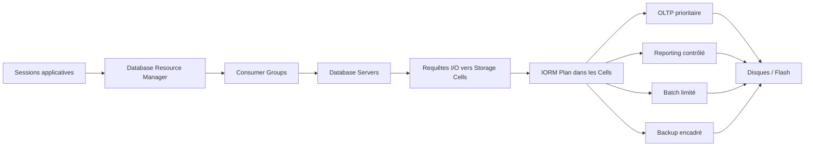

# Module 08 — IORM

## 1. Objectif pédagogique

À la fin de ce module, le lecteur doit être capable d’expliquer précisément le rôle d’**I/O Resource Management**, appelé **IORM**, dans une plateforme Oracle Exadata consolidée. Il doit comprendre pourquoi IORM existe, où il agit, comment il se distingue de **Database Resource Manager** et comment les deux mécanismes peuvent être combinés pour protéger les applications critiques sans interdire l’exécution des traitements secondaires.

Le lecteur doit également savoir concevoir une politique de priorisation I/O adaptée à une plateforme partagée. Cette compétence ne consiste pas à choisir arbitrairement une application prioritaire, mais à relier chaque workload à une criticité métier, à une fenêtre d’exécution, à une consommation I/O observable et à un risque opérationnel. Un bon plan IORM n’est donc pas seulement une configuration technique ; c’est une traduction contrôlée d’une politique de service.

Enfin, le lecteur doit savoir diagnostiquer un cas de **noisy neighbor** sur Exadata. Il doit pouvoir distinguer une saturation globale des storage cells, une mauvaise classification Resource Manager, un plan IORM absent, un SQL non sélectif, une sauvegarde trop intrusive ou une charge batch exécutée au mauvais moment. Le livrable attendu à la fin du module est une **matrice workload / priorité / justification**, accompagnée de preuves de lecture, de métriques et d’une recommandation argumentée.

| Compétence attendue | Résultat observable |
|---|---|
| Comprendre IORM | Le lecteur sait expliquer que l’arbitrage I/O est appliqué par les storage cells lorsqu’elles servent des requêtes concurrentes. |
| Expliquer pourquoi IORM existe | Le lecteur sait relier IORM à la consolidation, aux workloads concurrents et à la protection des services critiques. |
| Distinguer IORM et Database Resource Manager | Le lecteur sait séparer classification côté base et arbitrage côté stockage. |
| Concevoir une politique I/O | Le lecteur sait produire une matrice de priorité justifiée par criticité, fenêtre et profil d’accès. |
| Diagnostiquer un noisy neighbor | Le lecteur sait collecter des preuves read-only avant de proposer un changement. |
| Produire une matrice workload / priorité / justification | Le lecteur sait formaliser une décision exploitable par une équipe DBA, infrastructure et métier. |

## 2. Pourquoi IORM est important dans Exadata

Exadata est très souvent utilisée comme plateforme consolidée. Une même infrastructure peut héberger plusieurs bases de données, plusieurs PDB, plusieurs services applicatifs ou plusieurs environnements de criticité différente. Cette consolidation est recherchée parce qu’Exadata fournit une puissance de traitement, de stockage et d’interconnexion élevée, mais elle introduit un risque classique des plateformes partagées : un workload très consommateur peut dégrader la latence ou le débit observé par les autres workloads.

Sans mécanisme d’arbitrage, une opération de reporting, un batch de chargement, une sauvegarde RMAN ou un traitement analytique volumineux peut monopoliser une part importante des ressources I/O. Le problème n’est pas seulement le volume lu ou écrit ; il est aussi lié au moment où la charge apparaît. Un reporting acceptable la nuit peut devenir problématique à 10 h si une application OLTP critique doit conserver une latence stable pour traiter des transactions utilisateur.

IORM répond à ce problème en permettant aux **storage cells** d’appliquer une politique de gouvernance sur les requêtes I/O concurrentes. Les cells ne se contentent pas de recevoir passivement des demandes ; elles peuvent arbitrer l’accès aux ressources disque et flash selon un plan défini. L’objectif n’est pas d’arrêter les workloads secondaires, mais de leur donner une place contrôlée lorsque les workloads prioritaires ont besoin de ressources.

Cette nuance est essentielle. Une plateforme de production ne peut pas simplement suspendre toutes les sauvegardes, tous les batchs ou tous les reportings dès qu’une application critique travaille. Elle doit au contraire maintenir plusieurs activités en parallèle tout en respectant une hiérarchie de service. IORM permet cette hiérarchie : l’OLTP critique peut conserver une priorité de latence, le reporting peut être ralenti mais non bloqué, le batch peut utiliser la capacité disponible hors pics, et la sauvegarde peut être encadrée afin de ne pas provoquer une contention incontrôlée.

| Situation de consolidation | Risque sans IORM | Apport d’IORM |
|---|---|---|
| Base OLTP et entrepôt décisionnel sur les mêmes cells | Les scans analytiques consomment les ressources I/O pendant les heures ouvrées. | Les I/O OLTP peuvent être prioritaires lorsque les deux charges sont concurrentes. |
| Plusieurs PDB de criticité différente | Une PDB de test ou de reporting perturbe une PDB de production. | Une politique peut refléter la criticité réelle des services. |
| Sauvegarde RMAN pendant activité métier | La sauvegarde augmente la latence perçue par les applications. | La sauvegarde peut être contrôlée pour préserver la charge critique. |
| Batch massif débordant de sa fenêtre | La charge batch continue à consommer après le début de la journée. | Le batch peut être limité lorsque l’OLTP redevient prioritaire. |

## 3. Concepts clés

| Concept | Définition | Exemple concret | À ne pas confondre avec |
|---|---|---|---|
| **IORM** | Mécanisme Exadata de gestion des ressources I/O appliqué par les storage cells pour arbitrer des demandes concurrentes selon une politique. | Une base OLTP reçoit un traitement prioritaire lorsque des scans reporting sollicitent les mêmes cells. | Database Resource Manager, qui agit côté base sur les sessions et ressources database. |
| **IORM Plan** | Plan de gouvernance chargé sur les storage cells, décrivant comment les ressources I/O doivent être partagées entre bases, catégories ou workloads. | Un plan donne une priorité plus élevée à la catégorie `OLTP` qu’à la catégorie `REPORTING` pendant les heures ouvrées. | Un plan d’exécution SQL ou un plan de sauvegarde RMAN. |
| **Database Resource Manager** | Fonction Oracle Database permettant de classifier et contrôler les sessions côté base à travers des plans, consumer groups et directives. | Les sessions du service `APP_OLTP` sont placées dans un consumer group prioritaire, tandis que `APP_REPORTING` est classé séparément. | IORM, qui arbitre l’accès I/O dans les storage cells. |
| **Consumer Group** | Groupe logique utilisé par Database Resource Manager pour classifier des sessions selon leur rôle, service, utilisateur ou module applicatif. | Les connexions du batch de chargement appartiennent au consumer group `BATCH_LOAD`. | Un service RAC, même si le service peut servir à classer des sessions. |
| **Category Plan** | Approche de planification IORM fondée sur des catégories de workload plutôt que sur une base unique. | Les catégories `OLTP`, `REPORTING`, `BATCH` et `BACKUP` reçoivent des parts différentes. | Un plan interdatabase limité à une hiérarchie entre bases. |
| **Database Plan** | Politique de répartition I/O à l’échelle d’une base ou d’un ensemble de bases identifiées. | La base de facturation reçoit plus de ressources I/O que la base de reporting interne. | Un consumer group interne à une base. |
| **Interdatabase Plan** | Plan qui arbitre les ressources I/O entre plusieurs bases de données partageant les mêmes storage cells. | `PROD_FINANCE` est prioritaire sur `DWH_REPORTING` en journée. | Un plan intrabase qui ne concerne que des groupes de sessions dans une même base. |
| **Noisy Neighbor** | Workload qui consomme de manière disproportionnée une ressource partagée et dégrade les autres workloads. | Un scan complet non sélectif lancé par le reporting augmente la latence de l’OLTP. | Une panne matérielle ou une saturation CPU locale non liée à la concurrence I/O. |
| **OLTP** | Workload transactionnel orienté latence, avec de nombreuses opérations courtes et sensibles au temps de réponse. | Saisie de commandes, paiement, réservation ou validation de transactions. | Workload analytique orienté débit et scans volumineux. |
| **Reporting** | Workload de consultation ou d’analyse produisant souvent des lectures importantes et des agrégations. | Tableau de bord commercial lisant plusieurs mois d’historique. | Batch de transformation ou sauvegarde. |
| **Batch** | Traitement planifié, souvent volumineux, exécutant des chargements, calculs ou transformations. | Chargement nocturne de tables de faits dans un entrepôt. | Requête interactive utilisateur. |
| **Backup** | Opération de protection ou restauration des données, typiquement via RMAN, pouvant consommer du débit I/O important. | Sauvegarde incrémentale lancée pendant une fenêtre de maintenance. | Réplication Data Guard ou export logique. |
| **Flash Cache** | Couche flash des storage cells utilisée pour accélérer les lectures ou écritures selon les mécanismes Exadata. | Les blocs chauds d’une application OLTP bénéficient d’un accès flash à faible latence. | Buffer cache de l’instance Oracle Database. |
| **Storage Cell** | Serveur de stockage Exadata exécutant Exadata System Software, CellCLI, services iDB, offload SQL, flash cache et mécanismes IORM. | Une cell reçoit des requêtes iDB provenant de plusieurs database servers RAC. | Database server, où s’exécutent les instances Oracle. |
| **I/O Latency** | Temps nécessaire pour servir une opération I/O, particulièrement critique pour les transactions courtes. | Une hausse de latence sur lectures physiques peut ralentir une application de paiement. | Débit total, qui mesure un volume par unité de temps. |
| **I/O Throughput** | Volume d’I/O servi par unité de temps, important pour scans, batchs, sauvegardes et traitements analytiques. | Un reporting consomme plusieurs Go/s pendant une consolidation mensuelle. | Latence unitaire d’une opération courte. |

## 4. Architecture IORM

IORM agit dans les **storage cells**, au plus près des ressources flash et disque. Les database servers exécutent les instances Oracle, les services RAC, les sessions applicatives et Database Resource Manager. Lorsqu’une session génère une lecture ou une écriture physique, la demande traverse la couche database, ASM et le protocole interne vers les cells. Si plusieurs workloads demandent simultanément des ressources I/O, les cells peuvent appliquer le plan IORM pour décider comment servir les requêtes selon les priorités définies.

Le rôle des database servers reste déterminant. Ils hébergent les instances et exécutent les plans SQL, mais ils participent aussi à la classification des sessions via les services, les utilisateurs, les modules applicatifs ou Database Resource Manager. DBRM peut placer une session dans un **consumer group** ; cette information peut ensuite être cohérente avec une politique IORM côté stockage. La classification doit donc être pensée dès la connexion applicative, pas seulement au moment où la dégradation de performance apparaît.

Les storage cells appliquent la partie I/O de la politique. Elles reçoivent des requêtes issues de plusieurs database servers, potentiellement de plusieurs bases ou PDB, et elles observent la concurrence réelle sur les ressources. Le plan IORM devient pertinent lorsque la demande dépasse ou approche la capacité disponible. S’il n’y a pas de concurrence, un workload secondaire peut utiliser la capacité libre ; s’il y a concurrence, la priorité protège le workload critique.

ASM intervient dans le modèle parce que les fichiers Oracle sont répartis dans des diskgroups qui s’appuient sur les cellules. IORM ne remplace pas ASM et ne change pas la redondance des diskgroups. Il arbitre l’accès aux ressources I/O lorsque plusieurs flux concurrents sollicitent ces ressources. C’est pourquoi un diagnostic doit relier la base, les services, ASM, les cells et les métriques de workload au lieu de regarder une seule couche.



| Couche | Responsabilité | Preuve de lecture typique |
|---|---|---|
| Application | Utilise un service ou un module permettant d’identifier le workload. | Nom du service, module, action ou utilisateur de connexion. |
| Database Resource Manager | Classe les sessions et applique des règles côté base. | Vues Resource Manager, consumer groups actifs, plan DBRM activé. |
| Database servers | Exécutent les instances et émettent les demandes I/O vers les cells. | ASH, AWR, événements `cell%`, statistiques physiques. |
| ASM | Fournit les diskgroups et l’accès aux fichiers Oracle. | Répartition des diskgroups, redondance, métriques ASM pertinentes. |
| Storage cells | Appliquent IORM et servent les I/O via flash et disques. | `cellcli`, plan IORM, métriques cellule, latence et débit par catégorie. |

## 5. Fonctionnement détaillé

Le fonctionnement d’IORM doit être compris comme une chaîne de décision. Une session applicative arrive dans la base par un service, un utilisateur ou un module. Database Resource Manager peut classifier cette session dans un consumer group. La session exécute ensuite du SQL, qui peut générer des lectures physiques, des écritures, des smart scans ou des accès plus classiques. Lorsque les demandes atteignent les storage cells, celles-ci disposent d’un contexte suffisant pour appliquer une politique IORM si un plan est configuré et si la concurrence justifie un arbitrage.

La première décision consiste à définir ce que l’on veut protéger. Sur Exadata, l’objectif n’est pas toujours de maximiser le débit total. Dans un environnement OLTP, une faible latence peut être plus importante qu’un débit global élevé. Dans un environnement analytique, le débit peut être prioritaire pendant certaines fenêtres. Dans un environnement mixte, la bonne politique varie selon l’heure, la criticité et les engagements de service. IORM donne un cadre pour exprimer cette hiérarchie.

La deuxième décision consiste à choisir le niveau de gouvernance. Un plan interdatabase est pertinent lorsque plusieurs bases indépendantes partagent les mêmes cells. Un plan par catégorie devient utile lorsque l’on veut distinguer OLTP, reporting, batch et backup. Un alignement avec Database Resource Manager devient indispensable lorsque la priorité dépend de sessions ou services à l’intérieur d’une base. Une erreur fréquente consiste à configurer une priorité côté stockage sans s’assurer que les sessions sont correctement identifiées côté base.

La troisième décision concerne la preuve opérationnelle. Avant de modifier un plan, il faut démontrer qu’il existe bien une concurrence I/O et que cette concurrence affecte le workload critique. Les événements d’attente `cell%`, les statistiques AWR/ASH, les métriques de débit, les métriques de latence et les informations CellCLI doivent être lus ensemble. Si le problème vient d’un plan SQL catastrophique, d’une absence de partition pruning, d’un problème CPU ou d’un problème réseau, IORM peut masquer le symptôme sans corriger la cause.

Le mécanisme devient particulièrement puissant lorsque le plan respecte trois principes. D’abord, il doit être **explicite** : chaque priorité est justifiée par une criticité ou une fenêtre métier. Ensuite, il doit être **mesurable** : on doit pouvoir vérifier son effet par des métriques avant/après. Enfin, il doit être **réversible** : toute modification doit être documentée, validée et associée à une procédure de retour arrière.

| Étape | Question technique | Risque si l’étape est ignorée |
|---|---|---|
| Identifier les workloads | Qui consomme les I/O et à quel moment ? | Le plan protège le mauvais service ou limite un traitement légitime. |
| Classifier les sessions | Les sessions sont-elles rattachées aux bons services ou consumer groups ? | IORM reçoit une classification incohérente ou trop grossière. |
| Lire le plan actif | Quel plan est réellement appliqué dans les cells ? | L’équipe raisonne sur une configuration théorique non chargée. |
| Mesurer la concurrence | La dégradation correspond-elle à une contention I/O observable ? | IORM est accusé alors que la cause est SQL, CPU, réseau ou application. |
| Proposer la politique | Quelle priorité reflète le SLA et la criticité ? | Le plan devient politique, non technique, et crée des effets de bord. |

## 6. Exemple concret

Considérons une plateforme Exadata hébergeant trois usages principaux. La base `CRM_PROD` sert une application OLTP de relation client. La base `DWH_PROD` exécute des reportings volumineux pour les équipes métiers. Une sauvegarde RMAN quotidienne démarre en fin de nuit, mais elle déborde parfois sur le début de la journée. À 09 h 15, les utilisateurs CRM constatent une hausse du temps de réponse lors de la consultation et de la mise à jour des dossiers clients.

Une analyse superficielle pourrait conclure que la plateforme est simplement saturée. Une analyse IORM correcte cherche plutôt à répondre à une question précise : **un workload secondaire consomme-t-il des ressources I/O partagées au moment où l’OLTP a besoin d’une latence stable ?** Cette question impose de corréler l’heure de la dégradation, les services actifs, les sessions consommatrices, les événements d’attente côté base, le plan IORM chargé dans les cells et les métriques de latence ou débit côté stockage.

Dans ce scénario, la matrice de décision pourrait être la suivante. Elle ne constitue pas une configuration universelle ; elle illustre la manière de transformer un besoin métier en politique I/O justifiée.

| Workload | Fenêtre normale | Priorité proposée | Justification | Preuve attendue |
|---|---|---:|---|---|
| `CRM_PROD` OLTP | 08 h – 19 h | Très haute | Transactions utilisateur sensibles à la latence. | Attentes `cell single block physical read`, ASH par service, métriques de latence. |
| `DWH_PROD` Reporting | 07 h – 22 h | Moyenne | Reporting utile mais tolérant à un ralentissement. | Débit de scans, SQL_ID consommateurs, période d’exécution. |
| Batch chargement | Nuit | Basse en journée, moyenne la nuit | Ne doit pas perturber les heures ouvrées. | Sessions batch, volumes lus/écrits, fenêtre réelle. |
| Sauvegarde RMAN | Fin de nuit | Encadrée | Protection des données nécessaire mais contrôlable. | Canaux RMAN actifs, débit backup, impact sur latence OLTP. |

La recommandation ne doit pas être de « mettre l’OLTP au maximum » sans preuve. Elle doit dire : les mesures montrent que les attentes I/O OLTP augmentent lorsque reporting et sauvegarde consomment simultanément les cells ; le plan IORM doit donc garantir une priorité OLTP en journée, limiter reporting et backup lorsque la demande OLTP est forte, puis relâcher la contrainte pendant les fenêtres creuses.

## 7. Commandes, vues et métriques utiles

Les commandes suivantes sont données pour construire un diagnostic de lecture. Elles doivent être exécutées avec les privilèges appropriés, adaptées à la version Oracle, aux conventions du site et aux règles de sécurité locales. Dans un atelier, elles servent à apprendre le raisonnement ; en production, elles doivent être intégrées à un runbook validé.

```bash
cellcli -e "list iormplan detail"
cellcli -e "list metriccurrent where name like 'IORM%' detail"
cellcli -e "list metriccurrent where name like 'CD_IO%' detail"
```

```sql
select name, is_top_plan
from v$rsrc_plan
order by name;

select plan, group_or_subplan, mgmt_p1, mgmt_p2, mgmt_p3, status
from dba_rsrc_plan_directives
order by plan, group_or_subplan;

select sid, serial#, username, service_name, module, action, resource_consumer_group
from v$session
where type = 'USER'
order by service_name, username;

select event, total_waits, time_waited_micro
from v$system_event
where event like 'cell%'
order by time_waited_micro desc;
```

| Élément à lire | Interprétation |
|---|---|
| Plan IORM actif | Confirme si les storage cells appliquent une politique ou si l’environnement fonctionne sans arbitrage explicite. |
| Directives DBRM | Indiquent comment les sessions sont classées côté base et si cette classification peut alimenter une logique IORM cohérente. |
| `resource_consumer_group` dans `v$session` | Montre si les sessions OLTP, reporting, batch et backup sont effectivement séparées. |
| Événements `cell%` | Révèlent la part du temps d’attente associée aux accès Exadata côté instance. |
| Métriques IORM des cells | Montrent l’activité ou l’effet d’un plan IORM côté stockage. |
| Latence I/O par workload | Permet de vérifier si le workload prioritaire conserve une latence acceptable. |
| Débit I/O par workload | Permet de distinguer un workload ralenti volontairement d’un workload bloqué par problème. |

Les métriques doivent toujours être datées. Une capture isolée sans période de référence ne suffit pas. Il faut comparer la période dégradée à une période saine, puis relier la variation au workload actif. Le diagnostic IORM devient robuste lorsque les preuves base et cells racontent la même histoire.

## 8. Interprétation des résultats

L’interprétation commence par la distinction entre **contention**, **priorisation** et **mauvaise conception du workload**. Une contention signifie que plusieurs flux demandent simultanément plus de ressources I/O que ce qui peut être servi sans impact. Une priorisation signifie que le plan attribue volontairement plus de ressources à certains workloads. Une mauvaise conception du workload signifie qu’un SQL, un batch ou une sauvegarde consomme trop parce qu’il est mal borné, mal planifié ou mal optimisé.

Si les sessions OLTP attendent davantage sur des événements `cell%` pendant qu’un reporting ou un batch produit un débit très élevé, l’hypothèse IORM devient plausible. Si le plan IORM est absent ou trop permissif, la recommandation peut viser une politique de priorité. Si le plan existe mais que les sessions sont toutes dans le même consumer group, la correction doit d’abord porter sur Database Resource Manager ou sur la classification par service. Si les métriques IORM montrent que le workload secondaire est déjà limité, il faut chercher ailleurs : SQL non sélectif, contention CPU, verrouillage applicatif, saturation réseau ou problème cell.

| Observation | Interprétation possible | Action de diagnostic suivante |
|---|---|---|
| Plan IORM absent sur plateforme consolidée | Les workloads concurrents ne sont pas explicitement arbitrés côté cells. | Cartographier workloads et criticité avant de proposer un plan. |
| Plan IORM présent mais sessions non classées | La politique de stockage manque d’information métier ou technique. | Vérifier services, consumer groups et DBRM. |
| OLTP en attente `cell%` pendant reporting massif | Noisy neighbor I/O possible. | Corréler ASH, SQL_ID, débit cell et période métier. |
| Reporting ralenti mais OLTP stable | IORM peut fonctionner comme attendu. | Vérifier que le ralentissement respecte le SLA reporting. |
| Sauvegarde active pendant pic OLTP | Fenêtre ou intensité backup à revoir. | Lire canaux RMAN, débit, horaires et impact sur latence. |
| Toutes les charges dégradées sans workload dominant | Saturation globale ou problème infrastructure possible. | Vérifier cells, réseau, CPU database servers et alertes. |

Une interprétation correcte ne se limite jamais à « IORM est bon » ou « IORM est mauvais ». Elle précise ce qui est prouvé, ce qui reste incertain et ce qui doit être testé. Elle sépare les constats de lecture des décisions de changement. Elle explique aussi le risque métier : par exemple, augmenter la priorité OLTP peut protéger les transactions, mais rallonger les traitements de reporting ou la sauvegarde. Cette conséquence doit être acceptée par les responsables du service.

## 9. Erreurs fréquentes

| Erreur | Cause probable | Correction pédagogique |
|---|---|---|
| Confondre IORM et Database Resource Manager | Les deux mécanismes participent à la gouvernance, mais pas au même niveau. | Expliquer que DBRM classe et contrôle côté base, tandis qu’IORM arbitre côté storage cells. |
| Créer un plan IORM sans classification fiable | Les services, modules ou consumer groups ne distinguent pas les workloads réels. | Commencer par cartographier les connexions applicatives et les consumer groups. |
| Donner une priorité maximale à tout ce qui est production | Absence d’arbitrage métier réel. | Hiérarchiser selon latence, criticité, fenêtre et impact. |
| Limiter un batch sans vérifier le SQL | Le batch est peut-être inefficace ou non sélectif. | Lire SQL_ID, plan d’exécution, volumes lus et éligibilité offload avant de conclure. |
| Accuser IORM alors que le plan n’est pas actif | La configuration supposée n’est pas chargée ou pas appliquée. | Lire `list iormplan detail` sur les cells concernées. |
| Ignorer les sauvegardes | RMAN peut consommer fortement les ressources pendant des fenêtres sensibles. | Inclure backup dans la matrice workload / priorité. |
| Lire une seule métrique | Une latence ou un débit isolé ne prouve pas la cause. | Croiser ASH/AWR, CellCLI, horaires, services et SQL consommateurs. |
| Modifier en production sans retour arrière | La pression problème pousse à changer trop vite. | Documenter la modification, l’objectif, la mesure de succès et la procédure de rollback. |

La plus grave de ces erreurs est de transformer IORM en outil de compensation permanente. Si un reporting lit trop parce qu’il ignore des prédicats, si un batch déborde parce qu’il est mal planifié ou si une sauvegarde est lancée au mauvais moment, IORM peut réduire l’impact mais ne doit pas devenir l’unique réponse. Une politique saine protège le service critique tout en déclenchant l’amélioration du workload perturbateur.

## 10. Bonnes pratiques

| Bonne pratique | Application concrète |
|---|---|
| Définir les workloads avant le plan | Nommer OLTP, reporting, batch, backup, maintenance et préciser leurs fenêtres. |
| Aligner services, DBRM et IORM | Utiliser les services et consumer groups pour que la politique technique reflète les usages réels. |
| Protéger la latence critique | Prioriser les applications transactionnelles sensibles pendant leurs heures de service. |
| Encadrer les charges volumineuses | Donner une place au reporting, batch et backup sans les laisser perturber l’OLTP. |
| Mesurer avant et après | Comparer latence, débit, attentes `cell%` et durée des traitements. |
| Documenter la justification | Chaque priorité doit avoir une raison métier et technique. |
| Prévoir le retour arrière | Toute modification de plan doit pouvoir être annulée proprement. |
| Réviser périodiquement le plan | Les usages changent ; un plan valide aujourd’hui peut devenir inadapté après migration ou consolidation. |

Une bonne pratique spécifique à Exadata consiste à ne pas séparer artificiellement performance et exploitation. Le plan IORM doit être connu des équipes DBA, infrastructure, support et métiers. Lorsqu’un problème survient, chacun doit comprendre que le ralentissement d’un reporting peut être un comportement attendu si l’OLTP est protégé. Inversement, si tous les workloads souffrent, le plan IORM ne doit pas masquer une saturation globale ou un défaut matériel.

Il est également recommandé de conserver une matrice de décision dans le référentiel d’exploitation. Cette matrice doit préciser le propriétaire applicatif, la criticité, la fenêtre de service, les métriques de succès et la priorité I/O. Elle sert de base aux discussions CAB, aux revues de capacité et aux analyses post-problème.

## 11. Exercice pratique

Vous administrez une plateforme Exadata consolidée hébergeant les workloads suivants : `PAY_OLTP`, `CRM_OLTP`, `DWH_REPORTING`, `LOAD_BATCH` et `RMAN_BACKUP`. Depuis trois jours, les utilisateurs de `PAY_OLTP` signalent une hausse du temps de réponse entre 08 h 30 et 10 h 00. Les premiers éléments indiquent que `DWH_REPORTING` lance des requêtes analytiques longues dès 08 h 00 et que `RMAN_BACKUP` termine parfois après 09 h 00.

Votre travail consiste à produire une analyse structurée de diagnostic IORM. Vous ne devez pas proposer immédiatement une modification. Vous devez d’abord établir ce qui peut être prouvé en lecture seule, puis construire une matrice workload / priorité / justification.

Le livrable attendu doit contenir cinq parties. La première partie décrit les workloads et leur criticité. La deuxième indique les commandes ou vues read-only à exécuter côté base et côté cells. La troisième précise les métriques à comparer pendant la période dégradée et pendant une période saine. La quatrième propose une matrice de priorisation I/O. La cinquième formule une recommandation prudente, incluant ce qui invaliderait l’hypothèse IORM.

| Workload | Informations fournies | Question à résoudre |
|---|---|---|
| `PAY_OLTP` | Paiement en ligne, sensible à la latence, pic le matin. | Doit-il recevoir la priorité la plus haute entre 08 h et 19 h ? |
| `CRM_OLTP` | Application interne importante mais moins critique que le paiement. | Quelle priorité relative face à `PAY_OLTP` ? |
| `DWH_REPORTING` | Requêtes longues démarrant à 08 h. | Doit-il être ralenti pendant le pic OLTP ? |
| `LOAD_BATCH` | Chargement nocturne pouvant déborder. | Quelle limite appliquer s’il dépasse sa fenêtre ? |
| `RMAN_BACKUP` | Sauvegarde nécessaire mais parfois active après 09 h. | Comment préserver la protection des données sans dégrader l’OLTP ? |

Votre réponse doit inclure au minimum trois commandes ou vues, deux métriques côté base, deux métriques côté cells, une matrice de priorité et une justification par workload.

## 12. Corrigé de l’exercice

Une bonne réponse commence par refuser la conclusion immédiate. Le fait que `DWH_REPORTING` et `RMAN_BACKUP` soient actifs pendant la dégradation ne prouve pas encore qu’ils causent la dégradation. Il faut d’abord vérifier que `PAY_OLTP` attend réellement sur des événements liés aux cells, que la période correspond aux charges concurrentes, que le plan IORM est absent ou insuffisant, et que les sessions sont correctement classées.

Côté base, le diagnostic peut commencer par les sessions, services et consumer groups. Une requête sur `v$session` permet de vérifier si `PAY_OLTP`, `DWH_REPORTING` et `RMAN_BACKUP` sont visibles comme services ou modules distincts. Les vues Resource Manager permettent de vérifier si un plan DBRM est actif et si les consumer groups reflètent les workloads. Les événements `cell%` et ASH/AWR permettent ensuite de déterminer si la dégradation de `PAY_OLTP` est bien corrélée à des attentes I/O Exadata.

Côté cells, `cellcli -e "list iormplan detail"` permet de savoir si un plan IORM est réellement chargé. Les métriques IORM et les métriques de débit ou latence permettent d’observer si une catégorie ou une base consomme fortement les ressources. Si les cells montrent une forte activité reporting et backup pendant que `PAY_OLTP` accumule des attentes I/O, l’hypothèse noisy neighbor devient crédible.

La matrice de priorisation pourrait être la suivante, sous réserve de validation par les métriques.

| Workload | Priorité proposée | Justification | Condition de validité |
|---|---:|---|---|
| `PAY_OLTP` | Très haute | Paiement en ligne, forte sensibilité à la latence, impact direct utilisateur et chiffre d’affaires. | Les attentes `cell%` augmentent pendant la concurrence I/O. |
| `CRM_OLTP` | Haute | Application importante mais moins critique que le paiement. | Le SLA CRM accepte une priorité inférieure à paiement. |
| `DWH_REPORTING` | Moyenne en journée, haute hors pic | Reporting utile mais tolérant à un ralentissement temporaire. | Les métiers acceptent une fenêtre ou un ralentissement. |
| `LOAD_BATCH` | Basse en journée, moyenne la nuit | Le batch doit rester dans sa fenêtre et ne pas perturber les transactions. | Le traitement peut être replanifié ou limité sans rupture métier. |
| `RMAN_BACKUP` | Encadrée | La sauvegarde protège les données, mais son débit doit respecter les heures critiques. | Le RPO/RTO reste respecté malgré l’encadrement. |

La recommandation prudente est donc la suivante : si les preuves confirment une concurrence I/O, mettre en place ou ajuster un plan IORM aligné avec DBRM afin de protéger `PAY_OLTP` et `CRM_OLTP` pendant les heures ouvrées, tout en limitant `DWH_REPORTING`, `LOAD_BATCH` et `RMAN_BACKUP` lorsque la demande OLTP est forte. La recommandation doit être accompagnée d’une mesure avant/après : latence OLTP, temps d’attente `cell%`, durée des reportings, durée de sauvegarde et débit côté cells.

L’hypothèse IORM serait invalidée si `PAY_OLTP` ne présente pas d’attentes I/O significatives, si les lenteurs viennent de verrous applicatifs, si le CPU database server est saturé, si le réseau interne présente des erreurs, si les SQL de paiement ont changé de plan ou si le reporting est déjà fortement limité par un plan actif. Dans ces cas, modifier IORM ne serait pas la bonne première réponse.

## 13. Synthèse à retenir

IORM est un mécanisme de gouvernance I/O propre à l’architecture Exadata. Il prend tout son sens lorsque plusieurs bases, PDB, services ou traitements partagent les mêmes storage cells. Son objectif n’est pas de rendre tous les workloads plus rapides, mais de faire respecter une hiérarchie de service lorsque la demande I/O devient concurrente.

Le point central du module est la distinction entre **Database Resource Manager** et **IORM**. DBRM aide à classifier et gouverner les sessions côté base ; IORM arbitre l’accès aux ressources I/O côté storage cells. Une politique efficace nécessite l’alignement des deux. Si les sessions ne sont pas correctement classées, le plan IORM risque d’être trop grossier. Si le plan IORM est absent, une classification DBRM seule ne protège pas nécessairement l’accès au stockage partagé.

La démarche professionnelle repose sur la preuve. Avant de modifier une priorité, l’administrateur doit vérifier le plan actif, la classification des sessions, les événements `cell%`, les métriques IORM, la latence, le débit et la période métier. La bonne recommandation indique ce qui est prouvé, ce qui reste incertain et quelle conséquence le changement aura sur les workloads secondaires.

| À retenir | Formulation opérationnelle |
|---|---|
| IORM agit côté storage cells | Il arbitre les demandes I/O concurrentes vers flash et disques. |
| DBRM agit côté base | Il classe et gouverne les sessions, notamment via consumer groups. |
| La consolidation crée le besoin | Plusieurs workloads partagent les mêmes ressources physiques. |
| Le noisy neighbor doit être prouvé | Corréler horaires, sessions, événements `cell%`, métriques cells et impact métier. |
| La matrice de priorité est obligatoire | Chaque workload doit avoir une priorité et une justification. |
| Le changement doit être mesuré | Comparer avant/après et prévoir un retour arrière. |

Sources recommandées pour approfondissement : la documentation Oracle Exadata sur l’administration des storage servers et d’IORM, la documentation Oracle Database Resource Manager, la documentation AWR/ASH et les guides Oracle Maximum Availability Architecture pour replacer la gouvernance I/O dans une stratégie d’exploitation complète.
