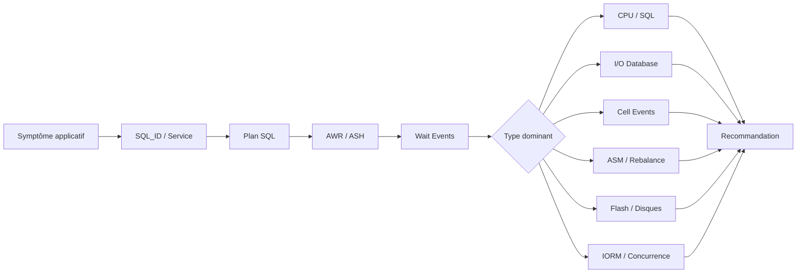

# Module 09 — Performance Recommendations Exadata

## 1. Objectif du module

Ce module explique comment analyser la performance Oracle sur Exadata.

L’objectif est de comprendre qu’une performance Exadata ne se lit pas uniquement côté base de données, ni uniquement côté Storage Cells. Il faut relier le SQL, le plan d’exécution, les statistiques AWR/ASH, les wait events, ASM, les métriques cells, le réseau interne, la flash et les workloads concurrents.

À la fin de ce module, le lecteur doit être capable de :

- partir d’un symptôme applicatif ;
- identifier les SQL_ID consommateurs ;
- lire AWR et ASH avec prudence ;
- comprendre les principaux wait events `cell%` ;
- distinguer problème SQL, problème I/O, problème ASM, problème cell ou problème réseau ;
- vérifier l’usage de Smart Scan et de l’offload ;
- interpréter Flash Cache, IORM et métriques CellCLI ;
- formuler une recommandation prudente et argumentée ;
- éviter de conclure uniquement parce que le matériel Exadata est puissant.

---

## 2. Pourquoi la performance Exadata doit être raisonnée

Exadata est une plateforme puissante, mais elle ne corrige pas automatiquement :

```text
un mauvais SQL
un mauvais plan d’exécution
des statistiques obsolètes
un modèle de données inefficace
des index inadaptés
une concurrence I/O mal contrôlée
une sauvegarde intrusive
une saturation réseau
une configuration ASM mal comprise
```

La performance Exadata se raisonne en partant du SQL, puis en descendant vers les couches techniques :

```text
Application
→ SQL_ID
→ plan d’exécution
→ AWR / ASH
→ wait events
→ ASM
→ Storage Cells
→ Flash / disques
→ réseau interne
→ workloads concurrents
```

À retenir :

```text
Exadata donne des capacités supplémentaires.
Mais le diagnostic reste une démarche structurée.
```

---

## 3. Vue d’ensemble du diagnostic performance

Schéma logique :



Méthode :

```text
1. Décrire le symptôme.
2. Identifier la période.
3. Identifier SQL_ID, service, module, base ou PDB.
4. Lire le plan SQL.
5. Lire AWR/ASH.
6. Identifier les wait events dominants.
7. Croiser avec ASM et CellCLI.
8. Vérifier offload, flash, IORM et réseau.
9. Formuler une recommandation limitée aux faits prouvés.
```

---

## 4. AWR — Automatic Workload Repository

### 4.1 Définition

AWR historise des statistiques de performance Oracle.

Il permet de comparer :

```text
période lente
période normale
top SQL
top wait events
DB time
I/O
CPU
activité instance
activité RAC
```

### 4.2 Ce qu’AWR permet de voir

| Élément | Utilité |
|---|---|
| DB Time | Charge globale database |
| Top SQL | SQL les plus consommateurs |
| Top Events | Attentes principales |
| Instance Activity | Statistiques globales |
| IO Stats | Lecture/écriture, débit, latence |
| RAC Statistics | Activité inter-instance |
| Exadata Statistics | Événements et bytes `cell` selon rapport |

### 4.3 Limite

AWR donne une vue agrégée.

Il ne suffit pas toujours à comprendre une session précise.

À retenir :

```text
AWR explique une période.
ASH explique mieux qui attendait, quand et sur quoi.
```

---

## 5. ASH — Active Session History

### 5.1 Définition

ASH échantillonne les sessions actives.

Il permet de relier :

```text
session
SQL_ID
event
wait class
service
module
objet
instance
temps
```

### 5.2 Exemple de lecture ASH

```sql
select inst_id, sql_id, event, count(*) as samples
from gv$active_session_history
where sample_time between timestamp '2026-01-01 09:00:00'
                      and timestamp '2026-01-01 10:00:00'
group by inst_id, sql_id, event
order by samples desc;
```

### 5.3 Ce qu’ASH aide à comprendre

```text
quel SQL attend
sur quel événement
sur quelle instance
à quelle période
avec quel service
avec quel module applicatif
```

---

## 6. Wait events Exadata

Les wait events `cell%` indiquent des attentes liées aux I/O Exadata.

Exemples :

| Wait event | Lecture simplifiée |
|---|---|
| `cell smart table scan` | Scan pouvant impliquer Smart Scan |
| `cell smart index scan` | Scan index pouvant impliquer offload |
| `cell single block physical read` | Lecture bloc unique via Exadata |
| `cell multiblock physical read` | Lecture multibloc via Exadata |
| `cell list of blocks physical read` | Lecture d’une liste de blocs |
| `cell smart file creation` | Création fichier via mécanismes Exadata |
| `log file sync` | Attente commit côté base, à corréler avec redo |
| `log file parallel write` | Écriture redo, potentiellement liée au stockage/flash |

Important :

```text
Voir un événement cell ne veut pas dire automatiquement qu’il y a un problème.
Il faut comparer la durée, le volume, le SQL, la période et le comportement attendu.
```

---

## 7. Plan SQL et accès Exadata

Le plan SQL est central.

Commande utile :

```sql
select *
from table(dbms_xplan.display_cursor(null, null, 'ALLSTATS LAST +PREDICATE'));
```

À chercher :

```text
TABLE ACCESS STORAGE FULL
INDEX STORAGE FAST FULL SCAN
storage predicates
filter predicates
predicate information
actual rows
bytes
parallel execution
```

### 7.1 TABLE ACCESS STORAGE FULL

`TABLE ACCESS STORAGE FULL` indique un accès compatible avec les mécanismes Exadata.

Mais il ne suffit pas à prouver un gain.

Il faut croiser avec :

```text
cell offload eligible bytes
cell physical IO interconnect bytes
cell smart table scan
SQL Monitor
AWR / ASH
```

### 7.2 Mauvaise conclusion

```text
Le plan contient STORAGE, donc Smart Scan marche parfaitement.
```

### 7.3 Bonne conclusion

```text
Le plan indique un accès compatible.
Les métriques doivent confirmer que l’offload réduit réellement le volume retourné.
```

---

## 8. Smart Scan et offload dans l’analyse performance

### 8.1 Question à poser

```text
La requête lit-elle beaucoup de données ?
Le plan est-il compatible Smart Scan ?
Les prédicats sont-ils offloadables ?
Les colonnes retournées sont-elles limitées ?
Le volume retourné est-il inférieur au volume lu ?
```

### 8.2 Métriques utiles

```sql
select name, value
from v$sysstat
where name like 'cell%';
```

Métriques à lire :

```text
cell physical IO bytes eligible for predicate offload
cell physical IO interconnect bytes
cell physical IO interconnect bytes returned by smart scan
cell scans
```

### 8.3 Interprétation

Si le volume éligible est élevé et le volume retourné sur l’interconnect est beaucoup plus faible, l’offload apporte probablement un gain.

Si le volume retourné reste proche du volume lu, le gain d’offload est limité.

---

## 9. Flash Cache dans l’analyse performance

Flash Cache peut accélérer certaines lectures.

Il faut distinguer :

```text
gain par réduction de volume : Smart Scan / Offload
gain par lecture plus rapide : Flash Cache
```

Métriques / indices possibles :

```text
latence de lecture
type de wait events
métriques CellCLI
répétition des lectures
profil OLTP
blocs chauds
```

À retenir :

```text
Une requête rapide n’est pas forcément rapide grâce à Smart Scan.
Elle peut être rapide grâce au cache, au plan SQL, à la partition pruning ou à la flash.
```

---

## 10. ASM et rebalance dans la performance

ASM peut influencer temporairement la performance.

Cas possibles :

```text
rebalance en cours
diskgroup proche saturation
disk offline
grid disk dégradé
failure group impacté
alerte cell
capacité RECO insuffisante
```

Commande utile :

```sql
select group_number, operation, state, power, actual, sofar, est_work, est_rate, est_minutes
from v$asm_operation;
```

Autres lectures :

```bash
asmcmd lsdg
asmcmd lsdsk -p
cellcli -e "list griddisk attributes name,status,asmmodestatus,asmdeactivationoutcome,size"
```

---

## 11. IORM et concurrence I/O

IORM doit être vérifié lorsque plusieurs workloads partagent les mêmes Storage Cells.

Questions :

```text
Un batch tourne-t-il en même temps que l’OLTP ?
Une sauvegarde RMAN chevauche-t-elle une période métier ?
Un reporting consomme-t-il trop d’I/O ?
Une PDB non critique perturbe-t-elle une PDB critique ?
Un plan IORM est-il actif ?
```

Commandes / vues possibles :

```bash
cellcli -e "list iormplan"
cellcli -e "list iormplan detail"
cellcli -e "list metriccurrent"
```

À retenir :

```text
IORM est utile pour une concurrence prouvée.
Il ne remplace pas l’optimisation SQL.
```

---

## 12. Réseau interne RoCE / InfiniBand

Le réseau interne transporte :

```text
RAC
ASM
iDB
demandes vers Storage Cells
retour des blocs ou résultats filtrés
```

Un problème de réseau interne peut apparaître comme :

```text
latence I/O
attentes cell élevées
symptômes RAC
ralentissement SQL
problèmes ASM
```

À vérifier selon droits et procédures :

```text
état interfaces
erreurs réseau
alertes cells
métriques Exadata
logs système
outils support Oracle
```

---

## 13. Méthode de diagnostic SQL lent après migration

### Situation

Une requête est plus lente après migration vers Exadata, alors que le matériel est plus puissant.

### Mauvaise conclusion

```text
Exadata ne marche pas.
```

### Bonne démarche

```text
1. Comparer le plan SQL avant/après.
2. Vérifier statistiques objets.
3. Identifier les wait events.
4. Vérifier Smart Scan / offload.
5. Vérifier index et partition pruning.
6. Vérifier parallélisme.
7. Vérifier Flash Cache ou lectures physiques.
8. Vérifier concurrence IORM.
9. Vérifier ASM / cells / alertes.
10. Formuler une conclusion prouvée.
```

### Causes possibles

```text
plan SQL changé
statistiques différentes
index non utilisé
partition pruning absent
offload absent
fonction non offloadable
parallélisme inadapté
concurrence I/O
rebalance ASM
backup en cours
```

---

## 14. Recommandations de performance

### 14.1 Recommandations SQL

```text
identifier les SQL_ID dominants
comparer les plans
vérifier statistiques
vérifier cardinalités
vérifier prédicats
vérifier partition pruning
vérifier accès STORAGE
éviter les fonctions empêchant l’offload si possible
```

### 14.2 Recommandations Exadata

```text
vérifier offload réel
vérifier bytes éligibles vs bytes retournés
vérifier CellCLI
vérifier Flash Cache si lecture répétée
vérifier IORM si consolidation
vérifier ASM rebalance
vérifier alertes cells
```

### 14.3 Recommandations exploitation

```text
ne pas changer sans preuve
comparer à une période saine
documenter la période
lier chaque recommandation à une métrique
séparer observation et action
passer par runbook / CAB si changement
```

---

## 15. Commandes read-only utiles

### 15.1 AWR / ASH

```sql
select inst_id, sql_id, event, count(*) as samples
from gv$active_session_history
where sample_time > systimestamp - interval '1' hour
group by inst_id, sql_id, event
order by samples desc;
```

### 15.2 Wait events cell

```sql
select event, total_waits, time_waited
from v$system_event
where event like 'cell%'
order by time_waited desc;
```

### 15.3 Statistiques cell côté base

```sql
select name, value
from v$sysstat
where name like 'cell%'
order by name;
```

### 15.4 Plan SQL

```sql
select *
from table(dbms_xplan.display_cursor('<sql_id>', null, 'ALLSTATS LAST +PREDICATE'));
```

### 15.5 ASM

```bash
asmcmd lsdg
asmcmd lsdsk -p
```

```sql
select group_number, operation, state, power, est_minutes
from v$asm_operation;
```

### 15.6 CellCLI

```bash
cellcli -e "list cell detail"
cellcli -e "list alert history"
cellcli -e "list metriccurrent"
cellcli -e "list griddisk attributes name,status,asmmodestatus,asmdeactivationoutcome,size"
```

### 15.7 IORM

```bash
cellcli -e "list iormplan"
cellcli -e "list iormplan detail"
```

---

## 16. Tableau de diagnostic rapide

| Symptôme | Hypothèse | Preuve à chercher |
|---|---|---|
| SQL lent | Mauvais plan | DBMS_XPLAN, AWR, ASH |
| Attentes `cell smart table scan` élevées | Grand scan / Smart Scan | Plan, offload bytes, SQL Monitor |
| Peu de gain Exadata | Offload absent ou faible | eligible bytes vs interconnect bytes |
| OLTP ralenti pendant reporting | Noisy neighbor | ASH par service, CellCLI, IORM |
| Latence redo | Écriture redo / Flash Log | `log file sync`, `log file parallel write` |
| Dégradation temporaire | Rebalance ASM | `v$asm_operation` |
| Sauvegarde trop lente | Réseau backup / RMAN / cible | RMAN logs, débit réseau, cible ZDLRA |
| Problème global I/O | Cell / flash / disque | CellCLI metrics, alerts |

---

## 17. Erreurs fréquentes

| Erreur | Pourquoi c’est dangereux | Correction |
|---|---|---|
| Dire “Exadata est puissant donc SQL doit être rapide” | Mauvais SQL reste mauvais | Analyser plan et statistiques |
| Conclure avec une seule métrique | Risque de faux diagnostic | Croiser AWR, ASH, plan, CellCLI |
| Confondre Smart Scan et Flash Cache | Gains différents | Séparer réduction de volume et accélération lecture |
| Ignorer IORM | Noisy neighbor non traité | Vérifier workloads concurrents |
| Ignorer ASM | Rebalance ou diskgroup peut impacter | Lire ASM et CellCLI |
| Modifier sans preuve | Risque de régression | Preuve, test, runbook, CAB |
| Oublier période saine | Pas de comparaison | Comparer avant/après ou normal/lent |

---

## 18. Exercice pratique

Après migration vers Exadata, une requête critique est plus lente qu’avant.

Le métier dit :

```text
Le matériel est plus puissant, donc ce n’est pas normal.
```

Répondez :

1. Pourquoi cette affirmation est incomplète ?
2. Quelles informations collecter en premier ?
3. Quelles vues ou commandes lire ?
4. Comment vérifier Smart Scan / offload ?
5. Comment vérifier une concurrence I/O ?
6. Comment formuler une recommandation prudente ?

---

## 19. Corrigé indicatif

L’affirmation est incomplète parce qu’Exadata apporte des capacités supplémentaires, mais ne corrige pas automatiquement un mauvais plan SQL, des statistiques obsolètes ou une mauvaise écriture de requête.

Informations à collecter :

```text
période lente
SQL_ID
plan actuel
plan avant migration si disponible
AWR
ASH
wait events
statistiques objets
métriques cell
activité concurrente
état ASM
alertes cells
```

Vues et commandes :

```sql
select *
from table(dbms_xplan.display_cursor('<sql_id>', null, 'ALLSTATS LAST +PREDICATE'));

select event, total_waits, time_waited
from v$system_event
where event like 'cell%'
order by time_waited desc;

select name, value
from v$sysstat
where name like 'cell%';
```

```bash
asmcmd lsdg
cellcli -e "list cell detail"
cellcli -e "list alert history"
cellcli -e "list metriccurrent"
```

Pour Smart Scan / offload, vérifier :

```text
TABLE ACCESS STORAGE FULL
storage predicates
cell physical IO bytes eligible for predicate offload
cell physical IO interconnect bytes
cell smart table scan
```

Pour concurrence I/O :

```text
ASH par service ou SQL_ID
workloads simultanés
IORM plan actif ou absent
métriques CellCLI
RMAN ou batch en cours
```

Conclusion prudente :

```text
À ce stade, on ne conclut pas que le problème vient d’Exadata.
On identifie d’abord si le temps est consommé par le SQL, l’I/O, l’absence d’offload,
la concurrence I/O, ASM ou les Storage Cells. La recommandation dépendra des preuves.
```

---

## 20. À retenir

```text
À retenir
- La performance Exadata commence par le SQL.
- AWR explique une période.
- ASH aide à identifier qui attendait, quand et sur quoi.
- Les wait events cell doivent être interprétés avec contexte.
- Smart Scan doit être prouvé par le plan et les métriques.
- Flash Cache et Smart Scan ne sont pas la même chose.
- IORM est utile si une concurrence I/O est prouvée.
- ASM et Storage Cells doivent être vérifiés.
- Toute recommandation doit être liée à une preuve.
```

---

## 21. Références officielles

| Référence | Utilisation dans le module |
|---|---|
| [Oracle Database Performance Tuning Guide](https://docs.oracle.com/en/database/) | AWR, ASH, wait events, SQL tuning, DBMS_XPLAN. |
| [Oracle Exadata Documentation](https://docs.oracle.com/en/engineered-systems/exadata-database-machine/) | Smart Scan, Storage Cells, monitoring Exadata. |
| [Oracle Exadata System Software Documentation](https://docs.oracle.com/en/engineered-systems/exadata-database-machine/sagug/) | CellCLI, métriques cells, IORM, Storage Server. |
| [Oracle ASM Documentation](https://docs.oracle.com/en/database/) | Diskgroups, rebalance, vues ASM. |
