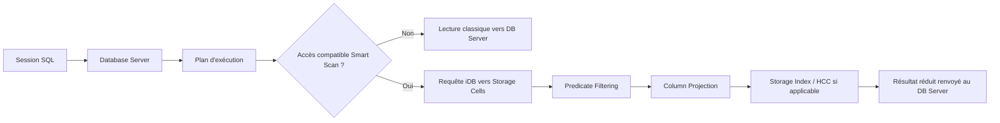

# Module 10 — Smart Scan

## 1. Objectif pédagogique

À la fin de ce module, le lecteur doit être capable d’expliquer précisément ce qu’est **Smart Scan** dans Oracle Exadata, pourquoi cette fonctionnalité est propre à l’architecture Exadata, et dans quelles conditions elle réduit le volume de données transféré entre les **storage cells** et les **database servers**. L’objectif n’est pas de retenir une définition générale, mais de savoir raisonner sur un SQL réel, son plan d’exécution, ses statistiques d’I/O et ses métriques `cell%`.

Le lecteur doit savoir distinguer un scan classique, où les blocs Oracle sont remontés vers l’instance pour être filtrés, d’un scan Exadata optimisé, où une partie du traitement SQL est exécutée au plus près des données dans les storage cells. Il doit également comprendre le rôle de l’**offload SQL**, du **predicate filtering**, de la **column projection**, du **Direct Path Read**, des scans volumineux et des mécanismes complémentaires comme **Storage Index** et **Hybrid Columnar Compression**.

Un diagnostic Smart Scan ne se limite jamais à constater qu’une requête est lente ou rapide. Il consiste à relier le plan SQL, les opérations de type `TABLE ACCESS STORAGE FULL`, les prédicats réellement évaluables côté cellule, les colonnes demandées, les compteurs `cell_offload_eligible_bytes`, `cell_offload_returned_bytes`, `physical_read_bytes`, les statistiques système `cell physical IO%`, et les attentes d’exécution de type `cell smart table scan`.

## 2. Pourquoi Smart Scan est important dans Exadata

Oracle Exadata associe des database servers, des storage cells intelligentes et un réseau interne très rapide. Dans une architecture classique, la baie de stockage livre des blocs au serveur de base de données, puis l’instance Oracle applique les prédicats, sélectionne les colonnes utiles et rejette les lignes non pertinentes. Dans Exadata, Smart Scan change ce modèle pour certains accès volumineux : une partie du traitement de recherche et de projection est envoyée aux storage cells, ce qui réduit le volume de données renvoyé vers les database servers lorsque les conditions techniques sont réunies.[1]

Cette approche est importante parce que les workloads analytiques, décisionnels, de consolidation et de reporting lisent souvent des volumes importants pour ne conserver qu’une fraction des lignes et des colonnes. Si une table de plusieurs téraoctets contient cent colonnes mais que la requête ne demande que trois colonnes et filtre 99 % des lignes, remonter tous les blocs vers l’instance consomme inutilement l’interconnect, les CPU des database servers et le temps d’attente des sessions. Smart Scan vise précisément à éviter ce transfert inutile dans les cas compatibles.[1] [2]

Smart Scan n’est toutefois pas une promesse universelle. Il ne s’applique pas à toutes les requêtes, ni à tous les chemins d’accès. Il est principalement associé à des scans complets ou rapides complets, à des lectures séquentielles importantes et au mécanisme **Direct Path Read**. Oracle indique que Smart Scan optimise notamment les full table scans, fast full index scans et fast full bitmap index scans utilisant Direct Path Read.[1]

## 3. Concepts clés

| Concept | Définition | Exemple concret | À ne pas confondre avec |
|---|---|---|---|
| Smart Scan | Fonction Exadata qui exécute certains traitements de recherche et de projection dans les storage cells.[1] | Une requête lit une grande table de ventes et ne renvoie que les lignes d’une région. | Une optimisation SQL disponible sur tout stockage. |
| Offload SQL | Déport d’une partie du travail SQL vers les storage cells.[2] | Le filtre `amount > 1000` est transmis aux cells. | Le parallélisme SQL seul. |
| Predicate Filtering | Évaluation côté cellule de prédicats compatibles. | `region = 'EMEA' and amount >= 1000`. | Un filtre appliqué uniquement après réception des blocs. |
| Column Projection | Sélection côté cellule des colonnes nécessaires. | `select customer_id, amount` sur une table très large. | La compression de table. |
| Direct Path Read | Mode de lecture direct utilisé par certains grands scans. | Une requête parallèle lit une grande table hors chemin bufferisé principal. | Une lecture logique depuis le buffer cache. |
| Full Table Scan | Lecture complète d’une table. | `TABLE ACCESS STORAGE FULL SALES`. | Un accès index très sélectif. |
| Cell Smart Table Scan | Activité ou attente liée à une lecture intelligente de table. | `cell smart table scan` dans les attentes. | `db file scattered read` sur stockage classique. |
| Eligible Bytes | Volume considéré comme éligible à l’offload. | `cell_offload_eligible_bytes = 900 Go`. | Le volume retourné au database server. |
| Returned Bytes | Volume renvoyé après filtrage/projection côté cell. | `cell_offload_returned_bytes = 20 Go`. | Le volume lu physiquement. |
| Storage Index | Métadonnées cell permettant d’éviter certaines régions de stockage. | Un filtre de date exclut des régions entières. | Un index B-tree Oracle. |
| HCC | Hybrid Columnar Compression, souvent favorable aux scans analytiques Exadata.[1] | Table historique compressée et scannée avec projection. | Compression OLTP classique. |

Ces concepts doivent être étudiés ensemble. Un plan peut mentionner `STORAGE`, mais le gain réel dépend du volume éligible, des prédicats offloadables, de la sélectivité, de la projection de colonnes, de l’état des statistiques, du degré de parallélisme et de la part de lecture directe.

## 4. Architecture Smart Scan

Smart Scan repose sur une coopération entre l’optimiseur Oracle Database, les database servers, les storage cells, ASM et le réseau interne Exadata. La session SQL s’exécute côté database server, mais certaines opérations de scan sont décrites dans des requêtes internes envoyées aux storage cells. Les cells lisent les extents gérés par ASM, appliquent les traitements compatibles, puis renvoient au database server un résultat réduit plutôt que l’intégralité des blocs.

Les **database servers** hébergent les instances Oracle, les sessions utilisateurs, l’optimiseur, les plans d’exécution et les opérations SQL qui ne sont pas déportées. Ils conservent la responsabilité de la cohérence transactionnelle, de l’assemblage final du résultat, des joins non déportés, des agrégations non offloadées et de la majorité de la logique SQL complexe.

Les **storage cells** ne sont pas de simples disques. Elles exécutent Oracle Exadata System Software, accèdent aux disques et au flash, maintiennent des statistiques internes et exécutent des fonctions spécialisées comme Smart Scan, Storage Index, IORM et les traitements associés à HCC. Dans le cas de Smart Scan, la cell reçoit la demande de scan, lit les données, applique les filtres et projections compatibles, puis renvoie au database server un flux réduit.

Le réseau interne **RoCE** ou **InfiniBand** fournit une faible latence et un haut débit entre database servers et storage cells. Smart Scan ne rend pas ce réseau inutile ; il cherche à éviter qu’il transporte des données qui seront immédiatement rejetées par l’instance. Plus l’écart entre les bytes éligibles et les bytes retournés est grand, plus la réduction du trafic interconnect est visible.



## 5. Fonctionnement détaillé

Dans un scan classique sur stockage non intelligent, l’instance Oracle demande des blocs au stockage, reçoit ces blocs, puis applique les prédicats dans le moteur SQL. Même si une seule ligne sur mille satisfait le filtre, les blocs traversent la chaîne I/O jusqu’au database server. L’instance extrait ensuite les lignes et colonnes nécessaires, rejette le reste, puis poursuit l’exécution du plan.

Smart Scan modifie ce chemin pour certains scans Exadata. Lorsque l’optimiseur et le moteur d’exécution choisissent un accès compatible, Oracle Database envoie aux storage cells une demande de scan enrichie : quelles colonnes sont nécessaires, quels prédicats peuvent être évalués côté cellule, quelles portions du segment sont à lire et quel contexte d’exécution s’applique. La cell lit alors les données depuis disque ou flash, applique les filtres admissibles, projette les colonnes demandées, exploite éventuellement Storage Index ou HCC, puis renvoie un résultat plus petit vers le database server.[1] [2]

Le **predicate filtering** est l’un des gains les plus visibles. Si la requête contient `where sale_date >= date '2026-01-01' and amount > 1000`, une cell peut éliminer les lignes qui ne satisfont pas les prédicats compatibles avant que ces lignes ne circulent sur l’interconnect. Oracle documente plusieurs opérateurs conditionnels pris en charge, notamment `=`, `!=`, `<`, `>`, `<=`, `>=`, `IS NULL`, `LIKE`, `BETWEEN`, `IN`, ainsi que des combinaisons logiques comme `AND` et `OR`.[1]

La **column projection** évite de renvoyer des colonnes inutiles. Dans une table large, une requête analytique peut demander uniquement `customer_id`, `sale_date` et `amount`. Avec Smart Scan, la cell renvoie seulement les colonnes utiles lorsque la structure et le plan le permettent. Oracle souligne que ce gain peut être substantiel pour les tables contenant de nombreuses colonnes ou des colonnes volumineuses.[1]

Le **Direct Path Read** est central parce que Smart Scan vise surtout les grands scans séquentiels et les opérations parallèles. Les index lookups très sélectifs ne bénéficient généralement pas de Smart Scan parce qu’ils n’ont pas besoin de lire un grand volume. Si un index unique permet de trouver une ligne client, forcer un scan complet pour obtenir Smart Scan serait souvent une dégradation.

Certaines **fonctions SQL** ou expressions peuvent limiter l’offload. Appliquer une fonction non compatible sur une colonne filtrée peut empêcher la cell d’évaluer le prédicat. Un filtre `where trunc(sale_date) = date '2026-01-01'` peut être moins favorable qu’un intervalle explicite `where sale_date >= date '2026-01-01' and sale_date < date '2026-01-02'`. La règle pratique est de vérifier le plan, les predicate informations et les métriques plutôt que de supposer que tout filtre est offloadable.

**Storage Index** complète Smart Scan en évitant parfois des lectures physiques. Les cells maintiennent des informations de type min/max sur des régions de stockage. Si un prédicat ne peut pas correspondre aux valeurs d’une région, la cell peut éviter de lire cette région. **HCC** peut aussi améliorer les scans analytiques parce que les données compressées en colonnes hybrides se prêtent bien aux lectures de colonnes et aux filtrages de grands volumes.[1]

## 6. Comparaison scan classique vs Smart Scan

| Étape | Scan classique | Smart Scan |
|---|---|---|
| Lecture | Les blocs sont remontés vers le database server. | Les cells lisent les données et peuvent renvoyer un résultat déjà filtré et projeté. |
| Filtrage | Les prédicats sont principalement évalués côté instance. | Les prédicats compatibles peuvent être évalués côté storage cell. |
| Projection | Des colonnes non utiles peuvent contribuer au volume remonté. | Les colonnes demandées peuvent être sélectionnées côté cell. |
| Trafic interconnect | Plus élevé quand beaucoup de données inutiles circulent. | Réduit si l’offload élimine lignes ou colonnes. |
| Conditions | Accès standard, lectures bufferisées ou chemins non compatibles. | Accès compatible offload, grand scan, Direct Path Read, prédicats admissibles. |
| Indicateurs | Attentes I/O classiques, peu de métriques `cell_offload%`. | `cell smart table scan`, bytes éligibles, bytes retournés. |
| Cas favorable | Accès index très sélectif, petits objets, données utiles en cache. | Scan volumineux avec forte sélectivité et table large. |

Le piège le plus courant consiste à considérer Smart Scan comme systématiquement supérieur. Pour une requête de recherche unitaire, un index lookup peut être le meilleur choix. Pour une requête analytique qui lit des centaines de gigaoctets et élimine l’essentiel des lignes, Smart Scan devient au contraire un levier majeur.

## 7. Commandes et vues utiles

Les commandes suivantes sont des requêtes de diagnostic en lecture seule. Elles doivent être exécutées avec les privilèges appropriés et adaptées au contexte de l’environnement. Leur objectif est de produire des preuves : plan réel, bytes éligibles, bytes retournés, statistiques système et événements d’attente.

```sql
select *
from table(dbms_xplan.display_cursor(:sql_id, null, 'ALLSTATS LAST +IOSTATS +PREDICATE'));
```

Cette requête montre les opérations du plan réellement exécuté, les lignes estimées et observées, les statistiques d’I/O et les prédicats. Pour Smart Scan, il faut rechercher des opérations comme `TABLE ACCESS STORAGE FULL`, `INDEX STORAGE FAST FULL SCAN`, des predicate informations cohérentes, ainsi que des écarts entre estimation et réalité. Oracle documente `DBMS_XPLAN.DISPLAY_CURSOR` comme une fonction permettant d’afficher le plan d’exécution d’un curseur chargé.[3]

```sql
select sql_id,
       cell_offload_eligible_bytes,
       cell_offload_returned_bytes,
       physical_read_bytes
from v$sql
where sql_id = :sql_id;
```

`cell_offload_eligible_bytes` indique le volume qui pouvait être soumis à l’offload. `cell_offload_returned_bytes` indique le volume renvoyé après les traitements côté cell. `physical_read_bytes` donne le volume de lectures physiques associé au SQL. Une lecture favorable montre souvent un eligible bytes élevé et un returned bytes beaucoup plus faible.

```sql
select name, value
from v$sysstat
where name in (
  'cell physical IO bytes eligible for predicate offload',
  'cell physical IO bytes saved by storage index',
  'cell physical IO interconnect bytes returned',
  'cell smart table scan',
  'cell smart index scan'
)
order by name;
```

Cette requête montre des compteurs cumulés au niveau de l’instance. Elle s’utilise avant et après un test, ou dans une observation de tendance, pour vérifier si le système réalise des scans intelligents, combien de bytes sont éligibles, combien sont renvoyés sur l’interconnect et combien sont évités par Storage Index.

```sql
select event, total_waits, time_waited
from v$system_event
where event like 'cell%'
order by time_waited desc;
```

Cette requête observe les attentes `cell%` au niveau système. Pour un diagnostic de session, elle doit être complétée par une lecture de `v$session` ou par SQL Monitor lorsque ces sources sont disponibles.

## 8. Interprétation des métriques

| Métrique | Signification | Interprétation |
|---|---|---|
| `cell_offload_eligible_bytes` | Volume du SQL considéré comme éligible à l’offload. | Une valeur élevée indique que le SQL a emprunté un chemin où Smart Scan pouvait intervenir. Une valeur nulle oriente vers un accès non compatible, un petit objet, un accès index lookup, un chemin bufferisé ou un curseur différent. |
| `cell_offload_returned_bytes` | Volume renvoyé par les cells au database server après traitement. | Une valeur très inférieure à l’eligible bytes suggère une réduction efficace. Une valeur proche indique que l’offload n’a pas beaucoup réduit le flux. |
| `physical_read_bytes` | Volume de lecture physique associé au SQL. | Cette valeur aide à comprendre le volume réellement lu. Elle doit être comparée aux bytes retournés et au plan. |
| `cell physical IO bytes eligible for predicate offload` | Statistique système cumulée des bytes éligibles. | Elle confirme une activité offload au niveau instance, surtout sur une différence avant/après test. |
| `cell physical IO bytes saved by storage index` | Bytes évités grâce à Storage Index. | Une valeur élevée montre que les cells éliminent des régions de stockage avant lecture complète. |
| `cell physical IO interconnect bytes returned` | Volume retourné par les cells sur l’interconnect. | À comparer au volume éligible. Une baisse relative indique que le trafic réseau interne a été réduit. |
| `cell smart table scan` | Indicateur d’activité ou d’attente lié aux scans intelligents de table. | Sa présence est un signal favorable pour un full table scan compatible. |
| `cell smart index scan` | Indicateur lié aux scans intelligents d’index compatibles. | Il peut apparaître pour des fast full index scans, mais ne doit pas être attendu pour chaque accès index. |

Un eligible bytes nul indique que la requête observée n’a probablement pas utilisé un chemin éligible. Un returned bytes proche de l’eligible bytes signifie que Smart Scan peut être présent mais peu sélectif. Une valeur élevée de `cell physical IO bytes saved by storage index` montre que Storage Index a évité des lectures. L’absence de `cell smart table scan` impose de vérifier le plan, le chemin d’accès et le mode de lecture.

## 9. Pourquoi Smart Scan ne se déclenche pas

| Cause possible | Explication | Vérification |
|---|---|---|
| Index lookup très sélectif | L’optimiseur choisit un accès index parce qu’il lit très peu de blocs. | Lire le plan : `INDEX UNIQUE SCAN`, `INDEX RANGE SCAN`, nested loops sur peu de lignes. |
| Pas de Direct Path Read | Le chemin de lecture ne correspond pas au mode généralement associé aux grands scans offloadables. | Examiner le plan, les statistiques d’I/O et les événements d’attente. |
| Petit objet | Le coût de mise en œuvre d’un grand scan direct n’est pas justifié. | Vérifier la taille du segment et les statistiques objet. |
| Données dans buffer cache | La requête peut être servie depuis le cache de l’instance. | Comparer logical reads, physical reads et attentes. |
| Fonction non offloadable | Une expression peut empêcher la cell d’évaluer le prédicat. | Lire les predicate informations et tester une forme plus simple. |
| Prédicat incompatible | Tous les prédicats ne sont pas transmissibles aux cells. | Identifier les prédicats dans `DBMS_XPLAN`. |
| Statistiques obsolètes | L’optimiseur peut choisir un chemin d’accès non représentatif. | Contrôler statistiques, histogrammes et cardinalités estimées/réelles. |
| Plan SQL différent | Le SQL_ID peut avoir plusieurs child cursors. | Vérifier `child_number`, plan hash value et contexte d’exécution. |
| Attente irréaliste sur une requête OLTP | Les requêtes unitaires très sélectives n’ont pas vocation à utiliser Smart Scan. | Classer le SQL : OLTP lookup ou scan analytique. |

Dans la pratique, la cause la plus fréquente n’est pas une défaillance Exadata, mais une hypothèse incorrecte sur le plan. L’équipe pense que le SQL scanne une grande table, alors que l’optimiseur choisit un index. Ou bien elle pense que le prédicat est très sélectif, alors que la distribution réelle renvoie une grande partie de la table.

## 10. Erreurs fréquentes

La première erreur consiste à croire que Smart Scan s’applique à toutes les requêtes exécutées sur Exadata. Exadata rend Smart Scan possible, mais le moteur Oracle choisit le chemin d’accès selon le SQL, les statistiques, les objets et le contexte.

La deuxième erreur consiste à forcer des paramètres internes sans preuve. Lorsqu’un comportement semble anormal malgré un plan et des métriques bien collectés, la voie saine consiste à documenter le SQL_ID, la version, le plan, les statistiques et les métriques Exadata.

La troisième erreur consiste à confondre performance SQL et offload. Un SQL peut bénéficier de Smart Scan et rester lent parce qu’il lit énormément de données, effectue des joins coûteux, trie massivement ou subit un parallélisme mal dimensionné. Inversement, un SQL sans Smart Scan peut être optimal s’il lit quelques blocs par un index sélectif.

La quatrième erreur consiste à ignorer le plan d’exécution. Sans le plan réel, il est impossible de savoir si l’absence d’offload vient d’un index lookup, d’un full table scan non direct, d’un child cursor différent, d’une estimation de cardinalité incorrecte ou d’un prédicat non transmissible.

La cinquième erreur consiste à regarder seulement le temps de réponse. Le temps varie avec le cache, la concurrence, le parallélisme, la charge des cells, le CPU database server et le réseau. Les bytes éligibles et retournés apportent une preuve plus stable du comportement d’offload.

## 11. Bonnes pratiques

La première bonne pratique est de toujours lire le plan réel avant de conclure. Utilisez `DBMS_XPLAN.DISPLAY_CURSOR` avec le bon `sql_id`, le bon child cursor si nécessaire, et des options permettant de voir les statistiques d’exécution et les prédicats.

La deuxième bonne pratique est de comparer `cell_offload_eligible_bytes` et `cell_offload_returned_bytes`. Ce ratio est l’un des indicateurs les plus utiles pour juger l’efficacité de Smart Scan. Un ratio fortement réduit soutient l’idée d’un offload efficace. Un ratio proche de 1 signifie souvent que le SQL conserve une grande partie des données lues.

La troisième bonne pratique est de vérifier les prédicats. Les prédicats simples, sélectifs et exprimés directement sur les colonnes sont généralement plus lisibles et plus favorables au diagnostic. Les fonctions appliquées aux colonnes filtrées, les conversions implicites, les expressions complexes et les types mal alignés doivent être examinés attentivement.

La quatrième bonne pratique est de vérifier le Direct Path Read et le volume. Smart Scan vise les grands scans. Si l’objet est petit, si les données sont servies depuis le buffer cache ou si le plan lit quelques blocs, l’absence d’offload peut être normale.

La cinquième bonne pratique est de maintenir les statistiques. Des statistiques obsolètes peuvent amener l’optimiseur à choisir un index alors qu’un scan serait plus adapté, ou l’inverse. Les écarts entre lignes estimées et lignes réelles dans le plan sont des signaux importants.

## 12. Scénario complet

Une équipe exploite une application de reporting sur Exadata. Une requête analytique sur la table `SALES_FACT` est lente pendant la fenêtre de clôture. La table contient plusieurs années de ventes, des colonnes de mesure, des dimensions dénormalisées et des attributs de segmentation. L’équipe pense que Smart Scan devrait réduire fortement le volume lu, car la requête filtre sur `sale_date`, `region_code` et `amount`, puis ne sélectionne que quelques colonnes.

```sql
select /* reporting_cloture */
       customer_id,
       sale_date,
       amount,
       channel_code
from sales_fact
where trunc(sale_date) = date '2026-05-31'
  and region_code = 'EMEA'
  and amount > 1000;
```

Le premier réflexe consiste à lire le plan réel. Si le plan montre `TABLE ACCESS STORAGE FULL SALES_FACT`, la requête emprunte au moins un chemin compatible avec un scan Exadata. Si le plan montre un `INDEX RANGE SCAN` suivi de nombreux accès table, il faut vérifier si ce choix est réellement coûteux ou si l’optimiseur a raison.

Le deuxième réflexe consiste à vérifier les prédicats. Le filtre `trunc(sale_date) = date '2026-05-31'` peut être moins favorable qu’une forme par intervalle :

```sql
sale_date >= date '2026-05-31'
and sale_date <  date '2026-06-01'
```

Le troisième réflexe consiste à comparer les bytes. Si `v$sql` indique 1,2 To de `cell_offload_eligible_bytes` et 1,05 To de `cell_offload_returned_bytes`, l’offload existe peut-être, mais la réduction est faible. Si, au contraire, returned bytes tombe à 35 Go, l’offload est efficace et la lenteur doit être cherchée ailleurs : join, tri, agrégation, parallélisme, CPU ou concurrence.

La conclusion prudente pourrait être la suivante : « Le SQL utilise un accès de type scan Exadata, mais l’efficacité de Smart Scan est limitée car le volume retourné reste proche du volume éligible. Le prédicat sur `sale_date` doit être reformulé sans fonction, les statistiques de `SALES_FACT` et la distribution de `region_code` doivent être vérifiées, puis un test contrôlé doit comparer plan, eligible bytes, returned bytes et temps de réponse. »

## 13. Exercice pratique

À partir d’un `SQL_ID` fourni par l’équipe DBA, construisez un diagnostic Smart Scan complet. L’objectif n’est pas de prouver à tout prix que Smart Scan doit s’activer, mais de produire une analyse structurée indiquant si le SQL est éligible, si l’offload est visible, si l’offload est efficace, et quelles actions sont raisonnables.

Le lecteur doit produire les requêtes de diagnostic suivantes : affichage du plan réel avec `DBMS_XPLAN.DISPLAY_CURSOR`, lecture des compteurs `cell_offload_eligible_bytes`, `cell_offload_returned_bytes` et `physical_read_bytes` dans `v$sql`, observation des statistiques `v$sysstat` liées à l’offload et à Storage Index, et vérification des attentes `cell%` pertinentes.

La production attendue est un court rapport technique comprenant le SQL_ID, le plan observé, les métriques principales, les hypothèses retenues, les hypothèses rejetées, une conclusion et une recommandation. Le rapport doit éviter les affirmations non prouvées.

## 14. Corrigé détaillé

Un corrigé solide commence par le plan réel. La requête suivante est exécutée avec le SQL_ID fourni :

```sql
select *
from table(dbms_xplan.display_cursor(:sql_id, null, 'ALLSTATS LAST +IOSTATS +PREDICATE'));
```

Le lecteur vérifie d’abord que le plan correspond au SQL étudié. Il regarde le `plan hash value`, les opérations principales, les lignes estimées et réelles, les prédicats et les informations d’I/O. Si le plan contient `TABLE ACCESS STORAGE FULL`, il existe un indice favorable pour Smart Scan. Si le plan contient un accès index très sélectif, l’absence de Smart Scan peut être normale.

Ensuite, le lecteur lit les bytes dans `v$sql`. Si `cell_offload_eligible_bytes` est nul, le SQL observé n’a pas produit de volume éligible à l’offload. Le corrigé doit alors vérifier le plan, le type d’accès, la taille de l’objet, le mode de lecture, le cache et le contexte d’exécution.

Si `cell_offload_eligible_bytes` est élevé mais que `cell_offload_returned_bytes` est proche, Smart Scan peut être présent sans réduction importante. Le corrigé doit expliquer que le filtrage est probablement faible, que les colonnes demandées représentent un volume important, ou que certains prédicats ne sont pas évalués côté cell.

Si eligible bytes est élevé et returned bytes faible, Smart Scan est efficace sur le transfert. Si le temps de réponse reste mauvais, le corrigé doit chercher ailleurs : opérations de join, tri, agrégation, distribution parallèle, CPU, concurrence ou attentes hors I/O.

Une conclusion acceptable serait : « Le SQL_ID analysé utilise un `TABLE ACCESS STORAGE FULL` sur `SALES_FACT`. Le volume éligible est de 780 Go et le volume retourné est de 42 Go, ce qui indique un offload efficace. La lenteur restante ne vient probablement pas d’une absence de Smart Scan ; elle doit être recherchée dans les joins et le tri final. »

Une autre conclusion acceptable serait : « Le SQL_ID analysé utilise un `INDEX RANGE SCAN` très sélectif, avec `cell_offload_eligible_bytes` nul. Smart Scan n’est pas attendu pour ce chemin d’accès. Forcer un full scan pour déclencher Smart Scan n’est pas justifié sans test prouvant un gain. »

## 15. À retenir

Smart Scan déporte une partie du traitement de recherche et de projection vers les Exadata Storage Servers lorsque le plan et le contexte d’exécution le permettent.[1] Ce mécanisme peut réduire fortement le trafic interconnect, car seules les lignes et colonnes utiles sont renvoyées au database server dans les cas favorables.[2]

Smart Scan dépend du plan SQL. Les opérations de type full table scan, fast full index scan ou fast full bitmap index scan avec Direct Path Read sont les candidates naturelles. Un index lookup très sélectif peut être parfaitement optimal sans Smart Scan.

Les métriques `cell_offload_eligible_bytes` et `cell_offload_returned_bytes` sont essentielles. Eligible élevé avec returned faible indique une réduction efficace. Eligible nul indique que le SQL observé n’a probablement pas emprunté un chemin éligible. Returned proche de eligible indique un filtrage ou une projection peu réducteurs.

Storage Index peut réduire les lectures en amont du transfert, mais son efficacité dépend des prédicats et de l’organisation physique des données. HCC peut renforcer l’efficacité des scans analytiques Exadata lorsque la compression, la projection de colonnes et le filtrage côté cell sont adaptés au workload.[1]

Toute conclusion doit être prouvée par un plan réel, des métriques SQL, des statistiques Exadata et, si possible, des observations de session. Une affirmation sans SQL_ID, sans plan et sans bytes n’est pas un diagnostic.

## 16. Références officielles

[1]: https://docs.oracle.com/en/engineered-systems/exadata-database-machine/sagug/offloading-data-search-and-retrieval-processing.html "Oracle Exadata Database Machine User’s Guide — Offloading Data Search and Retrieval Processing"

[2]: https://www.oracle.com/database/technologies/exadata/software/smartscan/ "Oracle — Exadata Smart Scan"

[3]: https://docs.oracle.com/en/database/oracle/oracle-database/18/arpls/DBMS_XPLAN.html "Oracle Database PL/SQL Packages and Types Reference — DBMS_XPLAN"
