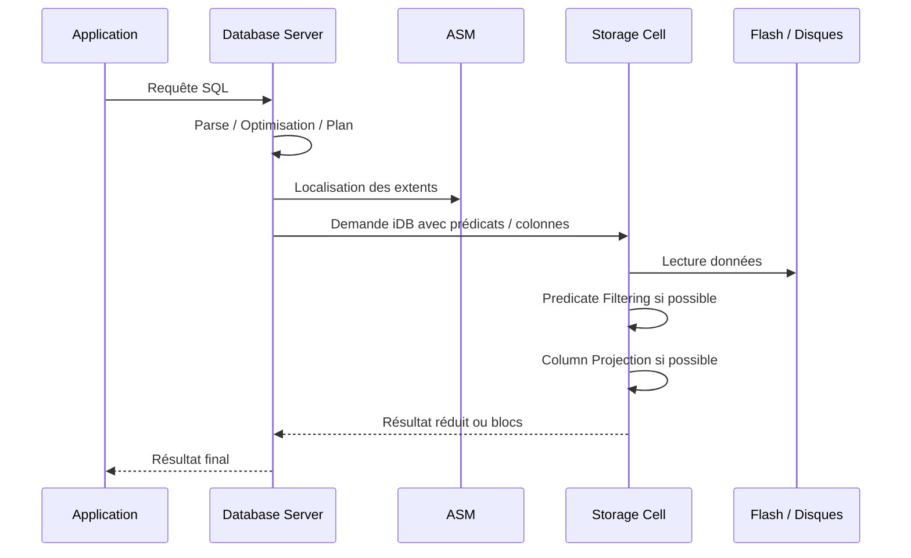

# Module 10 — Smart Scan

## 1. Objectif du module

Ce module explique **Smart Scan**, une des capacités majeures d’Oracle Exadata.

L’objectif est de comprendre pourquoi Smart Scan existe, où il agit, dans quelles conditions il fonctionne et comment prouver son effet avec un plan SQL et des métriques.

À la fin de ce module, le lecteur doit être capable de :

- expliquer ce qu’est Smart Scan ;
- distinguer scan classique et Smart Scan ;
- comprendre le rôle des Storage Cells ;
- comprendre le lien entre Smart Scan et Offload SQL ;
- expliquer Predicate Filtering ;
- expliquer Column Projection ;
- comprendre le rôle de Direct Path Read ;
- reconnaître les plans SQL compatibles ;
- lire les métriques `cell%` ;
- éviter de dire que Smart Scan accélère toutes les requêtes.

---

## 2. Pourquoi Smart Scan est important

Dans une architecture Oracle classique, le stockage renvoie principalement des blocs au serveur de base de données.

Le Database Server doit ensuite :

```text
lire les blocs
filtrer les lignes
sélectionner les colonnes utiles
exécuter les jointures et agrégations
renvoyer le résultat
```

Dans Exadata, les Storage Cells peuvent participer à certains scans.

Elles peuvent :

```text
appliquer certains filtres
ne renvoyer que certaines colonnes
réduire le volume transféré
éviter certaines lectures
retourner moins de données au Database Server
```

À retenir :

```text
Smart Scan ne rend pas seulement le stockage plus rapide.
Il permet surtout de réduire ce qui remonte vers le Database Server.
```

---

## 3. Scan classique vs Smart Scan

### 3.1 Scan classique

```text
Application
→ Database Server
→ Stockage SAN/NAS
→ blocs retournés
→ Database Server filtre et projette
→ résultat
```

Dans ce modèle, le stockage est essentiellement passif.

Il renvoie des blocs, même si une grande partie sera rejetée ensuite.

### 3.2 Smart Scan Exadata

```text
Application
→ Database Server
→ demande iDB
→ Storage Cells
→ lecture flash/disques
→ filtrage/projection côté cell si possible
→ retour réduit
→ Database Server finalise
→ résultat
```

Dans ce modèle, les Storage Cells sont actives.

Elles peuvent participer au traitement.

---

## 4. Architecture Smart Scan

Smart Scan repose sur la coopération entre :

```text
Oracle Database
Database Server
Optimiseur SQL
ASM
Protocole iDB
Réseau interne RoCE / InfiniBand
Storage Cells
Exadata System Software
Flash / disques
```

Schéma logique :



---

## 5. Définition de Smart Scan

Smart Scan est un mécanisme Exadata permettant aux Storage Cells d’exécuter une partie de certains scans SQL.

Il peut réduire :

```text
le volume de données retourné
le trafic sur le réseau interne
le travail CPU côté Database Server
le temps d’attente de certaines requêtes analytiques
```

Smart Scan est surtout visible sur :

```text
grandes tables
scans volumineux
requêtes analytiques
reporting
data warehouse
full table scans
fast full index scans
direct path reads
```

---

## 6. Offload SQL

Smart Scan est lié à l’**Offload SQL**.

Offload SQL signifie qu’une partie du traitement SQL est déportée vers les Storage Cells.

Ce qui peut être déporté selon conditions :

```text
certains prédicats WHERE
projection de colonnes
certains traitements sur données compressées
certains scans compatibles
```

Ce qui reste côté Database Server :

```text
cohérence transactionnelle
parse et optimisation
jointures non offloadées
agrégations non offloadées
tri final
résultat final
transactions
```

À retenir :

```text
La Storage Cell aide le Database Server.
Elle ne remplace pas Oracle Database.
```

---

## 7. Predicate Filtering

### 7.1 Définition

Predicate Filtering signifie que certains filtres peuvent être évalués dans la Storage Cell.

Exemple :

```sql
select customer_id, amount
from sales
where region = 'FR'
and amount > 1000;
```

Si les prédicats sont compatibles, la Storage Cell peut éliminer des lignes avant de les retourner.

### 7.2 Apport

```text
moins de lignes retournées
moins de trafic interconnect
moins de travail côté Database Server
meilleure efficacité sur grands volumes
```

### 7.3 Exemple logique

```text
Table : 1 milliard de lignes
Filtre utile : 1 % des lignes
Sans Smart Scan : beaucoup de blocs remontent
Avec Smart Scan : les cells peuvent renvoyer beaucoup moins de lignes
```

---

## 8. Column Projection

### 8.1 Définition

Column Projection signifie que la Storage Cell peut ne retourner que les colonnes demandées.

Exemple :

```sql
select customer_id, amount
from sales
where region = 'FR';
```

Si la table contient 80 colonnes mais que la requête en demande 2, Exadata peut réduire le volume retourné.

### 8.2 Apport

```text
moins de colonnes transférées
moins de données sur le réseau interne
meilleure efficacité pour tables larges
```

À retenir :

```text
Predicate Filtering réduit les lignes.
Column Projection réduit les colonnes.
```

---

## 9. Direct Path Read

Smart Scan est généralement associé aux accès de type **Direct Path Read**.

Direct Path Read permet de lire de grands volumes sans passer par le chemin classique du buffer cache de la même manière qu’un accès OLTP.

Cas favorables :

```text
full table scan
fast full index scan
requête parallèle
grand volume
traitement analytique
```

Cas moins favorables :

```text
index unique très sélectif
lecture d’une seule ligne
petites requêtes OLTP
accès déjà dans le buffer cache
```

---

## 10. Plans SQL compatibles

Dans un plan SQL, on peut voir :

```text
TABLE ACCESS STORAGE FULL
INDEX STORAGE FAST FULL SCAN
STORAGE
storage predicates
```

Exemple :

```sql
select *
from table(dbms_xplan.display_cursor('<sql_id>', null, 'ALLSTATS LAST +PREDICATE'));
```

À chercher :

```text
TABLE ACCESS STORAGE FULL
Predicate Information
storage(...)
filter(...)
actual rows
bytes
```

Attention :

```text
Voir STORAGE dans le plan ne suffit pas.
Il faut vérifier les métriques pour prouver le gain réel.
```

---

## 11. Métriques Smart Scan

Les métriques sont indispensables.

### 11.1 Statistiques globales

```sql
select name, value
from v$sysstat
where name like 'cell%'
order by name;
```

Métriques importantes :

```text
cell physical IO bytes eligible for predicate offload
cell physical IO interconnect bytes
cell physical IO interconnect bytes returned by smart scan
cell scans
```

### 11.2 Wait events

```sql
select event, total_waits, time_waited
from v$system_event
where event like 'cell%'
order by time_waited desc;
```

Exemples :

```text
cell smart table scan
cell smart index scan
cell multiblock physical read
cell single block physical read
```

### 11.3 SQL Monitor / DBMS_XPLAN

À lire :

```text
plan réel
lignes réelles
bytes réels
prédicats storage
prédicats filter
temps par opération
```

---

## 12. Interpréter les bytes

La distinction la plus importante :

```text
volume lu physiquement
volume éligible à l’offload
volume retourné au Database Server
volume réellement consommé par le SQL
```

Exemple simplifié :

```text
Données lues dans les cells : 900 Go
Données éligibles à l’offload : 900 Go
Données retournées sur interconnect : 20 Go
```

Interprétation :

```text
Smart Scan / Offload a probablement réduit fortement le volume retourné.
```

Autre exemple :

```text
Données lues : 900 Go
Données retournées : 850 Go
```

Interprétation :

```text
La réduction est faible.
Le Smart Scan peut être présent, mais le gain est limité.
```

---

## 13. Storage Index

Storage Index peut compléter Smart Scan.

Il permet à une Storage Cell d’éviter certaines régions de stockage si les métadonnées montrent qu’elles ne peuvent pas contenir les valeurs demandées.

Exemple :

```text
Région de stockage : dates de janvier à mars
Requête : ventes de décembre
Résultat : région potentiellement évitée
```

Attention :

```text
Storage Index n’est pas un index B-tree Oracle.
Il n’est pas créé manuellement comme un index classique.
```

---

## 14. HCC et Smart Scan

HCC signifie **Hybrid Columnar Compression**.

HCC peut être intéressant avec Exadata pour les données analytiques ou historiques.

Apport possible :

```text
moins de volume stocké
moins de volume lu
meilleure efficacité des scans
bonne compatibilité avec certaines lectures analytiques
```

Limites :

```text
pas adapté à toutes les tables
à éviter sur charges OLTP très modifiées sans analyse
peut influencer les coûts de modification
```

---

## 15. Cas où Smart Scan n’apporte pas de gain

Smart Scan peut ne pas aider si :

```text
la requête est très sélective via index
le volume lu est faible
le plan ne choisit pas un accès compatible
les prédicats ne sont pas offloadables
les données sont déjà dans le buffer cache
la requête retourne presque tout
les statistiques sont mauvaises
la requête est surtout CPU
la lenteur vient d’une jointure ou d’un tri
la lenteur vient d’un verrou ou d’une attente applicative
```

À retenir :

```text
Smart Scan est puissant, mais conditionnel.
```

---

## 16. Diagnostic d’une requête qui ne bénéficie pas de Smart Scan

Méthode :

```text
1. Identifier le SQL_ID.
2. Lire le plan réel.
3. Chercher TABLE ACCESS STORAGE FULL.
4. Lire les Predicate Information.
5. Vérifier storage predicates.
6. Lire les métriques cell.
7. Comparer eligible bytes et interconnect bytes.
8. Vérifier Direct Path Read.
9. Vérifier statistiques et cardinalités.
10. Conclure prudemment.
```

Commandes :

```sql
select *
from table(dbms_xplan.display_cursor('<sql_id>', null, 'ALLSTATS LAST +PREDICATE'));

select name, value
from v$sysstat
where name like 'cell%';
```

---

## 17. Exemple complet

### Requête

```sql
select customer_id, amount
from sales
where sale_date >= date '2026-01-01'
and sale_date < date '2026-02-01'
and region = 'FR';
```

### Conditions favorables

```text
table volumineuse
filtre sur date
filtre sur région
peu de colonnes retournées
plan en TABLE ACCESS STORAGE FULL
Direct Path Read
prédicats offloadables
```

### Ce qui peut se passer

```text
Storage Cells lisent les données.
Storage Index peut éviter certaines régions.
Predicate Filtering élimine les lignes hors période/région.
Column Projection garde customer_id et amount.
Database Server reçoit moins de données.
```

### Conclusion prudente

```text
Si les métriques montrent un volume retourné très inférieur au volume éligible,
le gain est probablement lié à Smart Scan / Offload.
```

---

## 18. Erreurs fréquentes

| Erreur | Pourquoi c’est faux | Correction |
|---|---|---|
| Smart Scan accélère tout | Toutes les requêtes ne sont pas éligibles | Vérifier plan et métriques |
| STORAGE dans le plan suffit | Le gain réel doit être mesuré | Lire les bytes cell |
| Confondre Flash Cache et Smart Scan | Cache accélère, Smart Scan réduit | Séparer les mécanismes |
| Forcer full scan partout | Un index sélectif peut être meilleur | Optimiser selon le SQL |
| Ignorer les prédicats | Certaines fonctions empêchent l’offload | Lire Predicate Information |
| Ignorer les stats | Mauvais plan possible | Vérifier statistiques |
| Conclure sans période de comparaison | Pas de preuve | Comparer période lente/normale |

---

## 19. Bonnes pratiques

| Bonne pratique | Application |
|---|---|
| Partir du SQL_ID | Ne pas raisonner globalement |
| Lire le plan réel | DBMS_XPLAN avec ALLSTATS |
| Vérifier les prédicats | storage vs filter |
| Lire les métriques cell | eligible bytes, interconnect bytes |
| Comparer les périodes | normal vs lent |
| Ne pas forcer sans preuve | Éviter les hints inutiles |
| Optimiser SQL d’abord | Exadata ne corrige pas tout |
| Documenter la conclusion | Plan + métriques + période |

---

## 20. Exercice pratique

Une requête lit une table `SALES` de plusieurs téraoctets.

Elle retourne seulement deux colonnes et filtre sur une période courte.

Après migration Exadata, elle est beaucoup plus rapide.

Répondez :

1. Pourquoi Smart Scan peut expliquer le gain ?
2. Quel rôle joue Predicate Filtering ?
3. Quel rôle joue Column Projection ?
4. Quel rôle peut jouer Storage Index ?
5. Quelle métrique permet de vérifier le volume éligible ?
6. Quelle métrique permet de vérifier le volume retourné ?
7. Quelle conclusion prudente formuler ?

---

## 21. Corrigé indicatif

Smart Scan peut expliquer le gain parce que la requête lit une grande table, retourne peu de colonnes et applique des filtres compatibles.

Predicate Filtering peut éliminer les lignes hors période directement dans les Storage Cells.

Column Projection peut éviter de renvoyer toutes les colonnes de la table.

Storage Index peut éviter certaines régions de stockage si elles ne contiennent pas la période recherchée.

Métriques utiles :

```text
cell physical IO bytes eligible for predicate offload
cell physical IO interconnect bytes
cell physical IO interconnect bytes returned by smart scan
```

Conclusion prudente :

```text
Le gain peut être attribué à Smart Scan / Offload seulement si le plan réel
et les métriques cell montrent que le volume retourné au Database Server
est nettement inférieur au volume éligible ou lu.
```

---

## 22. À retenir

```text
À retenir
- Smart Scan est une capacité Exadata liée aux Storage Cells.
- Il vise surtout les grands scans éligibles.
- Predicate Filtering réduit les lignes.
- Column Projection réduit les colonnes.
- Storage Index peut éviter certaines lectures.
- Direct Path Read est souvent associé aux chemins compatibles.
- Voir STORAGE dans le plan ne suffit pas.
- Le gain doit être prouvé avec les métriques cell.
- Smart Scan ne remplace pas l’optimisation SQL.
```

---

## 23. Références officielles

| Référence | Utilisation dans le module |
|---|---|
| [Oracle Exadata Documentation](https://docs.oracle.com/en/engineered-systems/exadata-database-machine/) | Smart Scan, Storage Cells, Exadata System Software. |
| [Oracle Exadata System Software Documentation](https://docs.oracle.com/en/engineered-systems/exadata-database-machine/sagug/) | Offload, CellCLI, métriques cells, Storage Index. |
| [Oracle Database Performance Tuning Guide](https://docs.oracle.com/en/database/) | Plans SQL, DBMS_XPLAN, wait events, AWR/ASH. |
| [Oracle Database SQL Tuning Guide](https://docs.oracle.com/en/database/) | Optimisation SQL, plans d’exécution, statistiques. |
