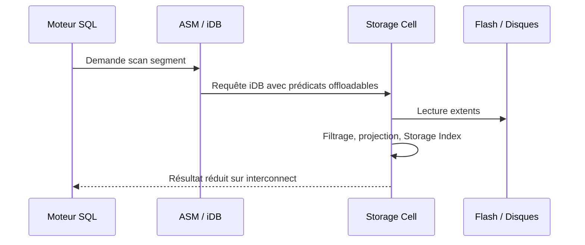

    # Module 10 — Smart Scan

    ## 1. Objectif pédagogique

    Expliquer Smart Scan en détail : offload, prédicats, projections, Storage Indexes et conditions d’éligibilité. Le chapitre vise une compréhension opérationnelle et théorique : l’étudiant doit pouvoir expliquer le mécanisme, reconnaître les composants impliqués, lire les principales vues ou commandes et résoudre un cas d’école sans modifier l’environnement.

    ## 2. Pourquoi ce sujet est important

    Smart Scan s’active surtout sur des scans volumineux et certains accès direct path. La cell applique les prédicats compatibles, renvoie les colonnes nécessaires et peut exploiter Storage Indexes ou HCC selon contexte.

    Smart Scan est déterminant parce qu’il déplace une partie du filtrage, de la projection et parfois du traitement vers les storage cells. L’enjeu n’est pas seulement d’accélérer une requête, mais de réduire le volume renvoyé aux database servers et de distinguer les accès éligibles des accès qui resteront traités côté instance.

    ## 3. Concepts clés expliqués

    | Concept | Définition claire | Exemple concret |
    |---|---|---|
    | **Offload SQL** | Déplacement d’une partie du traitement SQL vers les storage cells. | La cell filtre les lignes avant de renvoyer le résultat au DB server. |
| **Eligible bytes** | Volume d’I/O qui aurait pu être traité par les cells selon les conditions d’accès. | Un volume élevé indique que le SQL parcourt des données potentiellement offloadables. |
| **Returned bytes** | Volume réellement renvoyé par les cells aux DB servers après filtrage/projection. | Si returned bytes est beaucoup plus petit, Smart Scan réduit le trafic interconnect. |

    Ces concepts doivent être étudiés ensemble. Par exemple, **Offload SQL** n’a pas la même signification isolément que dans une architecture RAC, ASM et storage cells. La compréhension vient de la relation entre objet Oracle, ressource Exadata et workload applicatif.

    ## 4. Architecture concernée

    | Composant | Rôle dans ce chapitre |
    |---|---|
    | Database servers | Exécutent les instances, services, agents et outils Oracle liés au module. |
| Storage cells | Apportent stockage intelligent, flash, offload, alertes ou métriques lorsque le sujet touche les I/O. |
| ASM / Grid Infrastructure | Fournissent cluster, diskgroups, ressources RAC et accès aux fichiers Oracle. |
| Réseau RoCE / InfiniBand | Transporte les échanges internes rapides et peut influencer latence et disponibilité. |
| Outils Oracle | Enterprise Manager, AHF, Exachk, TFA, RMAN ou Data Guard selon le thème étudié. |

    Les diagrammes associés au chapitre sont :

    - [`smart-scan-flow.mmd`](../diagrams/smart-scan-flow.mmd)

    ## 5. Fonctionnement détaillé

    Smart Scan s’active surtout sur des scans volumineux et certains accès direct path. La cell applique les prédicats compatibles, renvoie les colonnes nécessaires et peut exploiter Storage Indexes ou HCC selon contexte.

    Le fonctionnement Smart Scan se vérifie en suivant le plan SQL, l’accès direct path, les prédicats offloadables, les compteurs `cell physical IO bytes eligible for predicate offload` et les bytes réellement retournés. Une lecture correcte relie le SQL, les segments, la compression, les statistiques et les métriques cellule.

    Pour ce module, les notions centrales sont **Offload SQL, Eligible bytes, Returned bytes**. Elles déterminent la façon dont le composant réagit à une charge réelle. Pour Smart Scan, l’analyse commence par l’éligibilité de l’accès. On compare le plan, les bytes éligibles, les bytes interconnect et la sélectivité des prédicats avant d’attribuer un écart de performance à Exadata. Une mauvaise lecture consiste à supposer que la plateforme corrige automatiquement un mauvais modèle de données, une requête mal écrite ou une architecture réseau incomplète.

    ## 6. Exemple concret

    Une requête analytique lit une grande table mais ne montre presque aucun gain ; le chapitre analyse plan, prédicats et statistiques offload.

    Dans ce scénario, l’analyse commence par le symptôme métier, puis remonte vers la couche Oracle concernée. Si le sujet touche les I/O, il faut différencier le temps passé dans Oracle Database, les attentes liées aux cells, la distribution ASM et la santé des storage cells. Si le sujet touche la haute disponibilité, il faut distinguer disponibilité locale RAC, continuité de service, sauvegarde et reprise après sinistre.

    ## 7. Commandes, vues et métriques utiles

    Les commandes ci-dessous sont données comme exemples de lecture. Elles doivent être adaptées aux noms de bases, privilèges, versions et conventions du site.

    ```bash
    select * from table(dbms_xplan.display_cursor(&SQL_ID, null, ALLSTATS LAST +IOSTATS +PREDICATE));
select sql_id,cell_offload_eligible_bytes,cell_offload_returned_bytes,physical_read_bytes from v$sql where sql_id=&SQL_ID;
select name,value from v$sysstat where name like cell% order by name;
    ```

    | Élément à lire | Interprétation |
    |---|---|
    | Offload SQL | Cette information indique comment le mécanisme Offload SQL se comporte dans un cas réel. Elle doit être lue avec le contexte de charge, de version et d’architecture. |
| Eligible bytes | Cette information indique comment le mécanisme Eligible bytes se comporte dans un cas réel. Elle doit être lue avec le contexte de charge, de version et d’architecture. |
| Returned bytes | Cette information indique comment le mécanisme Returned bytes se comporte dans un cas réel. Elle doit être lue avec le contexte de charge, de version et d’architecture. |
| cell_offload_eligible_bytes | Volume potentiellement traitable par les storage cells. S’il est nul, le plan ou le chemin d’accès ne favorise pas Smart Scan. |
| cell_offload_returned_bytes | Volume renvoyé après traitement cell. Le rapport returned/eligible illustre l’efficacité du filtrage côté cell. |

    ## 8. Interprétation des résultats

    L’interprétation doit répondre à une question technique précise. Une valeur isolée ne suffit pas : une latence se compare à une période comparable, un volume d’I/O se compare à un plan SQL et un état RAC se compare au placement attendu des services. Les métriques Exadata sont particulièrement utiles lorsqu’elles expliquent pourquoi un volume important de données a été lu, filtré, renvoyé ou retardé.

    Dans les chapitres performance, les valeurs liées aux bytes, événements `cell`, AWR ou ASH indiquent le chemin dominant. Dans les chapitres HA/DR, les états de rôle, lag, services et ressources cluster décrivent la capacité réelle à basculer ou maintenir le service. Dans les chapitres support et maintenance, les rapports AHF, Exachk ou TFA doivent être lus comme des aides structurées, pas comme des remplacements de raisonnement.

    ## 9. Erreurs fréquentes

    | Erreur | Cause probable | Correction pédagogique |
    |---|---|---|
    | Confondre symptôme et cause | Le premier message visible vient parfois d’une couche différente de la cause réelle. | Reconstituer le chemin technique avant de conclure. |
    | Appliquer une recette générique | Exadata dépend fortement du workload, du plan SQL, de la version et du modèle de service. | Relire les composants du chapitre et adapter le diagnostic. |
    | Ignorer les dépendances | Une base RAC dépend de GI, ASM, réseau privé et storage cells. | Vérifier les dépendances avant toute hypothèse. |
    | Oublier les limites du mécanisme | Certaines fonctions Exadata ne s’appliquent pas à tous les accès ou toutes les charges. | Identifier les conditions d’éligibilité et les cas d’exclusion. |

    ## 10. Bonnes pratiques

    | Bonne pratique | Application concrète |
    |---|---|
    | Partir du mécanisme | Dessiner le chemin DB → ASM → cell → réseau → retour résultat selon le sujet. |
    | Séparer lecture et changement | Les commandes de lecture servent à comprendre ; les changements exigent runbook et validation. |
    | Comparer avec un état de référence | Une valeur a du sens lorsqu’elle est rapprochée d’une période saine ou d’une cible prévue. |
    | Documenter la version | Les fonctionnalités et commandes peuvent varier selon génération Exadata et version Oracle. |

    ## 11. Exercice pratique

    Vous êtes responsable du sujet **Smart Scan** sur une plateforme Exadata de formation. À partir du scénario suivant, rédigez une analyse de deux pages :

    > Une requête analytique lit une grande table mais ne montre presque aucun gain ; le chapitre analyse plan, prédicats et statistiques offload.

    Votre réponse doit inclure un schéma simple des composants impliqués, trois commandes ou vues à exécuter, deux métriques à lire, les erreurs à éviter et une recommandation finale.

    ## 12. Corrigé de l’exercice

    Une bonne réponse commence par identifier les composants du chapitre : **Offload SQL, Eligible bytes, Returned bytes**. Elle explique ensuite le chemin technique suivi par l’opération et indique pourquoi les commandes proposées permettent de vérifier ce chemin. Les commandes attendues sont celles de la section 7, adaptées aux noms réels de l’environnement.

    Le corrigé doit aussi distinguer les observations et les décisions. Par exemple, constater un lag, une alerte cell, un volume `eligible bytes` ou une ressource CRS offline ne suffit pas : il faut expliquer la conséquence sur l’application, la disponibilité ou la performance.  : optimisation SQL, ajustement de plan de ressources, revue réseau, ouverture SR, test de restore ou préparation CAB selon le module.

    ## 13. Synthèse à retenir

    ```text
    À retenir
    - Smart Scan  : base, cluster, ASM, storage cells, réseau et outils Oracle.
    - Les notions centrales du chapitre sont : Offload SQL, Eligible bytes, Returned bytes.
    - Les commandes de lecture permettent de comprendre le mécanisme avant toute action de changement.
    - Les erreurs les plus coûteuses viennent d’une lecture isolée d’une seule couche.
    - Un bon administrateur Exadata relie toujours architecture, workload, métriques et impact métier.
    ```


## Rectification V5 vérifiable — contenu expert non générique

Cette section constitue la correction V5 visible du module. Elle remplace l’approche répétitive par un raisonnement propre au thème **Smart Scan**. L’objectif n’est pas d’ajouter une phrase de méthode, mais de montrer comment un administrateur Exadata produit une preuve technique exploitable devant une équipe production, architecture ou support.

| Élément expert V5 | Application concrète au module |
|---|---|
| Objets à nommer explicitement | offload, predicate filtering, storage index, direct path, eligible bytes. |
| Méthode de diagnostic | comparer bytes éligibles, bytes retournés et plan SQL. |
| Cas d’école attendu | un full scan peut être excellent si la cellule filtre massivement les données. |
| Preuve minimale | Une commande ou vue read-only, une métrique datée, un composant identifié et une interprétation liée au risque métier. |
| Limite de conclusion | Une mesure isolée ne suffit pas ; elle doit être reliée à la période, au workload, à la version Exadata et à l’objectif de service. |

### Raisonnement attendu en situation réelle

Pour **Smart Scan**, le diagnostic commence par une hypothèse précise et réfutable. L’administrateur doit formuler ce qu’il cherche à prouver : saturation, mauvais placement, absence d’offload, contention entre workloads, défaut de redondance, fenêtre de maintenance insuffisante ou frontière de responsabilité cloud. Ensuite, il collecte uniquement des preuves read-only. Cette discipline évite deux erreurs fréquentes : modifier une plateforme stable sans preuve et confondre un symptôme visible avec la cause racine.

Le livrable attendu dans un contexte professionnel est une courte note technique. Elle doit contenir le symptôme, l’heure, les objets Exadata concernés, les commandes utilisées, les résultats observés, l’interprétation et la prochaine action. Si une modification est proposée, elle doit être séparée du diagnostic et rattachée à un runbook, une validation CAB ou une procédure de support Oracle.

### Exercice V5 complémentaire

Rédigez une analyse opérationnelle pour le cas suivant : **un full scan peut être excellent si la cellule filtre massivement les données**. Votre réponse doit citer les objets Exadata concernés, indiquer trois preuves read-only, expliquer ce qui invaliderait votre hypothèse et proposer une recommandation limitée au périmètre du module.

### Corrigé V5 complémentaire

Une bonne réponse identifie d’abord le composant dominant du sujet **Smart Scan**, puis relie les preuves à un impact mesurable. Les trois preuves doivent couvrir au moins deux couches différentes lorsque le sujet l’exige, par exemple base et cell, cluster et réseau, ou cloud et VM cluster. La recommandation est correcte seulement si elle indique ce qui est prouvé, ce qui reste incertain et quelle action peut être engagée sans créer un risque supérieur au problème initial.

## Références officielles

| Référence | Utilisation dans le module |
|---|---|
| [Oracle University — Exadata Database Machine Administration Workshop](https://education.oracle.com/exadata-database-machine-administration-workshop/courP_4599) | Cadre pédagogique général du workshop. |
| [Oracle Exadata Documentation](https://docs.oracle.com/en/engineered-systems/exadata-database-machine/) | Administration Exadata, Storage Server, CellCLI, maintenance et monitoring. |
| [Oracle Database Documentation](https://docs.oracle.com/en/database/) | Vues dynamiques, SQL, RMAN, Data Guard, AWR/ASH selon licences. |
| [Oracle Maximum Availability Architecture](https://www.oracle.com/database/technologies/high-availability/maa.html) | Principes HA/DR, Data Guard, sauvegarde et continuité de service. |
| [Oracle Autonomous Health Framework](https://docs.oracle.com/en/engineered-systems/health-diagnostics/autonomous-health-framework/) | AHF, Exachk, ORAchk, TFA et diagnostics automatisés. |
## Complément expert V5 — Smart Scan, offload et réduction du trafic interconnect

### Explication technique spécifique

Smart Scan est le mécanisme par lequel Exadata déporte certaines opérations vers les storage cells. Lorsqu’un plan effectue un accès compatible, souvent un full table scan ou fast full scan en direct path, la cellule peut filtrer des lignes, projeter des colonnes, appliquer Storage Index, traiter certaines fonctions et réduire les données renvoyées. Le database server ne reçoit plus nécessairement tous les blocs ; il reçoit un résultat partiel déjà réduit. Les statistiques `cell physical IO bytes eligible for predicate offload`, `cell physical IO interconnect bytes` et `cell physical IO bytes saved by storage index` permettent d’observer ce comportement.[^v5-smart-scan]

Smart Scan n’est pas déclenché par le simple fait d’être sur Exadata. Il dépend du plan, du type d’accès, des prédicats, du format des segments, de la compression, du parallélisme, du cache et des opérations SQL. Un index range scan très sélectif peut être meilleur qu’un Smart Scan. À l’inverse, une requête analytique sur une grande table peut être beaucoup plus efficace si les cellules éliminent les données avant transfert.



### Exemple concret réaliste

Une table `SALES` contient 2 To. La requête demande `sum(amount)` pour une région et un mois. Si le plan effectue un full scan direct path et que les prédicats sur `sale_month` et `region_id` sont offloadables, les cellules peuvent lire un volume élevé mais renvoyer peu d’octets. Dans SQL Monitor, on peut voir une activité cellule importante et un trafic interconnect réduit. Si la même requête utilise une fonction non offloadable sur la colonne filtrée, le moteur peut devoir recevoir plus de données et filtrer côté database server.

### Comment raisonner

Le raisonnement Smart Scan suit une séquence : vérifier le plan d’exécution, confirmer que l’accès est compatible, vérifier les statistiques d’offload, comparer octets lus et octets interconnect, puis examiner les prédicats. Si les bytes éligibles sont élevés mais les bytes interconnect ne diminuent pas, les prédicats ne filtrent peut-être pas beaucoup. Si les bytes éligibles sont faibles, le plan ne déclenche peut-être pas l’offload. Si Storage Index économise des bytes, la localisation des valeurs dans les régions de stockage est favorable.

### Commandes / vues utiles

```sql
-- Read-only : statistiques offload sur la session courante ou historique selon contexte
select name, value from v$mystat m join v$statname n using(statistic#)
where name like 'cell physical IO%' order by name;

select * from table(dbms_xplan.display_cursor(null,null,'ALLSTATS LAST +IOSTATS +PREDICATE'));

select sql_id, plan_hash_value, elapsed_time, io_interconnect_bytes, physical_read_bytes
from v$sql where sql_text like '%SALES%' fetch first 10 rows only;
```

```bash
# Read-only : métriques cellule associées au scan et à l’I/O
cellcli -e "list metriccurrent where name like 'CL_%' attributes name,metricValue,objectName"
cellcli -e "list metriccurrent where name like 'FC_%' attributes name,metricValue,objectName"
```

### Comment interpréter

Un bon résultat Smart Scan ne signifie pas toujours baisse du temps total si le SQL est CPU-bound après agrégation ou si le parallélisme crée un goulot ailleurs. L’indicateur clé est la relation entre volume éligible, volume lu, volume renvoyé et temps d’attente. Si `io_interconnect_bytes` est proche de `physical_read_bytes`, la réduction est faible. Si `cell physical IO bytes saved by storage index` augmente, les Storage Index évitent des lectures de régions entières. L’interprétation doit donc combiner plan, statistiques et métriques cellule.

### Exercice pratique

Une requête full scan sur une grande table est lente malgré Exadata. Les statistiques montrent peu de bytes éligibles à l’offload. Donne trois causes possibles et indique comment les vérifier.

### Corrigé détaillé

Première cause : le plan n’utilise pas un accès compatible avec Smart Scan, par exemple un accès indexé ou un accès bufferisé ; on le vérifie avec `dbms_xplan.display_cursor`. Deuxième cause : les prédicats ou fonctions ne sont pas offloadables ; on lit la section predicate information du plan et on compare les statistiques cellule. Troisième cause : la requête n’effectue pas un direct path read, par exemple parce que la table est petite ou fortement mise en cache ; on vérifie les waits, les statistiques de session et le plan réel. La réponse est correcte parce qu’elle ne conclut pas que Smart Scan est cassé ; elle examine les conditions d’éligibilité.

### Limites et pièges

Smart Scan n’est pas une stratégie d’indexation. Il complète le modèle physique, la compression, la partitioning et la qualité SQL. Forcer des full scans pour obtenir l’offload peut dégrader l’OLTP. Un SQL Monitor isolé peut être trompeur si le cache, la concurrence ou le parallélisme changent entre deux exécutions.

### À retenir

Smart Scan réduit le travail remonté aux database servers lorsque le plan et les prédicats le permettent. Le diagnostic expert compare toujours les octets lus par les cellules et les octets transportés sur l’interconnect.

[^v5-smart-scan]: Oracle, *Oracle Exadata Smart Scan and Storage Server Software Concepts*, https://docs.oracle.com/en/engineered-systems/exadata-database-machine/dbmso/exadata-storage-server-software.html
