# Module 12 — Migration to Exadata

## 1. Objectif du module

Ce module explique les principales méthodes de **migration vers Oracle Exadata**.

L’objectif est de comprendre qu’une migration vers Exadata n’est pas seulement une copie de base. C’est un arbitrage entre volume, version Oracle, compatibilité plateforme, downtime, rollback, validation métier, performance après migration et stratégie de reprise.

À la fin de ce module, le lecteur doit être capable de :

- comparer RMAN, Data Pump, TTS/XTTS, Data Guard, GoldenGate et ZDM ;
- choisir une méthode selon volume, downtime et contrainte métier ;
- comprendre le rôle d’ASM, DATA, RECO et réseau backup ;
- préparer un plan de migration avec rollback ;
- distinguer migration physique et migration logique ;
- comprendre les validations avant cutover ;
- identifier les risques après migration ;
- utiliser des commandes read-only pour qualifier la source et la cible ;
- formuler une recommandation prudente.

---

## 2. Pourquoi migrer vers Exadata

Les objectifs possibles d’une migration vers Exadata sont :

```text
améliorer les performances Oracle
consolider plusieurs bases
bénéficier de Smart Scan
bénéficier de Flash Cache
standardiser la plateforme
améliorer la haute disponibilité
préparer Data Guard ou MAA
réduire la complexité de stockage
améliorer le monitoring Oracle
```

Mais Exadata ne supprime pas les contraintes Oracle classiques :

```text
version source / cible
compatibilité endian
taille de base
downtime accepté
archivelogs
réseau
sauvegarde
rollback
tests applicatifs
statistiques
plans SQL
validation métier
```

À retenir :

```text
La migration vers Exadata est un projet Oracle complet.
Exadata accélère certains chemins, mais ne remplace pas la méthode.
```

---

## 3. Les grandes familles de migration

| Famille | Méthodes | Principe |
|---|---|---|
| Physique | RMAN Duplicate, Restore/Recover, Data Guard | Copier ou répliquer les fichiers Oracle |
| Logique | Data Pump, export/import, scripts applicatifs | Exporter et importer les objets/logiques |
| Tablespaces | TTS, XTTS | Transporter des tablespaces |
| Réplication | GoldenGate | Répliquer les changements avec faible interruption |
| Automatisée | ZDM | Orchestrer une migration selon scénario supporté |

---

## 4. Critères de choix

La méthode dépend de plusieurs contraintes :

| Critère | Question |
|---|---|
| Volume | Quelle taille de base ? Go, To, dizaines de To ? |
| Downtime | Combien de temps d’arrêt accepté ? |
| Version | Source et cible ont-elles des versions compatibles ? |
| Plateforme | Même endian ? Même OS ? Même architecture ? |
| Données | Migration complète ou sélective ? |
| Refonte | Faut-il restructurer schémas/tablespaces ? |
| Réseau | Débit suffisant entre source et Exadata ? |
| Backup | RMAN disponible et testé ? |
| Data Guard | Standby possible ? |
| GoldenGate | Réplication logique acceptée ? |
| Rollback | Comment revenir arrière ? |
| Validation | Comment prouver que la cible est correcte ? |

---

## 5. RMAN Duplicate / Restore-Recover

### 5.1 Principe

RMAN réalise une migration physique.

Il copie les fichiers de la base :

```text
datafiles
controlfiles
archivelogs
spfile
redo selon scénario
```

Méthodes possibles :

```text
RMAN duplicate active database
restore depuis backup
restore/recover sur cible Exadata
```

### 5.2 Cas favorable

```text
migration complète de base
versions compatibles
downtime moyen acceptable
réseau ou backup suffisant
besoin de conserver la structure physique
```

### 5.3 Avantages

```text
méthode Oracle classique
fidélité physique
adaptée aux gros volumes
compatible avec stratégies backup
```

### 5.4 Limites

```text
downtime selon volume et archivelogs
réseau nécessaire si active duplicate
validation post-restore obligatoire
rollback à prévoir
ne restructure pas les objets
```

---

## 6. Data Pump

### 6.1 Principe

Data Pump est une migration logique.

Il exporte puis importe :

```text
schémas
tables
metadata
données
grants
objets selon options
```

### 6.2 Cas favorable

```text
migration sélective
restructuration de schémas
nettoyage applicatif
changement de tablespaces
volumes modérés
besoin de filtrer certains objets
```

### 6.3 Avantages

```text
souple
sélectif
utile pour restructurer
lisible par schéma/table
```

### 6.4 Limites

```text
peut être long sur très gros volumes
nécessite gestion des objets invalides
contraintes/index/statistiques à contrôler
downtime souvent plus élevé
attention aux séquences, grants, jobs, dblinks
```

---

## 7. TTS et XTTS

### 7.1 TTS — Transportable Tablespaces

TTS transporte des tablespaces entre bases compatibles.

Principe :

```text
tablespaces en read-only
export metadata
copie datafiles
import metadata
mise online cible
```

### 7.2 XTTS — Cross Platform Transportable Tablespaces

XTTS permet des migrations entre plateformes, selon compatibilité et conversion.

### 7.3 Cas favorable

```text
très gros volumes
besoin de réduire downtime
tablespaces transportables
architecture compatible
préparation en amont possible
```

### 7.4 Limites

```text
complexité supérieure
contraintes de compatibilité
objets non transportables à traiter
tests indispensables
gestion read-only / incremental selon scénario
```

---

## 8. Data Guard Migration

### 8.1 Principe

Data Guard permet de créer une standby sur Exadata, puis de basculer les rôles.

Flux :

```text
Base source primaire
→ redo transport
→ standby Exadata
→ apply redo
→ switchover
→ Exadata devient primaire
```

### 8.2 Cas favorable

```text
downtime court
base complète
versions compatibles
réseau redo disponible
besoin de rollback contrôlé
standby possible
```

### 8.3 Avantages

```text
réduction de downtime
réplication continue
cutover maîtrisé
possibilité de tests avant bascule selon design
aligné avec HA/DR
```

### 8.4 Limites

```text
configuration Data Guard stricte
lag à surveiller
réseau critique
switchover à répéter en test
services applicatifs à valider
rollback à formaliser
```

---

## 9. GoldenGate

### 9.1 Principe

GoldenGate réplique les changements logiques entre source et cible.

Flux :

```text
source Oracle
→ capture changements
→ trail files
→ apply sur cible Exadata
→ synchronisation
→ cutover applicatif
```

### 9.2 Cas favorable

```text
downtime très court
migration progressive
migration sélective
changement de version ou structure
besoin de coexistence temporaire
```

### 9.3 Avantages

```text
faible interruption
sélectif
souple
utile pour migrations complexes
```

### 9.4 Limites

```text
licence / compétence
complexité opérationnelle
gestion des conflits
validation stricte de la synchronisation
support applicatif requis
```

---

## 10. ZDM — Zero Downtime Migration

### 10.1 Principe

ZDM orchestre certaines migrations Oracle vers des plateformes cibles supportées, dont Exadata selon contexte.

Il peut s’appuyer sur des mécanismes Oracle comme :

```text
RMAN
Data Guard
GoldenGate selon scénario
```

### 10.2 Intérêt

```text
automatiser certaines étapes
réduire les erreurs manuelles
standardiser la migration
produire un workflow de migration
```

### 10.3 Limites

```text
scénario supporté à vérifier
prérequis stricts
ne remplace pas les tests
ne remplace pas la validation métier
```

---

## 11. Comparatif rapide

| Méthode | Type | Downtime | Volume | Restructuration | Complexité |
|---|---|---|---|---|---|
| RMAN Duplicate | Physique | Moyen | Gros | Non | Moyenne |
| Restore/Recover | Physique | Moyen | Gros | Non | Moyenne |
| Data Pump | Logique | Moyen/élevé | Petit à moyen | Oui | Moyenne |
| TTS/XTTS | Tablespaces | Moyen/faible selon scénario | Gros | Partielle | Élevée |
| Data Guard | Physique réplication | Faible | Gros | Non | Élevée |
| GoldenGate | Logique réplication | Très faible | Moyen/gros | Oui | Élevée |
| ZDM | Orchestration | Selon backend | Selon scénario | Selon scénario | Moyenne/élevée |

---

## 12. Plan de migration type

Un plan sérieux doit contenir :

```text
périmètre
méthode choisie
pré-requis source
pré-requis cible
fenêtre de migration
plan réseau
plan backup
plan Data Guard si utilisé
plan rollback
plan de validation technique
plan de validation métier
critères go/no-go
responsabilités
runbook
chronologie minute par minute
```

Schéma :

```mermaid
flowchart LR
    A[Cadrage] --> B[Analyse source]
    B --> C[Choix méthode]
    C --> D[Préparation cible Exadata]
    D --> E[Test migration]
    E --> F[Validation technique]
    F --> G[Validation métier]
    G --> H[Go / No-Go]
    H --> I[Migration production]
    I --> J[Cutover]
    J --> K[Post-check]
    K --> L[Rollback possible si critère KO]
```



---

## 13. Préparation source

À qualifier côté source :

```text
version Oracle
platform_name
taille base
taille tablespaces
mode archivelog
force logging
objets invalides
jobs
dblinks
directories
users/roles
services
statistiques
AWR baseline
sauvegarde RMAN récente
Data Guard existant
```

Commandes utiles :

```sql
select name, open_mode, database_role, log_mode, force_logging
from v$database;

select platform_name
from v$database;

select tablespace_name, status, contents
from dba_tablespaces;

select owner, object_type, count(*)
from dba_objects
where status <> 'VALID'
group by owner, object_type
order by owner, object_type;
```

---

## 14. Préparation cible Exadata

À qualifier côté cible :

```text
cluster prêt
ASM DATA / RECO prêt
capacité disponible
services RAC prévus
réseau client prêt
réseau backup prêt
DNS / SCAN validé
RMAN/ZDLRA disponible
monitoring prêt
Data Guard prêt si utilisé
sécurité et accès prêts
```

Commandes utiles :

```bash
crsctl stat res -t
asmcmd lsdg
srvctl config scan
srvctl status scan
cellcli -e "list cell detail"
cellcli -e "list alert history"
```

---

## 15. Validation après migration

La validation doit être technique et métier.

### 15.1 Validation technique

```text
base ouverte
rôle correct
services actifs
listeners OK
DATA/RECO OK
objets valides
jobs contrôlés
AWR baseline créée
statistiques contrôlées
backup post-migration lancé
Data Guard si prévu
monitoring OK
```

### 15.2 Validation métier

```text
application connectée
transactions critiques testées
batch testés
reporting testés
interfaces testées
temps de réponse comparés
support applicatif valide
```

---

## 16. Rollback

Un rollback doit être prévu avant le cutover.

Questions :

```text
Quel est le point de retour arrière ?
Combien de temps peut-on revenir en arrière ?
Les écritures sur la cible rendent-elles le rollback impossible ?
Le DNS ou service applicatif peut-il revenir vers la source ?
La source reste-t-elle ouverte en lecture seule ou arrêtée ?
Les données modifiées après cutover sont-elles réplicables vers la source ?
```

À retenir :

```text
Un plan de migration sans rollback explicite est incomplet.
```

---

## 17. Performance après migration

Une migration vers Exadata peut changer les plans SQL.

À vérifier :

```text
plans SQL critiques
statistiques
AWR avant/après
Smart Scan
offload réel
Flash Cache
IORM
parallélisme
services RAC
partition pruning
index
```

Commandes utiles :

```sql
select *
from table(dbms_xplan.display_cursor('<sql_id>', null, 'ALLSTATS LAST +PREDICATE'));

select name, value
from v$sysstat
where name like 'cell%';
```

---

## 18. Erreurs fréquentes

| Erreur | Pourquoi c’est dangereux | Correction |
|---|---|---|
| Choisir la méthode uniquement selon volume | Le downtime, rollback et validation comptent aussi | Matrice de choix |
| Oublier rollback | Cutover irréversible | Plan retour arrière |
| Ne pas tester restore | Backup inutilisable possible | Restore validate |
| Ne pas valider services RAC | Application non connectée | Tests service/listener |
| Oublier RECO/FRA | Archivelogs bloqués | Capacité RECO |
| Ne pas comparer AWR avant/après | Performance non prouvée | Baseline |
| Croire qu’Exadata corrige le SQL | Mauvais plans restent possibles | SQL tuning |
| Oublier métier | Migration technique mais application KO | Validation métier |

---

## 19. Commandes read-only utiles

### Source

```sql
select name, open_mode, database_role, log_mode, force_logging
from v$database;

select platform_name
from v$database;

select tablespace_name, status, contents
from dba_tablespaces;

select owner, object_type, count(*)
from dba_objects
where status <> 'VALID'
group by owner, object_type;
```

### Cible Exadata

```bash
crsctl stat res -t
asmcmd lsdg
srvctl config scan
srvctl status scan
cellcli -e "list cell detail"
cellcli -e "list alert history"
```

### RMAN

```bash
rman target / <<EOF
show all;
list backup summary;
report schema;
EOF
```

### Data Guard

```sql
select database_role, open_mode, protection_mode, switchover_status
from v$database;

select name, value, unit
from v$dataguard_stats;
```

```bash
dgmgrl / "show configuration"
```

---

## 20. Exercice pratique

Une base Oracle de 35 To doit migrer vers Exadata.

Contraintes :

```text
downtime maximum : 2 heures
retour arrière obligatoire
validation métier avant ouverture
réseau entre source et cible disponible
source et cible compatibles
```

Répondez :

1. Quelles méthodes sont candidates ?
2. Quelle méthode semble la plus adaptée ?
3. Quelles validations faut-il faire avant cutover ?
4. Quel rollback prévoir ?
5. Quelles commandes read-only utiliser ?
6. Quels risques de performance après migration surveiller ?

---

## 21. Corrigé indicatif

Méthodes candidates :

```text
Data Guard migration
RMAN restore/recover préparé en avance
XTTS selon contraintes
GoldenGate si besoin de très faible downtime ou transformation
ZDM si scénario supporté
```

La méthode la plus adaptée semble être Data Guard si la compatibilité et le réseau le permettent, car elle réduit le downtime et permet une bascule contrôlée.

Validations avant cutover :

```text
lag Data Guard faible ou nul
standby synchronisée
services prêts
listeners prêts
backup disponible
tests applicatifs effectués
plan rollback validé
go/no-go signé
```

Rollback :

```text
source conservée
services/DNS capables de revenir vers source
fenêtre de gel applicatif définie
conditions de non-retour identifiées
plan testé
```

Commandes :

```sql
select database_role, open_mode, switchover_status from v$database;
select name, value, unit from v$dataguard_stats;
```

```bash
dgmgrl / "show configuration"
crsctl stat res -t
asmcmd lsdg
```

Risques post-migration :

```text
plans SQL changés
statistiques différentes
offload absent
services mal placés
IORM non défini
backup non testé
monitoring incomplet
```

---

## 22. À retenir

```text
À retenir
- Une migration vers Exadata est un projet Oracle complet.
- RMAN est physique, Data Pump est logique.
- TTS/XTTS est utile pour certains très gros volumes.
- Data Guard réduit le downtime si le scénario est compatible.
- GoldenGate permet une réplication logique avec faible interruption.
- ZDM orchestre certains scénarios supportés.
- Le choix dépend du volume, downtime, version, rollback et validation métier.
- Le cutover doit être préparé avec critères go/no-go.
- Le rollback doit être écrit avant la migration.
- La performance post-migration doit être prouvée, pas supposée.
```

---

## 23. Références officielles

| Référence | Utilisation dans le module |
|---|---|
| [Oracle Exadata Documentation](https://docs.oracle.com/en/engineered-systems/exadata-database-machine/) | Plateforme cible Exadata, ASM, Storage Cells, monitoring. |
| [Oracle RMAN Documentation](https://docs.oracle.com/en/database/) | Duplicate, backup, restore, recover, validate. |
| [Oracle Data Pump Documentation](https://docs.oracle.com/en/database/) | Export/import logique, schémas, tables, metadata. |
| [Oracle Data Guard Documentation](https://docs.oracle.com/en/database/) | Standby, switchover, redo transport, lag. |
| [Oracle GoldenGate Documentation](https://docs.oracle.com/en/middleware/goldengate/) | Réplication logique et migration faible downtime. |
| [Oracle Zero Downtime Migration Documentation](https://docs.oracle.com/en/database/oracle/zero-downtime-migration/) | Orchestration de migration ZDM. |
