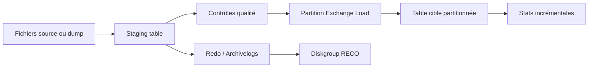

    # Module 13 — Bulk Data Loading

    ## 1. Objectif pédagogique

    Maîtriser le chargement massif : staging, external tables, SQL Loader, Data Pump, direct path, contraintes et statistiques. Le chapitre vise une compréhension opérationnelle et théorique : l’étudiant doit pouvoir expliquer le mécanisme, reconnaître les composants impliqués, lire les principales vues ou commandes et résoudre un cas d’école sans modifier l’environnement.

    ## 2. Pourquoi ce sujet est important

    Le chargement massif sur Exadata doit tenir compte du débit, de l’espace staging, des index, contraintes, redo, statistiques et possibilité de reprise. La vitesse brute ne suffit pas si la validation échoue.

    Le sujet **Read-only : capacité ASM et cellule pendant chargement** doit être traité comme un mécanisme Exadata précis : l’objectif est d’identifier les composants concernés, les métriques qui prouvent le comportement et les limites qui empêchent une conclusion hâtive.

    ## 3. Concepts clés expliqués

    | Concept | Définition claire | Exemple concret |
    |---|---|---|
    | **External Table** | Table Oracle qui lit des fichiers externes comme des lignes relationnelles. | Un fichier CSV livré par un partenaire est exposé puis inséré dans une table cible. |
| **Direct Path Load** | Chargement qui écrit directement dans les segments en contournant une partie du chemin SQL conventionnel. | SQL Loader direct path accélère une fenêtre de chargement nocturne. |
| **Bad file / reject table** | Fichier ou table enregistrant les lignes rejetées durant un chargement. | Les lignes au format invalide sont isolées pour correction. |

    Ces concepts doivent être étudiés ensemble. Par exemple, **External Table** n’a pas la même signification isolément que dans une architecture RAC, ASM et storage cells. La compréhension vient de la relation entre objet Oracle, ressource Exadata et workload applicatif.

    ## 4. Architecture concernée

    | Composant | Rôle dans ce chapitre |
    |---|---|
    | Database servers | Exécutent les instances, services, agents et outils Oracle liés au module. |
| Storage cells | Apportent stockage intelligent, flash, offload, alertes ou métriques lorsque le sujet touche les I/O. |
| ASM / Grid Infrastructure | Fournissent cluster, diskgroups, ressources RAC et accès aux fichiers Oracle. |
| Réseau RoCE / InfiniBand | Transporte les échanges internes rapides et peut influencer latence et disponibilité. |
| Outils Oracle | Enterprise Manager, AHF, Exachk, TFA, RMAN ou Data Guard selon le thème étudié. |

    Les diagrammes associés au chapitre sont :

    - [`bulk-data-loading-flow.mmd`](../diagrams/bulk-data-loading-flow.mmd)

    ## 5. Fonctionnement détaillé

    Le chargement massif sur Exadata doit tenir compte du débit, de l’espace staging, des index, contraintes, redo, statistiques et possibilité de reprise. La vitesse brute ne suffit pas si la validation échoue.

    Le fonctionnement de **Read-only : capacité ASM et cellule pendant chargement** se lit en reliant la base Oracle, Grid Infrastructure, ASM, les storage cells, le réseau privé et les outils de support uniquement lorsque ces couches interviennent réellement dans le scénario étudié.

    Pour ce module, les notions centrales sont **External Table, Direct Path Load, Bad file / reject table**. Elles déterminent la façon dont le composant réagit à une charge réelle. Pour **Read-only : capacité ASM et cellule pendant chargement**, l’analyse commence par une hypothèse technique testable, puis par des preuves read-only qui confirment ou écartent cette hypothèse. Une mauvaise lecture consiste à supposer que la plateforme corrige automatiquement un mauvais modèle de données, une requête mal écrite ou une architecture réseau incomplète.

    ## 6. Exemple concret

    Un fichier de 800 Go doit être chargé avant 6h avec contrôle des rejets et possibilité de retour arrière.

    Dans ce scénario, l’analyse commence par le symptôme métier, puis remonte vers la couche Oracle concernée. Si le sujet touche les I/O, il faut différencier le temps passé dans Oracle Database, les attentes liées aux cells, la distribution ASM et la santé des storage cells. Si le sujet touche la haute disponibilité, il faut distinguer disponibilité locale RAC, continuité de service, sauvegarde et reprise après sinistre.

    ## 7. Commandes, vues et métriques utiles

    Les commandes ci-dessous sont données comme exemples de lecture. Elles doivent être adaptées aux noms de bases, privilèges, versions et conventions du site.

    ```bash
    select * from dba_external_tables where table_name=&TABLE;
select owner,index_name,status,degree from dba_indexes where table_name=&TABLE;
select operation,status,start_time,end_time from dba_optstat_operations order by start_time desc fetch first 20 rows only;
    ```

    | Élément à lire | Interprétation |
    |---|---|
    | External Table | Cette information indique comment le mécanisme External Table se comporte dans un cas réel. Elle doit être lue avec le contexte de charge, de version et d’architecture. |
| Direct Path Load | Cette information indique comment le mécanisme Direct Path Load se comporte dans un cas réel. Elle doit être lue avec le contexte de charge, de version et d’architecture. |
| Bad file / reject table | Cette information indique comment le mécanisme Bad file / reject table se comporte dans un cas réel. Elle doit être lue avec le contexte de charge, de version et d’architecture. |

    ## 8. Interprétation des résultats

    L’interprétation doit répondre à une question technique précise. Une valeur isolée ne suffit pas : une latence se compare à une période comparable, un volume d’I/O se compare à un plan SQL et un état RAC se compare au placement attendu des services. Les métriques Exadata sont particulièrement utiles lorsqu’elles expliquent pourquoi un volume important de données a été lu, filtré, renvoyé ou retardé.

    Dans les chapitres performance, les valeurs liées aux bytes, événements `cell`, AWR ou ASH indiquent le chemin dominant. Dans les chapitres HA/DR, les états de rôle, lag, services et ressources cluster décrivent la capacité réelle à basculer ou maintenir le service. Dans les chapitres support et maintenance, les rapports AHF, Exachk ou TFA doivent être lus comme des aides structurées, pas comme des remplacements de raisonnement.

    ## 9. Erreurs fréquentes

    | Erreur | Cause probable | Correction pédagogique |
    |---|---|---|
    | Confondre symptôme et cause | Le premier message visible vient parfois d’une couche différente de la cause réelle. | Reconstituer le chemin technique avant de conclure. |
    | Appliquer une recette générique | Exadata dépend fortement du workload, du plan SQL, de la version et du modèle de service. | Relire les composants du chapitre et adapter le diagnostic. |
    | Ignorer les dépendances | Une base RAC dépend de GI, ASM, réseau privé et storage cells. | Vérifier les dépendances avant toute hypothèse. |
    | Oublier les limites du mécanisme | Certaines fonctions Exadata ne s’appliquent pas à tous les accès ou toutes les charges. | Identifier les conditions d’éligibilité et les cas d’exclusion. |

    ## 10. Bonnes pratiques

    | Bonne pratique | Application concrète |
    |---|---|
    | Partir du mécanisme | Dessiner le chemin DB → ASM → cell → réseau → retour résultat selon le sujet. |
    | Séparer lecture et changement | Les commandes de lecture servent à comprendre ; les changements exigent runbook et validation. |
    | Comparer avec un état de référence | Une valeur a du sens lorsqu’elle est rapprochée d’une période saine ou d’une cible prévue. |
    | Documenter la version | Les fonctionnalités et commandes peuvent varier selon génération Exadata et version Oracle. |

    ## 11. Exercice pratique

    Vous êtes responsable du sujet **Bulk Data Loading** sur une plateforme Exadata de formation. À partir du scénario suivant, rédigez une analyse de deux pages :

    > Un fichier de 800 Go doit être chargé avant 6h avec contrôle des rejets et possibilité de retour arrière.

    Votre réponse doit inclure un schéma simple des composants impliqués, trois commandes ou vues à exécuter, deux métriques à lire, les erreurs à éviter et une recommandation finale.

    ## 12. Corrigé de l’exercice

    Une bonne réponse commence par identifier les composants du chapitre : **External Table, Direct Path Load, Bad file / reject table**. Elle explique ensuite le chemin technique suivi par l’opération et indique pourquoi les commandes proposées permettent de vérifier ce chemin. Les commandes attendues sont celles de la section 7, adaptées aux noms réels de l’environnement.

    Le corrigé doit aussi distinguer les observations et les décisions. Par exemple, constater un lag, une alerte cell, un volume `eligible bytes` ou une ressource CRS offline ne suffit pas : il faut expliquer la conséquence sur l’application, la disponibilité ou la performance.  : optimisation SQL, ajustement de plan de ressources, revue réseau, ouverture SR, test de restore ou préparation CAB selon le module.

    ## 13. Synthèse à retenir

    ```text
    À retenir
    - Bulk Data Loading  : base, cluster, ASM, storage cells, réseau et outils Oracle.
    - Les notions centrales du chapitre sont : External Table, Direct Path Load, Bad file / reject table.
    - Les commandes de lecture permettent de comprendre le mécanisme avant toute action de changement.
    - Les erreurs les plus coûteuses viennent d’une lecture isolée d’une seule couche.
    - Un bon administrateur Exadata relie toujours architecture, workload, métriques et impact métier.
    ```


## Rectification V5 vérifiable — contenu expert non générique

Cette section rend visible la finition experte V5 pour **Chargement massif**. Elle impose un raisonnement lié aux objets réels du thème plutôt qu’une formule répétée entre modules.

| Élément expert V5 | Application concrète au module |
|---|---|
| Objets à contrôler | SQL Loader, external tables, direct path, indexes, statistiques, redo, NOLOGGING contrôlé. |
| Méthode de diagnostic | optimiser le débit sans perdre la récupérabilité ni saturer les cells. |
| Cas d’école attendu | un chargement direct path rapide doit être suivi d’une stratégie de backup et de validation des statistiques. |
| Preuve minimale | Une sortie read-only horodatée, un composant nommé, une métrique interprétée et une conséquence métier. |
| Limite | Le diagnostic reste invalide si la preuve ne distingue pas charge normale, anomalie transitoire et cause racine. |

### Raisonnement attendu

Pour **Chargement massif**, l’analyse commence par une question précise. L’administrateur ne cherche pas à appliquer une recette, mais à démontrer ou exclure une hypothèse. Les preuves doivent être collectées sans modification de configuration, puis rapprochées de la fenêtre horaire, du workload et de la version de plateforme. Une conclusion professionnelle indique ce qui est prouvé, ce qui reste incertain et quelle action peut être engagée sans augmenter le risque opérationnel.

### Exercice V5 complémentaire

Analysez le cas suivant : **un chargement direct path rapide doit être suivi d’une stratégie de backup et de validation des statistiques**. Produisez une note courte contenant le symptôme, les objets Exadata concernés, trois preuves read-only, les hypothèses rejetées et la recommandation.

### Corrigé V5 complémentaire

La réponse correcte nomme les objets du module, explique pourquoi les preuves choisies testent l’hypothèse et sépare diagnostic, décision et changement. Elle ne propose pas de modification immédiate si les métriques ne démontrent pas la cause. Elle prévoit également une validation après action, car une correction Exadata doit être prouvée par la disparition du symptôme ou par le retour à un niveau de service attendu.

## Références officielles

| Référence | Utilisation dans le module |
|---|---|
| [Oracle University — Exadata Database Machine Administration Workshop](https://education.oracle.com/exadata-database-machine-administration-workshop/courP_4599) | Cadre pédagogique général du workshop. |
| [Oracle Exadata Documentation](https://docs.oracle.com/en/engineered-systems/exadata-database-machine/) | Administration Exadata, Storage Server, CellCLI, maintenance et monitoring. |
| [Oracle Database Documentation](https://docs.oracle.com/en/database/) | Vues dynamiques, SQL, RMAN, Data Guard, AWR/ASH selon licences. |
| [Oracle Maximum Availability Architecture](https://www.oracle.com/database/technologies/high-availability/maa.html) | Principes HA/DR, Data Guard, sauvegarde et continuité de service. |
| [Oracle Autonomous Health Framework](https://docs.oracle.com/en/engineered-systems/health-diagnostics/autonomous-health-framework/) | AHF, Exachk, ORAchk, TFA et diagnostics automatisés. |
## Complément expert V5 — Chargements massifs sur Exadata

### Explication technique spécifique

Le chargement massif sur Exadata doit concilier débit, journalisation, pression flash, impact ASM, redo, undo, statistiques et concurrence I/O. Les méthodes fréquentes sont SQL*Loader direct path, external tables, Data Pump, `insert /*+ append */`, transportable tablespaces et chargements parallèles. Exadata accélère certains flux grâce à la bande passante stockage, au parallélisme et à la flash, mais un chargement mal gouverné peut saturer RECO avec les archivelogs, provoquer des waits I/O, perturber IORM ou déclencher des rebalances si la capacité est mal anticipée.[^v5-sqlloader]

Un chargement expert sépare la phase d’ingestion, la phase de validation, la phase de statistiques et la phase de mise à disposition. Les tables de staging peuvent recevoir les données avec contraintes différées, puis les partitions peuvent être échangées vers la table cible. Pour les très gros volumes, le partition exchange load réduit la durée de verrouillage sur la table finale. La question n’est pas seulement “comment charger vite”, mais “comment charger vite sans casser la fenêtre de production ni saturer les couches Exadata”.



### Exemple concret réaliste

Une équipe doit charger 800 Go de transactions quotidiennes dans une table partitionnée. Un chargement direct dans la table finale avec index globaux actifs peut générer beaucoup de redo et prolonger les verrous. Une approche plus robuste consiste à charger en staging avec direct path, contrôler les rejets, créer ou maintenir les index locaux, collecter les statistiques sur la partition, puis effectuer un exchange partition. Pendant l’opération, le DBA suit RECO, les waits `direct path write`, `log file sync`, les métriques cellule et la consommation CPU des database servers.

### Comment raisonner

Le raisonnement commence par le contrat de service : fenêtre disponible, volume, taux d’erreurs attendu, possibilité de rejouer, niveau de journalisation exigé et impact acceptable. Ensuite, on choisit la méthode : SQL*Loader pour fichiers plats, external tables pour SQL sur fichiers, Data Pump pour export/import Oracle, direct path insert pour transformations SQL, transportable tablespaces pour déplacement massif de segments. Enfin, on prépare la surveillance : DATA, RECO, archivelogs, parallélisme, stats et IORM.

### Commandes / vues utiles

```sql
-- Read-only : suivre sessions de chargement et waits
select sid, serial#, program, event, state, wait_class from v$session where program like '%sqlldr%' or module like '%Data Pump%';
select name, value from v$sysstat where name in ('redo size','physical writes direct','physical reads direct');
select tablespace_name, bytes/1024/1024 mb from dba_data_files fetch first 20 rows only;
select table_name, partition_name, num_rows, blocks, last_analyzed from dba_tab_partitions where table_name = 'SALES';
```

```bash
# Read-only : capacité ASM et cellule pendant chargement
asmcmd lsdg
cellcli -e "list metriccurrent where name like 'CD_IO%' attributes name,metricValue,objectName"
```

### Comment interpréter

Une hausse de `redo size` est normale si le chargement est journalisé ; elle devient problématique si RECO approche de la saturation ou si l’archivage ne suit plus. Les waits `direct path write` indiquent l’écriture directe des segments ; leur durée doit être analysée avec la charge cellule. Les index globaux peuvent transformer un chargement séquentiel en maintenance coûteuse. Les statistiques absentes après chargement peuvent produire de mauvais plans malgré un chargement réussi.

### Exercice pratique

On doit charger 800 Go en deux heures dans une table partitionnée utilisée le lendemain matin. Propose une stratégie Exadata et explique pourquoi elle limite le risque.

### Corrigé détaillé

Une stratégie robuste consiste à charger en staging avec direct path et parallélisme contrôlé, vérifier les rejets, collecter des statistiques sur les données chargées, puis utiliser partition exchange load vers la table cible. Il faut surveiller DATA, RECO, archivelogs, waits direct path et métriques cellule. Si la base est en production, IORM ou DBRM peut limiter l’impact sur les workloads critiques. Le corrigé est correct parce qu’il traite le chargement comme un processus complet : ingestion, validation, bascule, statistiques et surveillance, au lieu de se limiter à une commande rapide.

### Limites et pièges

Le mode NOLOGGING peut être tentant mais il a des implications de récupération et de Data Guard ; il doit respecter les règles de protection de l’entreprise. Un parallélisme trop élevé peut saturer CPU, I/O ou redo. Un exchange partition sans statistiques peut créer une régression le lendemain. Un chargement réussi techniquement mais non contrôlé fonctionnellement reste un échec opérationnel.

### À retenir

Sur Exadata, un chargement massif performant est un compromis maîtrisé entre débit, redo, capacité RECO, parallélisme, index, statistiques et protection des workloads concurrents.

[^v5-sqlloader]: Oracle, *Oracle Database Utilities — SQL*Loader and Data Pump*, https://docs.oracle.com/en/database/oracle/oracle-database/19/sutil/
