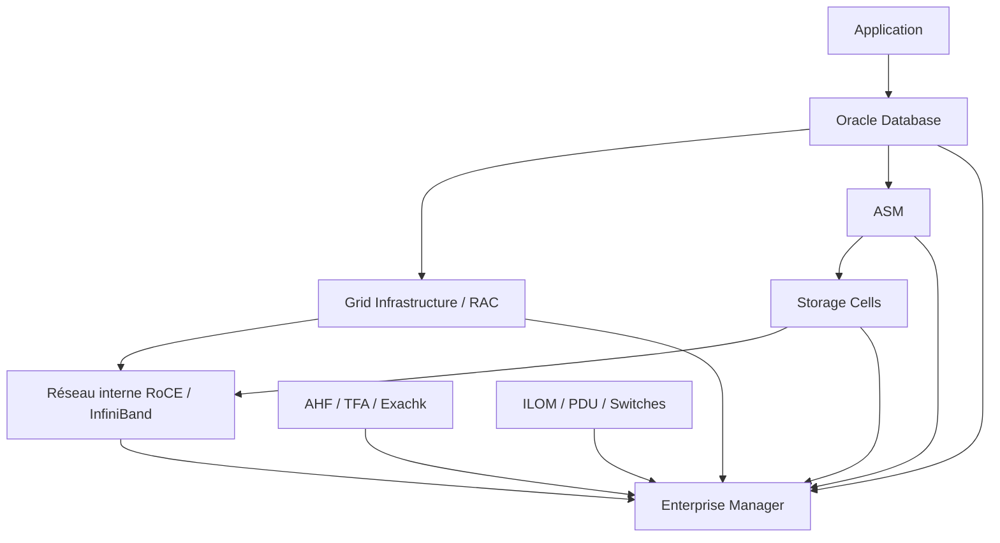

# Module 14 — Platform Monitoring Introduction

## 1. Objectif du module

Ce module introduit le **monitoring global d’une plateforme Oracle Exadata**.

L’objectif est de comprendre que le monitoring Exadata est multi-couches : une lenteur visible côté application peut provenir de la base, du cluster, d’ASM, des Storage Cells, du réseau, d’un composant matériel ou d’un outil de supervision.

À la fin de ce module, le lecteur doit être capable de :

- identifier les couches à surveiller sur Exadata ;
- relier un symptôme applicatif à une couche technique ;
- construire une timeline d’incident ;
- distinguer métrique, alerte, symptôme et cause racine ;
- comprendre le rôle d’Enterprise Manager, AHF, TFA, Exachk, CellCLI et OSWatcher ;
- définir une baseline ;
- lire des signaux database, cluster, storage, réseau et matériel ;
- éviter de conclure à partir d’un seul graphique.

---

## 2. Pourquoi le monitoring Exadata est spécifique

Exadata n’est pas un serveur Oracle isolé.

Une plateforme Exadata combine :

```text
Database Servers
Oracle Database
Grid Infrastructure
ASM
Storage Cells
Flash Cache
Smart Scan
IORM
Réseau interne RoCE / InfiniBand
Réseaux client / admin / backup
ILOM / PDU / switches
Enterprise Manager
AHF / TFA / Exachk
```

Un incident peut apparaître dans une couche et avoir sa cause dans une autre.

Exemple :

```text
Symptôme visible : application lente
Cause possible 1 : SQL mal optimisé
Cause possible 2 : cell avec latence élevée
Cause possible 3 : service RAC déplacé
Cause possible 4 : backup en concurrence
Cause possible 5 : réseau interne instable
Cause possible 6 : saturation RECO/FRA
```

À retenir :

```text
Le monitoring Exadata sert à corréler les signaux.
Il ne sert pas seulement à afficher des graphiques.
```

---

## 3. Les couches de monitoring

| Couche | Ce qu’on surveille | Outils / vues |
|---|---|---|
| Application | Temps de réponse, erreurs, transactions | APM, logs applicatifs |
| Oracle Database | sessions, SQL, wait events, AWR/ASH | SQL, AWR, ASH, EM |
| RAC / GI | services, listeners, VIP, ressources CRS | crsctl, srvctl, EM |
| ASM | DATA, RECO, rebalance, diskgroups | asmcmd, vues ASM |
| Storage Cells | flash, griddisks, disks, alerts, metrics | CellCLI, EM |
| Réseau | client, admin, backup, RDMA fabric | OS, switch, CellCLI, AHF |
| Matériel | ILOM, PDU, alimentation, température | ILOM, EM, alertes |
| Support | collecte, rapport santé, diagnostic | AHF, TFA, Exachk |

---

## 4. Symptôme, métrique, alerte et cause

Il faut distinguer quatre notions.

| Notion | Définition | Exemple |
|---|---|---|
| Symptôme | Ce que l’utilisateur ou l’application observe | lenteur paiement |
| Métrique | Mesure technique | latence I/O, CPU, wait time |
| Alerte | Signal dépassant une règle ou un seuil | alerte cell, disque predictive failure |
| Cause racine | Origine réelle du problème | griddisk dégradé, mauvais plan SQL |

Erreur fréquente :

```text
Une alerte visible n’est pas forcément la cause racine.
```

Bonne démarche :

```text
symptôme
→ période
→ composant
→ métriques
→ corrélation
→ hypothèse
→ preuve
→ conclusion
```

---

## 5. Baseline

### 5.1 Définition

Une baseline est un état de référence.

Elle décrit le comportement normal d’une plateforme.

Exemples de baseline :

```text
latence I/O normale
débit RMAN habituel
CPU moyen par plage horaire
volume archivelog par jour
temps batch habituel
nombre de sessions par service
DATA / RECO / FRA habituels
lag Data Guard normal
```

### 5.2 Pourquoi elle est indispensable

Sans baseline, une valeur est difficile à interpréter.

Exemple :

```text
Latence I/O = 8 ms
```

Question :

```text
Est-ce normal ou anormal ?
```

Réponse correcte :

```text
Cela dépend de la baseline, du workload, de la période et de la couche observée.
```

---

## 6. Timeline d’incident

La timeline relie les événements dans le temps.

Elle doit contenir :

```text
heure du symptôme métier
heure des alertes
heure des changements
heure des pics CPU/I/O
heure des batchs
heure des sauvegardes
heure des bascules ou maintenances
heure des erreurs réseau
heure des collectes TFA/AHF
```

Exemple :

```text
21:55 début backup RMAN
22:00 batch reporting
22:05 hausse cell smart table scan
22:08 latence griddisk sur cell02
22:10 application lente
22:20 alerte EM
22:30 retour normal
```

À retenir :

```text
Une bonne timeline vaut souvent mieux que dix graphiques isolés.
```

---

## 7. Architecture de monitoring Exadata

Schéma logique :



Ce schéma rappelle que le monitoring doit relier plusieurs couches.

---

## 8. Monitoring database

Côté base Oracle, on surveille :

```text
sessions
services
SQL_ID
AWR
ASH
wait events
plans SQL
CPU
I/O
locks
temp
undo
```

Commandes / vues read-only :

```sql
select inst_id, instance_name, host_name, status
from gv$instance
order by inst_id;
```

```sql
select inst_id, service_name, count(*) as sessions
from gv$session
where type = 'USER'
group by inst_id, service_name
order by sessions desc;
```

```sql
select event, total_waits, time_waited
from v$system_event
order by time_waited desc;
```

---

## 9. Monitoring RAC / Grid Infrastructure

Côté RAC/GI, on surveille :

```text
état des ressources CRS
bases
instances
listeners
SCAN
VIP
services
ASM
placement des services
```

Commandes :

```bash
crsctl stat res -t
srvctl status database -d <db_unique_name> -v
srvctl status service -d <db_unique_name>
srvctl config service -d <db_unique_name>
srvctl status scan
```

Point important :

```text
Une base ouverte ne signifie pas forcément que le service applicatif est disponible.
```

---

## 10. Monitoring ASM

ASM est central pour Exadata.

À surveiller :

```text
DATA
RECO
free_mb
usable_file_mb
rebalance
disques
failure groups
état des diskgroups
```

Commandes :

```bash
asmcmd lsdg
asmcmd lsdsk -p
```

```sql
select name, total_mb, free_mb, usable_file_mb, type, state
from v$asm_diskgroup
order by name;
```

```sql
select group_number, operation, state, power, est_minutes
from v$asm_operation;
```

---

## 11. Monitoring Storage Cells

Côté Storage Cells, on surveille :

```text
cell status
alert history
metric current
metric history
physical disks
cell disks
grid disks
flash cache
flash log
IORM
latence
débit
erreurs
```

Commandes :

```bash
cellcli -e "list cell detail"
cellcli -e "list alert history"
cellcli -e "list metriccurrent"
cellcli -e "list griddisk attributes name,status,asmmodestatus,asmdeactivationoutcome,size"
cellcli -e "list physicaldisk attributes name,status,errormessage"
```

À retenir :

```text
Les Storage Cells donnent des preuves utiles sur les I/O.
Mais il faut les relier aux SQL, services et périodes.
```

---

## 12. Monitoring réseau

Le réseau Exadata n’est pas unique.

Réseaux à distinguer :

```text
réseau client
réseau administration
réseau backup
réseau interne RoCE / InfiniBand
réseau Data Guard selon architecture
```

Symptômes possibles :

| Réseau | Symptôme possible |
|---|---|
| Client | connexions lentes ou impossibles |
| Admin | monitoring ou accès SSH perturbé |
| Backup | RMAN lent |
| Interne | latence cell, RAC, ASM |
| Data Guard | transport lag |

À retenir :

```text
Une lenteur backup ne doit pas être diagnostiquée comme une lenteur SQL sans preuve.
```

---

## 13. Monitoring matériel

Certains composants ne sont pas visibles dans SQL.

À surveiller :

```text
ILOM
PDU
alimentation
ventilateurs
température
disques physiques
switches
capteurs
firmware
```

Une alerte matérielle doit être prise au sérieux parce qu’elle peut précéder :

```text
perte d’un disque
dégradation flash
problème alimentation
throttling
panne serveur
incident réseau
```

---

## 14. Enterprise Manager

Enterprise Manager fournit une vue centralisée.

Il peut surveiller :

```text
database
listener
ASM
host
Exadata rack
Storage Cells
incidents
métriques
alertes
blackouts
jobs
```

Mais il faut vérifier :

```text
agent actif
targets découverts
blackouts terminés
seuils adaptés
incidents visibles
données récentes
```

Erreur fréquente :

```text
Aucune alerte dans EM = aucun problème.
```

Correction :

```text
Vérifier aussi la couche locale : SQL, crsctl, asmcmd, CellCLI, AHF/TFA.
```

---

## 15. AHF, TFA, Exachk, OSWatcher

Ces outils complètent le monitoring.

| Outil | Usage |
|---|---|
| AHF | Framework santé et diagnostic Oracle |
| TFA | Collecte de traces autour d’un incident |
| Exachk | Vérification santé / bonnes pratiques Exadata |
| ORAchk | Vérification santé Oracle plus générale |
| OSWatcher | Historique OS pour CPU, mémoire, I/O, réseau |

À retenir :

```text
Ces outils accélèrent le diagnostic.
Ils ne remplacent pas le raisonnement technique.
```

---

## 16. Méthode de diagnostic monitoring

Méthode simple :

```text
1. Décrire le symptôme métier.
2. Fixer la période exacte.
3. Identifier les composants concernés.
4. Lire la couche database.
5. Lire la couche RAC/GI.
6. Lire ASM.
7. Lire Storage Cells.
8. Vérifier réseau si cohérent avec le symptôme.
9. Vérifier matériel si alerte.
10. Corréler avec timeline.
11. Comparer à la baseline.
12. Conclure seulement sur preuve.
```

---

## 17. Tableau symptôme → couche à vérifier

| Symptôme | Couches à vérifier |
|---|---|
| Application lente | DB, SQL, ASH, cells, réseau, batch concurrent |
| Connexion impossible | service RAC, listener, SCAN, réseau client |
| Backup lent | RMAN, RECO/FRA, réseau backup, cells |
| Data Guard lag | redo transport, réseau, standby, apply, I/O |
| Cell alert | CellCLI, ASM, alert history, physical disks |
| CPU élevé | DB server, SQL_ID, sessions, OSWatcher |
| RECO plein | ASM, FRA, archivelogs, backup |
| Service déplacé | CRS, srvctl, services RAC |
| Incident intermittent | timeline, TFA, AHF, OSWatcher |

---

## 18. Erreurs fréquentes

| Erreur | Pourquoi c’est dangereux | Correction |
|---|---|---|
| Lire un seul graphique | Vision partielle | Corréler plusieurs couches |
| Confondre alerte et cause | Faux diagnostic | Revenir à la timeline |
| Ne pas avoir de baseline | Valeur non interprétable | Construire état de référence |
| Ignorer les services RAC | Application invisible | Surveiller par service |
| Ignorer Storage Cells | I/O non expliquées | Lire CellCLI |
| Ignorer réseau backup | RMAN mal diagnostiqué | Séparer réseaux |
| Croire EM suffisant | Agent ou target peut être KO | Vérifier localement |
| Collecter trop large | Bruit inutile | Collecter selon hypothèse |

---

## 19. Commandes read-only utiles

### Database

```sql
select inst_id, instance_name, host_name, status
from gv$instance
order by inst_id;
```

```sql
select inst_id, service_name, count(*) as sessions
from gv$session
where type = 'USER'
group by inst_id, service_name
order by sessions desc;
```

### RAC / GI

```bash
crsctl stat res -t
srvctl status database -d <db_unique_name> -v
srvctl status service -d <db_unique_name>
srvctl status scan
```

### ASM

```bash
asmcmd lsdg
asmcmd lsdsk -p
```

### Storage Cells

```bash
cellcli -e "list cell detail"
cellcli -e "list alert history"
cellcli -e "list metriccurrent"
```

### AHF / TFA

```bash
ahfctl status
tfactl print status
tfactl diagcollect -help
```

---

## 20. Exercice pratique

Une application se plaint de lenteurs entre 22h00 et 22h30.

Aucun composant isolé ne donne immédiatement la cause.

Contexte :

```text
un batch reporting tourne à 22h
une sauvegarde RMAN démarre à 21h55
une alerte cell apparaît à 22h10
le service applicatif reste online
la base reste ouverte
```

Répondez :

1. Quelle timeline construisez-vous ?
2. Quelles couches vérifiez-vous en premier ?
3. Quelles commandes read-only utilisez-vous ?
4. Comment distinguer symptôme, alerte et cause ?
5. Quelle conclusion prudente formulez-vous ?

---

## 21. Corrigé indicatif

Timeline attendue :

```text
21h55 : début RMAN
22h00 : début batch reporting
22h10 : alerte cell
22h00-22h30 : lenteur applicative
```

Couches à vérifier :

```text
database / ASH
services RAC
ASM
Storage Cells
RMAN / backup network
IORM si actif
alert history
```

Commandes :

```bash
crsctl stat res -t
srvctl status service -d <db_unique_name>
asmcmd lsdg
cellcli -e "list alert history"
cellcli -e "list metriccurrent"
```

```sql
select inst_id, sql_id, event, count(*) as samples
from gv$active_session_history
where sample_time between timestamp '2026-01-01 22:00:00'
                      and timestamp '2026-01-01 22:30:00'
group by inst_id, sql_id, event
order by samples desc;
```

Conclusion prudente :

```text
La lenteur ne doit pas être attribuée automatiquement à l’alerte cell.
Il faut corréler la période avec le batch, RMAN, les wait events,
les métriques cells et la baseline avant de conclure.
```

---

## 22. À retenir

```text
À retenir
- Le monitoring Exadata est multi-couches.
- Un symptôme applicatif peut venir de DB, RAC, ASM, cells, réseau ou matériel.
- La timeline est centrale.
- Une baseline est indispensable.
- Enterprise Manager centralise, mais ne suffit pas seul.
- CellCLI donne des preuves côté Storage Cells.
- AHF/TFA/Exachk aident à collecter et structurer.
- Une alerte n’est pas toujours la cause racine.
- La bonne démarche est : symptôme → période → couche → preuve → conclusion.
```

---

## 23. Références officielles

| Référence | Utilisation dans le module |
|---|---|
| [Oracle Exadata Documentation](https://docs.oracle.com/en/engineered-systems/exadata-database-machine/) | Architecture Exadata, Storage Cells, monitoring. |
| [Oracle Enterprise Manager Documentation](https://docs.oracle.com/en/enterprise-manager/) | Targets, agents, incidents, blackouts, monitoring centralisé. |
| [Oracle Autonomous Health Framework Documentation](https://docs.oracle.com/en/engineered-systems/health-diagnostics/autonomous-health-framework/) | AHF, TFA, ORAchk, Exachk. |
| [Oracle Database Performance Tuning Guide](https://docs.oracle.com/en/database/) | AWR, ASH, wait events, SQL monitoring. |
| [Oracle Real Application Clusters Documentation](https://docs.oracle.com/en/database/) | RAC, services, GI, CRS. |
