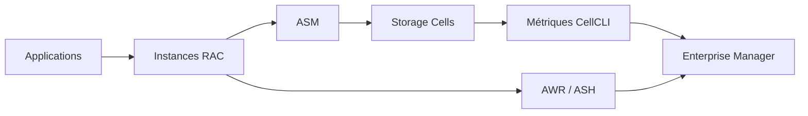

    # Module 14 — Platform Monitoring Introduction

    ## 1. Objectif pédagogique

    Construire une vision d’observabilité Exadata sur les couches DB, GI, storage, réseau et support. Le chapitre vise une compréhension opérationnelle et théorique : l’étudiant doit pouvoir expliquer le mécanisme, reconnaître les composants impliqués, lire les principales vues ou commandes et résoudre un cas d’école sans modifier l’environnement.

    ## 2. Pourquoi ce sujet est important

    Le monitoring Exadata est multi-couches. Un incident visible dans la base peut avoir une origine storage, réseau ou cluster. Le cours enseigne comment lire les signaux de chaque couche.

    Le monitoring Exadata transforme des signaux dispersés en preuve d’exploitation. Il sert à relier un symptôme applicatif aux métriques database, cluster, storage cell, réseau ou support automatisé.

    ## 3. Concepts clés expliqués

    | Concept | Définition claire | Exemple concret |
    |---|---|---|
    | **Baseline** | État de référence décrivant comportement normal d’une plateforme. | La latence I/O moyenne en heure creuse n’est pas comparée à un pic batch. |
| **Timeline incident** | Chronologie des symptômes, changements et alertes. | Un patch réseau à 22h précède des erreurs interconnect à 22h15. |
| **Target monitoring** | Objet surveillé par EM ou outil équivalent. | Une database, une ASM instance ou une storage cell est un target. |

    Ces concepts doivent être étudiés ensemble. Par exemple, **Baseline** n’a pas la même signification isolément que dans une architecture RAC, ASM et storage cells. La compréhension vient de la relation entre objet Oracle, ressource Exadata et workload applicatif.

    ## 4. Architecture concernée

    | Composant | Rôle dans ce chapitre |
    |---|---|
    | Database servers | Exécutent les instances, services, agents et outils Oracle liés au module. |
| Storage cells | Apportent stockage intelligent, flash, offload, alertes ou métriques lorsque le sujet touche les I/O. |
| ASM / Grid Infrastructure | Fournissent cluster, diskgroups, ressources RAC et accès aux fichiers Oracle. |
| Réseau RoCE / InfiniBand | Transporte les échanges internes rapides et peut influencer latence et disponibilité. |
| Outils Oracle | Enterprise Manager, AHF, Exachk, TFA, RMAN ou Data Guard selon le thème étudié. |

    Les diagrammes associés au chapitre sont :

    - [`monitoring-stack.mmd`](../diagrams/monitoring-stack.mmd)

    ## 5. Fonctionnement détaillé

    Le monitoring Exadata est multi-couches. Un incident visible dans la base peut avoir une origine storage, réseau ou cluster. Le cours enseigne comment lire les signaux de chaque couche.

    Le fonctionnement se lit par corrélation temporelle : événement métier, métrique database, état cluster, alerte cell, métrique réseau et rapport d’outil. Le diagnostic valide que les horodatages, instances et composants désignent la même période.

    Pour ce module, les notions centrales sont **Baseline, Timeline incident, Target monitoring**. Elles déterminent la façon dont le composant réagit à une charge réelle. Pour le monitoring, l’analyse commence par la question opérationnelle à résoudre, puis sélectionne les métriques utiles au lieu d’empiler des graphiques sans hypothèse. Une mauvaise lecture consiste à supposer que la plateforme corrige automatiquement un mauvais modèle de données, une requête mal écrite ou une architecture réseau incomplète.

    ## 6. Exemple concret

    Une application se plaint de lenteurs ; aucun composant isolé ne suffit à expliquer le symptôme.

    Dans ce scénario, l’analyse commence par le symptôme métier, puis remonte vers la couche Oracle concernée. Si le sujet touche les I/O, il faut différencier le temps passé dans Oracle Database, les attentes liées aux cells, la distribution ASM et la santé des storage cells. Si le sujet touche la haute disponibilité, il faut distinguer disponibilité locale RAC, continuité de service, sauvegarde et reprise après sinistre.

    ## 7. Commandes, vues et métriques utiles

    Les commandes ci-dessous sont données comme exemples de lecture. Elles doivent être adaptées aux noms de bases, privilèges, versions et conventions du site.

    ```bash
    crsctl stat res -t
cellcli -e "list alerthistory detail"
tfactl print status
    ```

    | Élément à lire | Interprétation |
    |---|---|
    | Baseline | Cette information indique comment le mécanisme Baseline se comporte dans un cas réel. Elle doit être lue avec le contexte de charge, de version et d’architecture. |
| Timeline incident | Cette information indique comment le mécanisme Timeline incident se comporte dans un cas réel. Elle doit être lue avec le contexte de charge, de version et d’architecture. |
| Target monitoring | Cette information indique comment le mécanisme Target monitoring se comporte dans un cas réel. Elle doit être lue avec le contexte de charge, de version et d’architecture. |

    ## 8. Interprétation des résultats

    L’interprétation doit répondre à une question technique précise. Une valeur isolée ne suffit pas : une latence se compare à une période comparable, un volume d’I/O se compare à un plan SQL et un état RAC se compare au placement attendu des services. Les métriques Exadata sont particulièrement utiles lorsqu’elles expliquent pourquoi un volume important de données a été lu, filtré, renvoyé ou retardé.

    Dans les chapitres performance, les valeurs liées aux bytes, événements `cell`, AWR ou ASH indiquent le chemin dominant. Dans les chapitres HA/DR, les états de rôle, lag, services et ressources cluster décrivent la capacité réelle à basculer ou maintenir le service. Dans les chapitres support et maintenance, les rapports AHF, Exachk ou TFA doivent être lus comme des aides structurées, pas comme des remplacements de raisonnement.

    ## 9. Erreurs fréquentes

    | Erreur | Cause probable | Correction pédagogique |
    |---|---|---|
    | Confondre symptôme et cause | Le premier message visible vient parfois d’une couche différente de la cause réelle. | Reconstituer le chemin technique avant de conclure. |
    | Appliquer une recette générique | Exadata dépend fortement du workload, du plan SQL, de la version et du modèle de service. | Relire les composants du chapitre et adapter le diagnostic. |
    | Ignorer les dépendances | Une base RAC dépend de GI, ASM, réseau privé et storage cells. | Vérifier les dépendances avant toute hypothèse. |
    | Oublier les limites du mécanisme | Certaines fonctions Exadata ne s’appliquent pas à tous les accès ou toutes les charges. | Identifier les conditions d’éligibilité et les cas d’exclusion. |

    ## 10. Bonnes pratiques

    | Bonne pratique | Application concrète |
    |---|---|
    | Partir du mécanisme | Dessiner le chemin DB → ASM → cell → réseau → retour résultat selon le sujet. |
    | Séparer lecture et changement | Les commandes de lecture servent à comprendre ; les changements exigent runbook et validation. |
    | Comparer avec un état de référence | Une valeur a du sens lorsqu’elle est rapprochée d’une période saine ou d’une cible prévue. |
    | Documenter la version | Les fonctionnalités et commandes peuvent varier selon génération Exadata et version Oracle. |

    ## 11. Exercice pratique

    Vous êtes responsable du sujet **Platform Monitoring Introduction** sur une plateforme Exadata de formation. À partir du scénario suivant, rédigez une analyse de deux pages :

    > Une application se plaint de lenteurs ; aucun composant isolé ne suffit à expliquer le symptôme.

    Votre réponse doit inclure un schéma simple des composants impliqués, trois commandes ou vues à exécuter, deux métriques à lire, les erreurs à éviter et une recommandation finale.

    ## 12. Corrigé de l’exercice

    Une bonne réponse commence par identifier les composants du chapitre : **Baseline, Timeline incident, Target monitoring**. Elle explique ensuite le chemin technique suivi par l’opération et indique pourquoi les commandes proposées permettent de vérifier ce chemin. Les commandes attendues sont celles de la section 7, adaptées aux noms réels de l’environnement.

    Le corrigé doit aussi distinguer les observations et les décisions. Par exemple, constater un lag, une alerte cell, un volume `eligible bytes` ou une ressource CRS offline ne suffit pas : il faut expliquer la conséquence sur l’application, la disponibilité ou la performance.  : optimisation SQL, ajustement de plan de ressources, revue réseau, ouverture SR, test de restore ou préparation CAB selon le module.

    ## 13. Synthèse à retenir

    ```text
    À retenir
    - Platform Monitoring Introduction  : base, cluster, ASM, storage cells, réseau et outils Oracle.
    - Les notions centrales du chapitre sont : Baseline, Timeline incident, Target monitoring.
    - Les commandes de lecture permettent de comprendre le mécanisme avant toute action de changement.
    - Les erreurs les plus coûteuses viennent d’une lecture isolée d’une seule couche.
    - Un bon administrateur Exadata relie toujours architecture, workload, métriques et impact métier.
    ```


## Rectification V5 vérifiable — contenu expert non générique

Cette section rend visible la finition experte V5 pour **Introduction au monitoring plateforme**. Elle impose un raisonnement lié aux objets réels du thème plutôt qu’une formule répétée entre modules.

| Élément expert V5 | Application concrète au module |
|---|---|
| Objets à contrôler | événements database, alertes cell, métriques OS, Enterprise Manager, AHF. |
| Méthode de diagnostic | transformer des signaux dispersés en chronologie unique. |
| Cas d’école attendu | un pic applicatif doit être rapproché des métriques base, cell et réseau de la même minute. |
| Preuve minimale | Une sortie read-only horodatée, un composant nommé, une métrique interprétée et une conséquence métier. |
| Limite | Le diagnostic reste invalide si la preuve ne distingue pas charge normale, anomalie transitoire et cause racine. |

### Raisonnement attendu

Pour **Introduction au monitoring plateforme**, l’analyse commence par une question précise. L’administrateur ne cherche pas à appliquer une recette, mais à démontrer ou exclure une hypothèse. Les preuves doivent être collectées sans modification de configuration, puis rapprochées de la fenêtre horaire, du workload et de la version de plateforme. Une conclusion professionnelle indique ce qui est prouvé, ce qui reste incertain et quelle action peut être engagée sans augmenter le risque opérationnel.

### Exercice V5 complémentaire

Analysez le cas suivant : **un pic applicatif doit être rapproché des métriques base, cell et réseau de la même minute**. Produisez une note courte contenant le symptôme, les objets Exadata concernés, trois preuves read-only, les hypothèses rejetées et la recommandation.

### Corrigé V5 complémentaire

La réponse correcte nomme les objets du module, explique pourquoi les preuves choisies testent l’hypothèse et sépare diagnostic, décision et changement. Elle ne propose pas de modification immédiate si les métriques ne démontrent pas la cause. Elle prévoit également une validation après action, car une correction Exadata doit être prouvée par la disparition du symptôme ou par le retour à un niveau de service attendu.

## Références officielles

| Référence | Utilisation dans le module |
|---|---|
| [Oracle University — Exadata Database Machine Administration Workshop](https://education.oracle.com/exadata-database-machine-administration-workshop/courP_4599) | Cadre pédagogique général du workshop. |
| [Oracle Exadata Documentation](https://docs.oracle.com/en/engineered-systems/exadata-database-machine/) | Administration Exadata, Storage Server, CellCLI, maintenance et monitoring. |
| [Oracle Database Documentation](https://docs.oracle.com/en/database/) | Vues dynamiques, SQL, RMAN, Data Guard, AWR/ASH selon licences. |
| [Oracle Maximum Availability Architecture](https://www.oracle.com/database/technologies/high-availability/maa.html) | Principes HA/DR, Data Guard, sauvegarde et continuité de service. |
| [Oracle Autonomous Health Framework](https://docs.oracle.com/en/engineered-systems/health-diagnostics/autonomous-health-framework/) | AHF, Exachk, ORAchk, TFA et diagnostics automatisés. |
## Complément expert V5 — Introduction au monitoring Exadata multi-couches

### Explication technique spécifique

Le monitoring Exadata ne consiste pas à regarder une seule alerte ou un seul graphe. Pour **la plate-forme Exadata complète**, l’objectif est de rapprocher l’état matériel, l’état logiciel, les métriques courantes et la perception côté base. Une alerte cellule peut être bénigne si elle correspond à une transition attendue, mais elle peut aussi expliquer une hausse de latence observée par les sessions Oracle. La démarche experte consiste à identifier la mesure native, son objet, son horodatage, puis à la comparer avec les waits, les statistiques SQL et l’état ASM. Enterprise Manager apporte une vision centralisée, tandis que `cellcli`, les vues dynamiques et les journaux de diagnostic donnent une preuve locale.[^v5-monitoring]

Pour ce thème, un DBA confirmé doit distinguer **symptôme**, **cause probable** et **preuve observable**. Le symptôme typique est : une hausse simultanée des temps de réponse SQL et des alertes de capacité. La cause peut être locale au composant, liée à une saturation, à une opération planifiée ou à une panne partielle. La preuve doit venir d’au moins deux sources indépendantes : métrique cellule et vue base, alerte système et historique Enterprise Manager, ou état ASM et journal Exadata.

| Indicateur | Ce qu’il mesure | Interprétation experte |
|---|---|---|
| `DB_IO_RQ_SM_SEC` | Débit de petites I/O côté base ou cellule selon contexte | Utile pour distinguer OLTP intensif et scans volumineux |
| `CL_CPUT` | Utilisation CPU cellule | Une cellule CPU-bound peut ralentir offload et compression |
| `GD_IO_RQ_LG_SEC` | Grandes requêtes I/O sur grid disks | Souvent lié aux scans, backups ou chargements |



### Exemple concret réaliste

Pendant une fenêtre de reporting, l’équipe observe une hausse simultanée des temps de réponse SQL et des alertes de capacité. Le réflexe débutant serait de conclure à un problème général de performance. L’analyse V5 impose plutôt de vérifier si l’événement est isolé à une cellule, à un database server, à un réseau ou à une base. Si une seule cellule montre une métrique anormale alors que les autres restent stables, la piste est locale. Si toutes les cellules montrent la même hausse au même instant, il faut chercher une opération globale : chargement massif, backup, rebalance ASM, scan parallèle ou patching.

### Comment raisonner

Commence par fixer la période exacte de l’incident, puis compare trois horloges : heure applicative, heure base et heure composant Exadata. Ensuite, identifie l’objet affecté : cellule, disque, flash, port réseau, instance, service, diskgroup ou target Enterprise Manager. Enfin, vérifie si l’anomalie modifie réellement l’expérience des sessions : hausse des waits, baisse de débit, erreurs applicatives ou alertes critiques. Une métrique élevée sans impact observable peut rester un signal de capacité ; une métrique modérée mais corrélée à des erreurs peut être prioritaire.

### Commandes / vues utiles

```bash
cellcli -e "list cell detail"
cellcli -e "list metriccurrent attributes name,metricValue,objectName"
cellcli -e "list alerthistory attributes severity,alertMessage,beginTime"
```

```sql
select inst_id, event, total_waits, time_waited_micro
from gv$system_event
where event like 'cell%' or event like 'gc%' or event like 'log file%'
order by time_waited_micro desc fetch first 20 rows only;

select inst_id, name, value
from gv$sysstat
where name like 'cell%' or name like 'physical%'
order by inst_id, name;
```

### Comment interpréter

L’interprétation correcte cherche une corrélation, pas une coïncidence. Si la métrique change avant le symptôme applicatif, elle peut être causale. Si elle change après, elle peut être une conséquence. Si elle ne change que sur un composant, la portée est locale. Si elle change partout, la cause est probablement un workload ou une opération de plate-forme. Une hausse globale sans alerte matérielle oriente vers le workload ; une alerte critique localisée oriente vers composant.

### Exercice pratique

Un rapport EM montre une hausse globale de latence à 22h00. Décris comment distinguer incident plate-forme et batch applicatif.

### Corrigé détaillé

La bonne réponse commence par la chronologie et l’étendue. Si toutes les bases et cellules sont touchées à 22h00, un batch, backup ou rebalance global est probable. Si une seule base souffre, il faut inspecter ses plans SQL et services. On vérifie les alertes, métriques cellule, waits GV$ et jobs planifiés. La conclusion est justifiée seulement si les sources convergent.

### Limites et pièges

Le principal piège est de diagnostiquer depuis une capture unique. Exadata est fortement parallèle : un instantané peut masquer un pic court, un effet de cache ou une opération transitoire. Il faut conserver l’horodatage, comparer plusieurs composants et éviter les actions correctives sans preuve. Les commandes proposées ici restent read-only et servent à documenter l’état, pas à modifier la plate-forme.

### À retenir

Pour la plate-forme Exadata complète, le monitoring expert relie métriques Exadata, vues Oracle, alertes et chronologie. La valeur pédagogique vient de l’interprétation, pas de l’accumulation de sorties brutes.

[^v5-monitoring]: Oracle, *Monitoring Oracle Exadata Database Machine*, https://docs.oracle.com/en/engineered-systems/exadata-database-machine/dbmmn/
