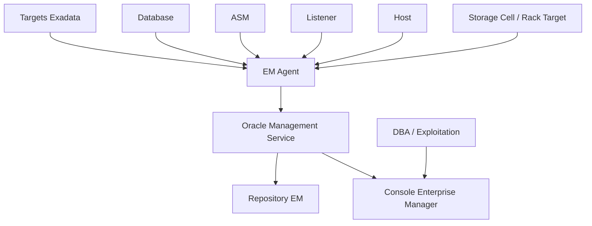

# Module 16 — Enterprise Manager Cloud Control

## 1. Objectif du module

Ce module explique comment utiliser **Oracle Enterprise Manager Cloud Control** pour surveiller une plateforme Oracle Exadata.

L’objectif est de comprendre qu’Enterprise Manager centralise la supervision, mais ne remplace pas les vérifications locales. Une absence d’alerte dans EM ne prouve pas qu’il n’y a aucun problème : les agents, targets, blackouts, seuils, collectes et droits doivent eux-mêmes être contrôlés.

À la fin de ce module, le lecteur doit être capable de :

- expliquer le rôle d’Enterprise Manager dans le monitoring Exadata ;
- comprendre les notions d’agent, target, incident, metric et blackout ;
- vérifier qu’un target est découvert et surveillé ;
- comprendre les risques d’un agent arrêté ou mal configuré ;
- distinguer alerte EM, incident EM et problème réel ;
- utiliser EM pour corréler database, ASM, host, cell et rack ;
- savoir quand compléter EM avec CellCLI, SQL, crsctl, AHF ou TFA ;
- préparer une vérification post-maintenance.

---

## 2. Pourquoi Enterprise Manager est important

Enterprise Manager donne une vue centralisée sur :

```text
bases Oracle
instances RAC
listeners
ASM
hosts
Exadata rack
Storage Cells
services
jobs
incidents
métriques
alertes
blackouts
```

Il aide à :

```text
suivre la santé globale
visualiser les alertes
centraliser les incidents
surveiller les performances
piloter des jobs
conserver un historique
préparer un dossier support
```

Mais il dépend de :

```text
agents actifs
targets découverts
permissions
réseau de supervision
seuils adaptés
collectes récentes
blackouts correctement terminés
```

À retenir :

```text
Enterprise Manager est un point de supervision central.
Mais il n’est pas une preuve unique.
```

---

## 3. Concepts clés

| Concept | Définition | Exemple |
|---|---|---|
| Agent EM | Processus installé sur un hôte pour collecter et envoyer des données | Agent arrêté = métriques absentes |
| Target | Objet surveillé par EM | database, host, ASM, listener, cell |
| Metric | Mesure collectée | CPU, sessions, latence, espace |
| Incident | Regroupement d’alertes ou problèmes | Incident storage cell |
| Alert | Signal déclenché par seuil ou règle | tablespace presque plein |
| Blackout | Suspension programmée des alertes | maintenance planifiée |
| Repository EM | Base stockant les données EM | Historique de monitoring |
| OMS | Oracle Management Service | Serveur central EM |

---

## 4. Architecture Enterprise Manager

Schéma logique :



À surveiller dans cette architecture :

```text
agent
communication agent → OMS
repository EM
targets découverts
statut des collections
blackouts
incidents
seuils
```

---

## 5. Targets Exadata

Enterprise Manager peut surveiller plusieurs types de targets.

| Target | Exemple de surveillance |
|---|---|
| Host | CPU, mémoire, filesystem, agent |
| Oracle Database | sessions, wait events, tablespaces |
| RAC Database | instances, services, disponibilité |
| ASM | diskgroups, rebalance, capacité |
| Listener | disponibilité, connexions |
| Exadata Rack | vue globale machine |
| Storage Cell | alertes, métriques, disques |
| Cluster | ressources CRS, disponibilité |

Erreur fréquente :

```text
Surveiller uniquement la database et oublier les Storage Cells.
```

---

## 6. Agent EM

### 6.1 Rôle

L’agent collecte les informations locales et les remonte vers Enterprise Manager.

Il peut collecter :

```text
métriques OS
métriques database
statut targets
configuration
alertes
jobs
disponibilité
```

### 6.2 Risques

Si l’agent est arrêté ou en erreur :

```text
les métriques ne remontent plus
les alertes peuvent être absentes
les targets peuvent apparaître indisponibles
les incidents peuvent être incomplets
```

Commandes utiles selon environnement :

```bash
emctl status agent
emctl upload agent
emctl pingOMS
```

À retenir :

```text
Avant de conclure qu’il n’y a pas d’alerte, il faut vérifier que l’agent collecte bien.
```

---

## 7. Blackout

### 7.1 Définition

Un blackout suspend les alertes EM pendant une maintenance.

Cas d’usage :

```text
patching
redémarrage programmé
maintenance réseau
intervention storage
test contrôlé
```

### 7.2 Risque

Un blackout oublié peut masquer un vrai incident.

Questions à poser :

```text
Un blackout est-il actif ?
Le blackout couvre-t-il le bon target ?
Le blackout est-il terminé ?
Les alertes sont-elles réactivées ?
```

Erreur fréquente :

```text
Après maintenance, les alertes ne remontent plus parce qu’un blackout est resté actif.
```

---

## 8. Incidents et alertes

Enterprise Manager regroupe les signaux sous forme d’alertes et d’incidents.

À lire :

```text
target concerné
sévérité
heure de début
heure de fin
message
métrique source
répétition
statut ouvert/fermé
actions associées
```

Attention :

```text
Une alerte EM peut être une conséquence et non la cause.
```

Exemple :

```text
Alerte tablespace plein
Cause réelle : batch massif + archivelogs + purge non exécutée
```

---

## 9. Monitoring performance dans EM

EM peut aider à lire :

```text
AWR
ASH
top activity
SQL monitoring
sessions
wait events
services
CPU
I/O
tablespaces
incidents
```

Mais il faut compléter avec :

```text
DBMS_XPLAN
requêtes SQL directes
crsctl / srvctl
asmcmd
CellCLI
AHF/TFA
```

À retenir :

```text
EM aide à naviguer.
Les preuves techniques doivent parfois être confirmées localement.
```

---

## 10. EM et Exadata Storage Cells

Pour Exadata, EM doit permettre de voir les Storage Cells ou targets associés.

À vérifier :

```text
targets cells découverts
alertes cells visibles
métriques cells collectées
état des physical disks
état des grid disks
flash cache
metric history
incidents hardware
```

Vérification locale complémentaire :

```bash
cellcli -e "list cell detail"
cellcli -e "list alert history detail"
cellcli -e "list metriccurrent"
cellcli -e "list physicaldisk attributes name,status,errormessage"
```

---

## 11. EM, RAC et services

EM doit aider à suivre :

```text
bases RAC
instances
services
listeners
SCAN
ressources CRS
placement des services
```

Vérification locale :

```bash
crsctl stat res -t
srvctl status database -d <db_unique_name> -v
srvctl status service -d <db_unique_name>
srvctl config service -d <db_unique_name>
```

Point clé :

```text
Une base visible dans EM ne garantit pas que le service applicatif attendu est actif.
```

---

## 12. EM et ASM

EM peut surveiller :

```text
diskgroups
DATA
RECO
free space
usable space
rebalance
alertes ASM
```

Vérification locale :

```bash
asmcmd lsdg
```

```sql
select name, total_mb, free_mb, usable_file_mb, type, state
from v$asm_diskgroup
order by name;
```

---

## 13. Post-maintenance : méthode de vérification

Après maintenance, vérifier :

```text
agents actifs
targets visibles
blackouts terminés
incidents nouveaux
métriques récentes
bases ouvertes
services actifs
ASM OK
cells sans alerte bloquante
jobs EM éventuels OK
```

Méthode :

```text
1. Vérifier statut agent.
2. Vérifier upload agent.
3. Vérifier blackouts.
4. Vérifier disponibilité des targets.
5. Vérifier incidents ouverts.
6. Vérifier métriques récentes.
7. Vérifier localement si EM est silencieux.
```

---

## 14. Exemple concret

Situation :

```text
Après maintenance, les alertes Exadata ne remontent plus.
```

Hypothèses :

```text
agent arrêté
agent ne communique plus avec OMS
blackout encore actif
targets non disponibles
seuils modifiés
problème repository/OMS
incident réel non collecté
```

Vérifications :

```bash
emctl status agent
emctl upload agent
emctl pingOMS
```

Puis côté Exadata :

```bash
cellcli -e "list alert history detail"
crsctl stat res -t
asmcmd lsdg
```

Conclusion prudente :

```text
L’absence d’alerte dans EM n’est fiable que si les agents,
targets, blackouts et collectes sont eux-mêmes validés.
```

---

## 15. EM Cloud Control et responsabilité

Dans un contexte Exadata Cloud Service ou Cloud@Customer, la supervision dépend aussi du modèle de responsabilité.

À distinguer :

```text
ce que le client voit
ce qu’Oracle opère
ce qui est visible dans OCI
ce qui est visible dans EM
ce qui demande un SR Oracle
ce qui reste administré par le DBA
```

À retenir :

```text
La frontière de responsabilité change selon on-prem, Exadata Cloud Service et Cloud@Customer.
```

---

## 16. Erreurs fréquentes

| Erreur | Pourquoi c’est dangereux | Correction |
|---|---|---|
| Croire qu’EM suffit | Agent ou target peut être KO | Vérifier localement |
| Oublier les blackouts | Alertes masquées | Contrôler blackouts |
| Surveiller seulement database | Storage/cell invisible | Ajouter targets Exadata |
| Ignorer la fraîcheur des métriques | Données anciennes | Vérifier dernière collecte |
| Confondre incident EM et cause racine | Diagnostic faux | Corréler avec timeline |
| Ne pas vérifier agents après maintenance | Supervision aveugle | Post-check EM |
| Oublier droits/permissions | Targets invisibles | Vérifier accès |

---

## 17. Commandes read-only utiles

### Agent EM

```bash
emctl status agent
emctl upload agent
emctl pingOMS
```

### RAC / GI

```bash
crsctl stat res -t
srvctl status database -d <db_unique_name> -v
srvctl status service -d <db_unique_name>
```

### ASM

```bash
asmcmd lsdg
```

```sql
select name, total_mb, free_mb, usable_file_mb, type, state
from v$asm_diskgroup
order by name;
```

### Storage Cells

```bash
cellcli -e "list cell detail"
cellcli -e "list alert history detail"
cellcli -e "list metriccurrent"
cellcli -e "list physicaldisk attributes name,status,errormessage"
```

### Database

```sql
select inst_id, instance_name, host_name, status
from gv$instance
order by inst_id;
```

```sql
select inst_id, service_name, count(*) as sessions
from gv$session
where type = 'USER'
group by inst_id, service_name
order by sessions desc;
```

---

## 18. Exercice pratique

Après une maintenance, l’équipe constate que les alertes Exadata ne remontent plus dans Enterprise Manager.

Contexte :

```text
la base est ouverte
les applications fonctionnent
aucune alerte EM visible
une alerte CellCLI existe pourtant sur une Storage Cell
un blackout avait été créé pour la maintenance
```

Répondez :

1. Quelles hypothèses formulez-vous ?
2. Que vérifiez-vous dans EM ?
3. Que vérifiez-vous localement ?
4. Pourquoi l’absence d’alerte EM ne suffit pas ?
5. Quelle recommandation finale donnez-vous ?

---

## 19. Corrigé indicatif

Hypothèses :

```text
blackout encore actif
agent EM arrêté
agent ne communique plus avec OMS
target cell non découvert ou indisponible
collecte métrique en retard
droits/permissions insuffisants
```

Vérifications EM :

```text
blackouts
targets
incidents
dernière collecte
statut agent
statut target cell
```

Vérifications locales :

```bash
emctl status agent
emctl pingOMS
cellcli -e "list alert history detail"
crsctl stat res -t
asmcmd lsdg
```

Conclusion :

```text
L’absence d’alerte EM ne prouve rien tant que l’agent, le target,
les blackouts et la fraîcheur des métriques ne sont pas validés.
```

Recommandation :

```text
Clôturer ou corriger le blackout, vérifier les agents, forcer une collecte
selon procédure, confirmer les alertes localement puis documenter le post-check.
```

---

## 20. À retenir

```text
À retenir
- Enterprise Manager centralise le monitoring Exadata.
- EM dépend des agents, targets, seuils, blackouts et collectes.
- Un target manquant rend une couche invisible.
- Un blackout oublié peut masquer un incident.
- Une absence d’alerte EM ne prouve pas une absence de problème.
- EM doit être complété par SQL, crsctl, asmcmd, CellCLI, AHF/TFA.
- Après maintenance, le post-check EM est obligatoire.
```

---

## 21. Références officielles

| Référence | Utilisation dans le module |
|---|---|
| [Oracle Enterprise Manager Cloud Control Documentation](https://docs.oracle.com/en/enterprise-manager/) | Agents, targets, incidents, blackouts, monitoring. |
| [Oracle Exadata Documentation](https://docs.oracle.com/en/engineered-systems/exadata-database-machine/) | Targets Exadata, Storage Cells, monitoring machine. |
| [Oracle Database Performance Tuning Guide](https://docs.oracle.com/en/database/) | AWR, ASH, SQL monitoring, wait events. |
| [Oracle RAC Documentation](https://docs.oracle.com/en/database/) | Services RAC, CRS, listeners, availability. |
| [Oracle Autonomous Health Framework Documentation](https://docs.oracle.com/en/engineered-systems/health-diagnostics/autonomous-health-framework/) | AHF, TFA, diagnostic complémentaire. |
