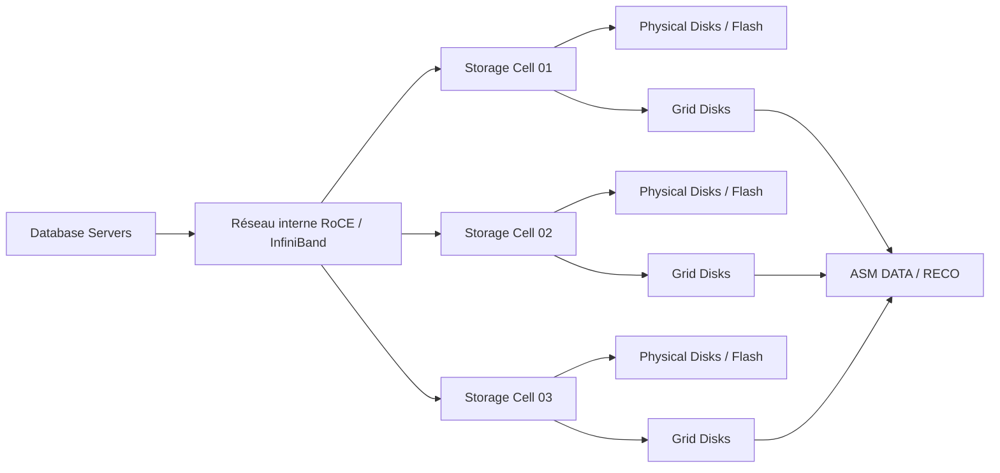

# Module 17 — Monitoring Storage Servers

## 1. Objectif du module

Ce module explique comment surveiller les **Storage Servers Exadata**, aussi appelés **Storage Cells**.

L’objectif est de comprendre que les Storage Cells ne sont pas de simples baies de disques. Elles exécutent Exadata System Software, exposent CellCLI, gèrent les physical disks, cell disks, grid disks, Flash Cache, Flash Log, IORM, Smart Scan, alertes et métriques de performance.

À la fin de ce module, le lecteur doit être capable de :

- expliquer le rôle d’une Storage Cell ;
- lire l’état général d’une cell ;
- surveiller physical disks, cell disks et grid disks ;
- interpréter `alerthistory`, `metriccurrent` et `metrichistory` ;
- vérifier Flash Cache et Flash Log ;
- relier une latence cell à un SQL, un service ou un workload ;
- distinguer panne matérielle, saturation, déséquilibre et comportement normal ;
- utiliser des commandes CellCLI read-only ;
- éviter de conclure à partir d’une seule métrique.

---

## 2. Rôle des Storage Servers

Les Storage Servers fournissent le stockage intelligent d’Exadata.

Ils assurent notamment :

```text
lecture/écriture des données Oracle
gestion des disques physiques
gestion des cell disks
gestion des grid disks
Flash Cache
Flash Log
Smart Scan
SQL Offload
Storage Index
IORM
métriques I/O
alertes hardware/software
```

Schéma logique :



---

## 3. Objets principaux à connaître

| Objet | Définition |
|---|---|
| Physical Disk | Disque physique ou composant flash réel |
| Cell Disk | Objet logique créé à partir d’un physical disk |
| Grid Disk | Portion de cell disk présentée à ASM |
| Flash Cache | Cache flash utilisé pour accélérer certaines lectures |
| Flash Log | Zone flash utilisée pour optimiser certaines écritures redo |
| CellCLI | Interface d’administration et de lecture des Storage Cells |
| Alert History | Historique des alertes cell |
| MetricCurrent | Métriques courantes |
| MetricHistory | Métriques historiques |
| IORM | Gestion des priorités I/O côté Storage Cells |

---

## 4. Physical Disks

Les physical disks sont les composants matériels de stockage.

À surveiller :

```text
status
erreurs
predictive failure
remplacement
performance anormale
latence
capacité
```

Commande :

```bash
cellcli -e "list physicaldisk attributes name,status,errormessage"
```

Interprétation :

| Observation | Lecture |
|---|---|
| status normal | disque visible et sain selon la cell |
| predictive failure | risque matériel à traiter |
| errormessage non vide | anomalie à qualifier |
| plusieurs disques en erreur | risque majeur sur redondance |

---

## 5. Cell Disks

Les cell disks sont créés à partir des physical disks.

Ils servent de base aux grid disks.

Commande :

```bash
cellcli -e "list celldisk attributes name,status,size"
```

À vérifier :

```text
nom
statut
taille
correspondance physical disk
erreurs
```

---

## 6. Grid Disks

Les grid disks sont présentés à ASM.

Ils sont essentiels car ASM s’appuie dessus pour DATA et RECO.

Commande :

```bash
cellcli -e "list griddisk attributes name,status,asmmodestatus,asmdeactivationoutcome,size"
```

À surveiller :

```text
status
asmmodestatus
asmdeactivationoutcome
size
relation avec DATA / RECO
déséquilibre éventuel
```

Lecture importante :

```text
Un grid disk visible côté cell doit aussi être cohérent côté ASM.
```

Complément côté ASM :

```bash
asmcmd lsdg
asmcmd lsdsk -p
```

---

## 7. Alert History

### 7.1 Rôle

L’alert history garde les alertes connues par la cell.

Commande :

```bash
cellcli -e "list alert history detail"
```

À lire :

```text
date
severity
type
message
component
status
répétition
corrélation avec incident
```

### 7.2 Active vs historique

Une alerte peut être :

```text
active
cleared
ancienne
récurrente
isolée
corrélée à un incident
```

Erreur fréquente :

```text
Voir une alerte ancienne et conclure qu’elle explique l’incident actuel.
```

Correction :

```text
Comparer l’heure de l’alerte avec la timeline applicative.
```

---

## 8. MetricCurrent

`metriccurrent` affiche les métriques courantes.

Commande :

```bash
cellcli -e "list metriccurrent"
```

À utiliser pour :

```text
voir l’état immédiat
identifier une anomalie en cours
vérifier latence ou débit instantané
comparer plusieurs cells
```

Limite :

```text
metriccurrent ne suffit pas pour expliquer un incident passé.
```

---

## 9. MetricHistory

`metrichistory` permet de relire une période.

Commande indicative :

```bash
cellcli -e "list metrichistory"
```

À utiliser pour :

```text
corréler avec une lenteur passée
comparer une période lente avec une période normale
identifier un pic I/O
analyser une cell plus lente que les autres
```

À retenir :

```text
MetricCurrent = maintenant.
MetricHistory = pendant la période d’incident.
```

---

## 10. Flash Cache

Flash Cache accélère certaines lectures.

À surveiller :

```text
état flash
utilisation
hit ratio selon outils
latence lecture
alertes flash
dégradation flash
```

Commande indicative :

```bash
cellcli -e "list flashcache detail"
cellcli -e "list flashcachecontent"
```

Attention :

```text
Une requête rapide peut être rapide grâce à Flash Cache, pas forcément grâce à Smart Scan.
```

---

## 11. Flash Log

Flash Log optimise certaines écritures redo.

À surveiller :

```text
latence redo
log file sync
log file parallel write
alertes flash
état flash log
```

Commandes indicatives :

```bash
cellcli -e "list flashlog detail"
cellcli -e "list alert history detail"
```

Côté database :

```sql
select event, total_waits, time_waited
from v$system_event
where event in ('log file sync','log file parallel write')
order by time_waited desc;
```

---

## 12. Latence cell et diagnostic

Une latence cell élevée peut venir de plusieurs causes :

```text
charge normale élevée
batch concurrent
backup RMAN
Smart Scan massif
disk ou flash dégradé
déséquilibre ASM
IORM absent ou mal réglé
réseau interne
rebalance ASM
```

Méthode :

```text
1. Identifier la période.
2. Comparer les cells entre elles.
3. Lire alerthistory.
4. Lire metriccurrent/metrichistory.
5. Vérifier grid disks.
6. Vérifier ASM.
7. Relier à ASH/AWR.
8. Identifier SQL_ID/service/workload.
9. Conclure uniquement sur preuves.
```

---

## 13. IORM côté Storage Cells

IORM contrôle la priorité I/O côté cells.

Commandes :

```bash
cellcli -e "list iormplan"
cellcli -e "list iormplan detail"
```

À vérifier :

```text
plan actif ou non
catégories
bases/PDB concernées
priorités
objectif de protection OLTP/reporting/batch
```

Erreur fréquente :

```text
Accuser une cell alors que le problème vient d’une concurrence I/O non gouvernée.
```

---

## 14. Corrélation avec Database

Les métriques cells doivent être corrélées à la base.

Côté database :

```sql
select inst_id, sql_id, event, count(*) as samples
from gv$active_session_history
where sample_time > systimestamp - interval '1' hour
group by inst_id, sql_id, event
order by samples desc;
```

```sql
select name, value
from v$sysstat
where name like 'cell%'
order by name;
```

À relier :

```text
SQL_ID
service
module
wait event
cell metrics
période exacte
baseline
```

---

## 15. Cas concret : une cell plus lente

Situation :

```text
Pendant un batch, cell02 montre une latence supérieure aux autres cells.
```

Hypothèses :

```text
charge plus élevée sur certains grid disks
physical disk en alerte
rebalance ASM
backup concurrent
déséquilibre de distribution
métrique transitoire
```

Commandes :

```bash
cellcli -e "list alert history detail"
cellcli -e "list metriccurrent"
cellcli -e "list griddisk attributes name,status,asmmodestatus,asmdeactivationoutcome,size"
cellcli -e "list physicaldisk attributes name,status,errormessage"
asmcmd lsdg
```

Conclusion prudente :

```text
La latence de cell02 doit être comparée à la période, aux autres cells,
aux alertes, à ASM et à l’activité SQL avant de conclure à une panne.
```

---

## 16. Erreurs fréquentes

| Erreur | Pourquoi c’est dangereux | Correction |
|---|---|---|
| Lire une seule cell | Pas de comparaison | Comparer toutes les cells |
| Confondre alerte ancienne et active | Faux diagnostic | Lire timestamp/status |
| Ignorer ASM | Perte du lien DATA/RECO | Vérifier diskgroups |
| Ignorer ASH/AWR | Pas de lien SQL | Corréler côté DB |
| Confondre Flash Cache et Smart Scan | Mauvaise cause | Lire métriques adaptées |
| Conclure sur metriccurrent seul | Incident passé non couvert | Lire metrichistory |
| Modifier IORM sans preuve | Risque production | Diagnostic puis runbook |

---

## 17. Commandes read-only utiles

```bash
cellcli -e "list cell detail"
cellcli -e "list cell attributes name,releaseVersion"
cellcli -e "list alert history detail"
cellcli -e "list metriccurrent"
cellcli -e "list metrichistory"
cellcli -e "list physicaldisk attributes name,status,errormessage"
cellcli -e "list celldisk attributes name,status,size"
cellcli -e "list griddisk attributes name,status,asmmodestatus,asmdeactivationoutcome,size"
cellcli -e "list flashcache detail"
cellcli -e "list flashlog detail"
cellcli -e "list iormplan detail"
```

Côté ASM :

```bash
asmcmd lsdg
asmcmd lsdsk -p
```

Côté database :

```sql
select name, value
from v$sysstat
where name like 'cell%';

select event, total_waits, time_waited
from v$system_event
where event like 'cell%'
order by time_waited desc;
```

---

## 18. Exercice pratique

Une application se plaint de lenteurs pendant un batch.

EM indique une latence élevée sur une Storage Cell.

Répondez :

1. Quelles hypothèses formulez-vous ?
2. Quelles commandes CellCLI utilisez-vous ?
3. Comment vérifier si l’alerte est active ou ancienne ?
4. Comment relier la cell à un SQL ou service ?
5. Comment distinguer panne, saturation et comportement normal ?
6. Quelle conclusion prudente donnez-vous ?

---

## 19. Corrigé indicatif

Hypothèses :

```text
batch I/O massif
backup concurrent
Smart Scan volumineux
physical disk dégradé
flash dégradée
rebalance ASM
IORM absent ou insuffisant
```

Commandes :

```bash
cellcli -e "list alert history detail"
cellcli -e "list metriccurrent"
cellcli -e "list physicaldisk attributes name,status,errormessage"
cellcli -e "list griddisk attributes name,status,asmmodestatus,asmdeactivationoutcome,size"
```

Lien avec SQL/service :

```sql
select inst_id, sql_id, event, count(*) as samples
from gv$active_session_history
where sample_time > systimestamp - interval '1' hour
group by inst_id, sql_id, event
order by samples desc;
```

Conclusion :

```text
La cell est suspecte uniquement si les alertes, métriques, ASM et ASH
corrèlent avec la période de lenteur. Sinon, la latence peut être une conséquence
du batch ou d’un workload concurrent.
```

---

## 20. À retenir

```text
À retenir
- Les Storage Cells sont au cœur de la performance Exadata.
- CellCLI est indispensable pour lire leur état.
- Physical disks, cell disks et grid disks doivent être distingués.
- Alert history doit être corrélé à la timeline.
- MetricCurrent décrit le présent, MetricHistory décrit le passé.
- Flash Cache, Flash Log, Smart Scan et IORM sont des mécanismes différents.
- Une latence cell doit être reliée à ASM, SQL, service et workload.
- Une seule métrique ne suffit jamais à conclure.
```

---

## 21. Références officielles

| Référence | Utilisation dans le module |
|---|---|
| [Oracle Exadata System Software Documentation](https://docs.oracle.com/en/engineered-systems/exadata-database-machine/sagug/) | CellCLI, metrics, alerts, IORM, Flash Cache, Flash Log. |
| [Oracle Exadata Database Machine Documentation](https://docs.oracle.com/en/engineered-systems/exadata-database-machine/) | Architecture Storage Cells et administration Exadata. |
| [Oracle ASM Documentation](https://docs.oracle.com/en/database/) | Diskgroups, grid disks, rebalance, capacité. |
| [Oracle Database Performance Tuning Guide](https://docs.oracle.com/en/database/) | AWR, ASH, wait events, métriques `cell%`. |
