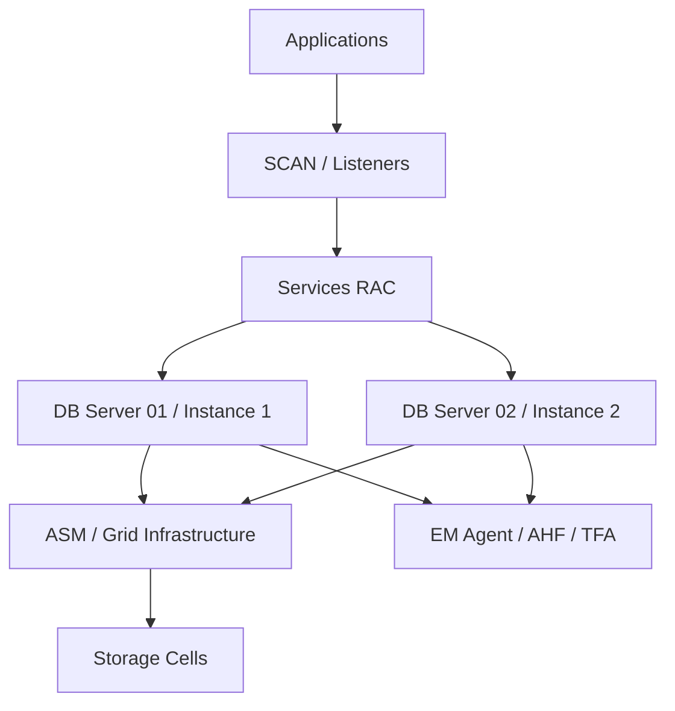

# Module 18 — Monitoring Database Servers

## 1. Objectif du module

Ce module explique comment surveiller les **Database Servers Exadata**.

Les Database Servers hébergent Oracle Database, Grid Infrastructure, ASM, listeners, services RAC, agents de monitoring et processus OS. Ils sont la couche visible par les applications, mais ils dépendent aussi des Storage Cells, du réseau interne et d’ASM.

À la fin de ce module, le lecteur doit être capable de :

- expliquer le rôle des DB servers dans Exadata ;
- vérifier l’état des instances Oracle ;
- vérifier les ressources CRS ;
- surveiller les services RAC ;
- vérifier listeners, SCAN, VIP et placement des services ;
- lire CPU, mémoire, processus et filesystems ;
- relier symptôme applicatif à service, instance et host ;
- utiliser `crsctl`, `srvctl`, SQL et commandes OS read-only ;
- éviter de conclure que “la base est ouverte donc tout va bien”.

---

## 2. Rôle des Database Servers

Les Database Servers exécutent :

```text
Oracle Database instances
Grid Infrastructure
ASM instances
listeners
SCAN listeners
services RAC
VIP
agents Enterprise Manager
outils AHF/TFA
processus OS
```

Ils dialoguent avec :

```text
applications via réseau client
Storage Cells via réseau interne
autres DB servers via interconnect cluster
outils de monitoring
réseau backup selon architecture
```

---

## 3. Architecture logique



---

## 4. Ce qu’il faut surveiller

| Domaine | Éléments |
|---|---|
| Instances | état, open mode, host, version |
| CRS | ressources online/offline/intermediate |
| Services | placement, preferred/available, statut |
| Listeners | listener local, SCAN listener |
| ASM | instance ASM, diskgroups, rebalance |
| OS | CPU, mémoire, swap, filesystems |
| Réseau | client, interconnect, backup |
| Agents | EM agent, AHF/TFA |
| Logs | alert log, CRS logs, listener logs |

---

## 5. Instances Oracle

Vue utile :

```sql
select inst_id, instance_name, host_name, status
from gv$instance
order by inst_id;
```

Pour la base :

```sql
select name, open_mode, database_role, log_mode
from v$database;
```

Interprétation :

| Observation | Lecture |
|---|---|
| Instance OPEN | Instance ouverte |
| Une instance absente | Problème RAC ou instance arrêtée |
| Database role inattendu | Attention Data Guard |
| Base ouverte mais service KO | Problème applicatif possible |

À retenir :

```text
Une instance ouverte ne garantit pas que les applications peuvent se connecter.
```

---

## 6. CRS Resources

CRS gère les ressources cluster.

Commande :

```bash
crsctl stat res -t
```

À lire :

```text
database resources
services
listeners
SCAN listeners
VIP
ASM
diskgroups
ONS
état online/offline
nœud d’exécution
```

Exemples d’états :

```text
ONLINE
OFFLINE
INTERMEDIATE
UNKNOWN
FAILED
```

Erreur fréquente :

```text
Regarder uniquement SQL et oublier CRS.
```

---

## 7. Services RAC

Les services RAC sont essentiels pour les applications.

Commandes :

```bash
srvctl config service -d <db_unique_name>
srvctl status service -d <db_unique_name>
```

Vue SQL :

```sql
select inst_id, name, network_name
from gv$services
order by inst_id, name;
```

À vérifier :

```text
service actif
service sur instance attendue
preferred instances
available instances
failover
load balancing
service utilisé par application
```

Point clé :

```text
Une application doit se connecter à un service, pas à une instance au hasard.
```

---

## 8. Listeners et SCAN

À surveiller :

```text
listener local
SCAN listener
résolution DNS SCAN
VIP
ports
services enregistrés
```

Commandes :

```bash
srvctl status listener
srvctl status scan
srvctl status scan_listener
lsnrctl status
```

Symptômes possibles :

```text
connexion impossible
connexion lente
service non enregistré
erreur TNS
bascule service non prise en compte
```

---

## 9. ASM sur DB Servers

ASM est exécuté côté DB servers et sert l’accès aux fichiers Oracle.

Commandes :

```bash
asmcmd lsdg
asmcmd lsdsk -p
```

Vue SQL :

```sql
select name, total_mb, free_mb, usable_file_mb, type, state
from v$asm_diskgroup
order by name;
```

Rebalance :

```sql
select group_number, operation, state, power, est_minutes
from v$asm_operation;
```

À retenir :

```text
Un problème ASM peut apparaître comme un problème database ou application.
```

---

## 10. OS et ressources système

À surveiller côté OS :

```text
CPU
load average
mémoire
swap
filesystems
processus Oracle
réseau
logs système
temps système/NTP
```

Commandes read-only :

```bash
hostname
uptime
date
df -h
free -h
ps -ef | grep pmon
ps -ef | grep tns
```

Selon contexte :

```bash
top
vmstat 1 5
iostat -xm 1 5
```

À utiliser avec prudence selon politique du site.

---

## 11. Agents et outils locaux

À vérifier :

```text
Enterprise Manager Agent
AHF
TFA
OSWatcher
scripts de supervision
```

Commandes :

```bash
emctl status agent
ahfctl status
tfactl print status
```

Une supervision silencieuse peut venir de :

```text
agent arrêté
blackout EM
target manquant
collecte en retard
droits insuffisants
```

---

## 12. Diagnostic connexion applicative KO

Situation :

```text
Une application ne se connecte plus à un service alors que la base paraît ouverte.
```

Hypothèses :

```text
service arrêté
service déplacé
listener KO
SCAN DNS KO
VIP indisponible
base ouverte mais service non enregistré
firewall/réseau client
erreur credentials ou wallet
```

Commandes :

```bash
crsctl stat res -t
srvctl status service -d <db_unique_name>
srvctl config service -d <db_unique_name>
srvctl status scan
srvctl status listener
lsnrctl status
```

SQL :

```sql
select inst_id, name, network_name
from gv$services
order by inst_id, name;
```

---

## 13. Corrélation avec Storage Cells

Un DB server peut montrer des attentes I/O qui viennent des Storage Cells.

Côté database :

```sql
select event, total_waits, time_waited
from v$system_event
where event like 'cell%'
order by time_waited desc;
```

Côté cell :

```bash
cellcli -e "list alert history detail"
cellcli -e "list metriccurrent"
```

Conclusion :

```text
La preuve doit relier DB wait event, période, service/SQL_ID et métrique cell.
```

---

## 14. Erreurs fréquentes

| Erreur | Pourquoi c’est dangereux | Correction |
|---|---|---|
| Base ouverte = application OK | Service/listener peut être KO | Vérifier services |
| Ignorer CRS | Ressource offline non vue | crsctl stat res -t |
| Ignorer SCAN | Connexions client KO | Vérifier SCAN/listeners |
| Lire un seul nœud | Vue RAC incomplète | Utiliser gv$ et tous DB servers |
| Ignorer OS | CPU/swap/filesystem non vus | Lire OS |
| Ignorer ASM | DATA/RECO/rebalance cachés | asmcmd/v$asm |
| Ignorer EM agent | Supervision aveugle | emctl status agent |

---

## 15. Commandes read-only utiles

### CRS

```bash
crsctl stat res -t
```

### Services

```bash
srvctl config database
srvctl status database -d <db_unique_name> -v
srvctl config service -d <db_unique_name>
srvctl status service -d <db_unique_name>
```

### Listeners / SCAN

```bash
srvctl status listener
srvctl status scan
srvctl status scan_listener
lsnrctl status
```

### Instances

```sql
select inst_id, instance_name, host_name, status
from gv$instance
order by inst_id;
```

### Services SQL

```sql
select inst_id, name, network_name
from gv$services
order by inst_id, name;
```

### OS

```bash
hostname
uptime
date
df -h
free -h
ps -ef | grep pmon
```

### ASM

```bash
asmcmd lsdg
asmcmd lsdsk -p
```

---

## 16. Exercice pratique

Une application ne se connecte plus à un service Oracle.

La base est ouverte et une instance répond en SQL.

Répondez :

1. Pourquoi “la base est ouverte” ne suffit pas ?
2. Quelles ressources CRS vérifiez-vous ?
3. Quelles commandes `srvctl` utilisez-vous ?
4. Comment vérifiez-vous les services côté SQL ?
5. Quelles causes réseau/listener sont possibles ?
6. Quelle conclusion prudente formulez-vous ?

---

## 17. Corrigé indicatif

“La base est ouverte” ne suffit pas parce que l’application dépend du service RAC, du listener, du SCAN, de la VIP et de l’enregistrement du service.

Commandes :

```bash
crsctl stat res -t
srvctl status service -d <db_unique_name>
srvctl config service -d <db_unique_name>
srvctl status scan
srvctl status listener
lsnrctl status
```

SQL :

```sql
select inst_id, name, network_name
from gv$services
order by inst_id, name;
```

Conclusion :

```text
L’incident doit être qualifié au niveau service/listener/SCAN/CRS.
La base ouverte est une information utile, mais insuffisante pour prouver
la disponibilité applicative.
```

---

## 18. À retenir

```text
À retenir
- Les DB servers hébergent instances, GI, ASM, listeners et services.
- CRS donne la vérité cluster des ressources.
- Les services RAC sont la vraie unité de connexion applicative.
- Une base ouverte ne garantit pas un service disponible.
- ASM et OS doivent être surveillés avec la database.
- La supervision EM doit être confirmée par les commandes locales si besoin.
- Le diagnostic doit relier application, service, instance, host et CRS.
```

---

## 19. Références officielles

| Référence | Utilisation dans le module |
|---|---|
| [Oracle RAC Documentation](https://docs.oracle.com/en/database/) | Services RAC, CRS, listeners, SCAN, GI. |
| [Oracle Database Documentation](https://docs.oracle.com/en/database/) | GV$INSTANCE, GV$SERVICES, diagnostic database. |
| [Oracle ASM Documentation](https://docs.oracle.com/en/database/) | Diskgroups, ASM instance, rebalance. |
| [Oracle Exadata Documentation](https://docs.oracle.com/en/engineered-systems/exadata-database-machine/) | Architecture DB servers et intégration Exadata. |
