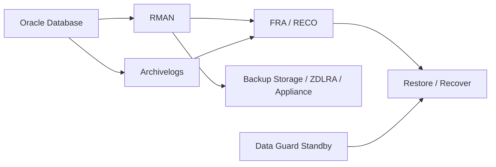

# Module 22 — Backup and Recovery

## 1. Objectif du module

Ce module explique la **sauvegarde et la restauration Oracle sur Exadata**.

L’objectif est de comprendre qu’une sauvegarde n’a de valeur que si la restauration est possible dans les délais attendus. Exadata peut offrir de fortes performances, mais RMAN, FRA, archivelogs, catalog, Data Guard, ZDLRA éventuelle et tests de restore restent indispensables.

À la fin de ce module, le lecteur doit être capable de :

- expliquer le rôle de RMAN ;
- comprendre FRA, archivelogs, controlfile autobackup et backup pieces ;
- distinguer backup, restore et recover ;
- vérifier la récupérabilité réelle ;
- comprendre le lien avec RPO/RTO ;
- lire les informations RMAN essentielles ;
- surveiller DATA, RECO et FRA ;
- comprendre l’impact Data Guard ;
- préparer une validation avant patching ;
- éviter de confondre backup existant et restore garanti.

---

## 2. Pourquoi le backup est critique

Un backup doit répondre à une question simple :

```text
Peut-on restaurer la bonne donnée, au bon moment, dans le délai attendu ?
```

Risques fréquents :

```text
backup absent
backup incomplet
backup corrompu
archivelogs manquants
FRA saturée
controlfile autobackup absent
catalog RMAN incohérent
restore jamais testé
RPO/RTO non tenus
Data Guard lag non surveillé
```

À retenir :

```text
Un backup non testé n’est pas une garantie de reprise.
```

---

## 3. Concepts clés

| Concept | Définition |
|---|---|
| Backup | Copie de données ou archivelogs |
| Restore | Remise en place des fichiers sauvegardés |
| Recover | Application des redo/archivelogs pour atteindre un point cohérent |
| RMAN | Outil Oracle de backup/restore/recover |
| FRA | Fast Recovery Area |
| Archivelog | Redo archivé nécessaire à la récupération |
| Controlfile autobackup | Sauvegarde automatique du controlfile/spfile |
| Restore validate | Test de lisibilité/restaurabilité |
| RPO | Perte maximale de données acceptable |
| RTO | Durée maximale de reprise acceptable |

---

## 4. Architecture backup Exadata

Schéma logique :



À surveiller :

```text
base
RMAN
FRA / RECO
archivelogs
backup destination
catalog
Data Guard
réseau backup
restore tests
```

---

## 5. RMAN

RMAN permet :

```text
backup database
backup archivelog
restore database
recover database
validate backup
list backup
report schema
crosscheck
delete obsolete selon politique
```

Commandes read-only utiles :

```bash
rman target / <<EOF
show all;
list backup summary;
report schema;
EOF
```

À lire :

```text
rétention
device type
parallelism
backup optimization
controlfile autobackup
channels
backup sets
dernier backup complet
archivelogs inclus
```

---

## 6. FRA et RECO

Sur Exadata, RECO est souvent utilisé pour les fichiers de récupération.

FRA peut contenir :

```text
archivelogs
flashback logs
backups
controlfile autobackups
online redo selon configuration
```

Vue utile :

```sql
select * from v$recovery_file_dest;
```

ASM :

```sql
select name, total_mb, free_mb, usable_file_mb, type, state
from v$asm_diskgroup
order by name;
```

Risque :

```text
FRA pleine → archivelogs bloqués → base en risque.
```

---

## 7. Archivelogs

Les archivelogs sont essentiels pour récupérer jusqu’à un point récent.

À vérifier :

```sql
select log_mode, force_logging, database_role
from v$database;
```

Autres contrôles :

```sql
select sequence#, first_time, next_time, applied
from v$archived_log
order by sequence# desc fetch first 20 rows only;
```

À retenir :

```text
Sans archivelogs nécessaires, la récupération complète peut être impossible.
```

---

## 8. Restore Validate

`RESTORE VALIDATE` permet de tester la lisibilité des sauvegardes sans restaurer réellement en production.

Principe :

```text
RMAN lit les backup pieces
vérifie la cohérence
détecte certains problèmes avant incident réel
```

Commande conceptuelle :

```bash
rman target / <<EOF
restore database validate;
EOF
```

Attention :

```text
Même un validate doit être planifié selon charge et procédures.
```

---

## 9. Controlfile autobackup

Le controlfile contient les métadonnées nécessaires à RMAN.

À vérifier :

```bash
rman target / <<EOF
show controlfile autobackup;
EOF
```

Risque :

```text
Sans controlfile autobackup, une perte complète rend la restauration plus complexe.
```

---

## 10. Backup et Data Guard

Data Guard ne remplace pas les backups.

Data Guard protège contre :

```text
panne site
certains scénarios de continuité
bascule primaire/standby
```

Backup protège contre :

```text
suppression logique
corruption non détectée
besoin de restauration ancienne
erreur humaine
ransomware selon stratégie
```

À surveiller :

```sql
select name, value, unit
from v$dataguard_stats;
```

À retenir :

```text
Data Guard et RMAN sont complémentaires.
```

---

## 11. RPO / RTO

| Notion | Question |
|---|---|
| RPO | Combien de données peut-on perdre ? |
| RTO | Combien de temps pour revenir au service ? |

Exemple :

```text
RPO = 15 minutes
RTO = 2 heures
```

Cela implique :

```text
archivelogs disponibles
backup récent
restore testé
procédure connue
ressources disponibles
équipe prête
```

---

## 12. ZDLRA ou appliance backup

Selon architecture, Exadata peut être reliée à :

```text
ZDLRA
appliance backup
stockage NFS
stockage objet
solution entreprise
```

À surveiller :

```text
connectivité
débit backup
débit restore
rétention
catalogue
fenêtre backup
erreurs
```

---

## 13. Validation avant patching

Avant patching majeur :

```text
backup récent
archivelogs disponibles
controlfile autobackup activé
restore validate récent
Data Guard état OK si présent
FRA/RECO non saturée
catalog RMAN cohérent
procédure rollback prête
```

Commandes :

```bash
rman target / <<EOF
show all;
list backup summary;
report schema;
EOF
```

```sql
select * from v$recovery_file_dest;
select log_mode, force_logging, database_role from v$database;
```

---

## 14. Erreurs fréquentes

| Erreur | Pourquoi c’est dangereux | Correction |
|---|---|---|
| Backup sans restore test | Fausse sécurité | Restore validate |
| Ignorer FRA | Archivelogs bloqués | Surveiller RECO/FRA |
| Confondre Data Guard et backup | Perte logique non couverte | Garder RMAN |
| Oublier controlfile autobackup | Restore complexe | Vérifier config |
| Ne pas connaître RTO | Procédure non réaliste | Tester durée restore |
| Ne pas documenter | Dépendance à une personne | Runbook |
| Pas de post-check | Backup supposé OK | Contrôler logs RMAN |

---

## 15. Commandes read-only utiles

### RMAN

```bash
rman target / <<EOF
show all;
list backup summary;
report schema;
EOF
```

### Database

```sql
select log_mode, force_logging, database_role
from v$database;
```

### FRA

```sql
select * from v$recovery_file_dest;
```

### ASM

```bash
asmcmd lsdg
```

### Data Guard

```sql
select name, value, unit
from v$dataguard_stats;
```

```bash
dgmgrl / "show configuration"
```

---

## 16. Exercice pratique

Avant un patching majeur, le responsable exige une démonstration de récupérabilité.

Répondez :

1. Quelles preuves RMAN fournissez-vous ?
2. Pourquoi `list backup` ne suffit pas ?
3. Que vérifiez-vous côté FRA/RECO ?
4. Quel rôle pour Data Guard ?
5. Quels critères go/no-go proposez-vous ?
6. Quelle conclusion prudente formulez-vous ?

---

## 17. Corrigé indicatif

Preuves :

```text
show all
list backup summary
report schema
controlfile autobackup
restore validate récent
FRA/RECO OK
archivelogs disponibles
Data Guard OK si utilisé
```

`list backup` ne suffit pas car il prouve l’existence de backups, pas la capacité à restaurer dans le délai.

Conclusion :

```text
Le patching ne doit pas démarrer tant que la récupérabilité
n’est pas prouvée par des sauvegardes exploitables, des archivelogs disponibles,
une FRA saine, un rollback documenté et une validation restore récente.
```

---

## 18. À retenir

```text
À retenir
- RMAN est l’outil central de backup/recovery Oracle.
- FRA/RECO et archivelogs sont critiques.
- Backup et Data Guard sont complémentaires.
- Un backup non testé ne prouve pas la récupérabilité.
- RPO/RTO doivent piloter la stratégie.
- Restore validate est une preuve importante.
- Avant patching, la récupérabilité doit être vérifiée.
```

---

## 19. Références officielles

| Référence | Utilisation dans le module |
|---|---|
| [Oracle Backup and Recovery User’s Guide](https://docs.oracle.com/en/database/) | RMAN, restore, recover, validate. |
| [Oracle Exadata Documentation](https://docs.oracle.com/en/engineered-systems/exadata-database-machine/) | Exadata, RECO, intégration backup. |
| [Oracle Data Guard Documentation](https://docs.oracle.com/en/database/) | Complément HA/DR et redo transport. |
