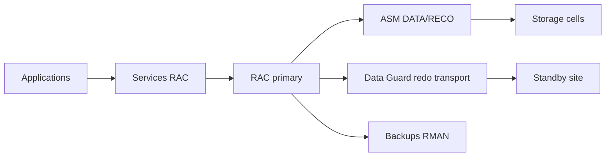

    # Module 23 — HA/DR et MAA

    ## 1. Objectif pédagogique

    Comprendre RAC, Data Guard, Broker, switchover, failover, lag et principes MAA. Le chapitre vise une compréhension opérationnelle et théorique : l’étudiant doit pouvoir expliquer le mécanisme, reconnaître les composants impliqués, lire les principales vues ou commandes et résoudre un cas d’école sans modifier l’environnement.

    ## 2. Pourquoi ce sujet est important

    RAC et Data Guard répondent à des risques différents. RAC traite des pannes locales ; Data Guard protège contre perte de site ou corruption logique selon stratégie.

    HA/DR sur Exadata combine disponibilité locale, continuité RAC, Data Guard, sauvegarde et procédures de bascule. Le sujet est critique parce qu’une architecture redondante non testée peut rester indisponible en incident réel.

    ## 3. Concepts clés expliqués

    | Concept | Définition claire | Exemple concret |
    |---|---|---|
    | **RAC HA locale** | Disponibilité locale par plusieurs instances sur un cluster accédant à la même base. | La perte d’un DB server peut laisser la base disponible sur un autre. |
| **Data Guard** | Réplication Oracle vers une base standby pour continuité de site ou disaster recovery. | Une standby reçoit les redo du primaire. |
| **Switchover** | Bascule contrôlée et réversible des rôles primaire/standby. | On switche pendant une maintenance planifiée du site primaire. |

    Ces concepts doivent être étudiés ensemble. Par exemple, **RAC HA locale** n’a pas la même signification isolément que dans une architecture RAC, ASM et storage cells. La compréhension vient de la relation entre objet Oracle, ressource Exadata et workload applicatif.

    ## 4. Architecture concernée

    | Composant | Rôle dans ce chapitre |
    |---|---|
    | Database servers | Exécutent les instances, services, agents et outils Oracle liés au module. |
| Storage cells | Apportent stockage intelligent, flash, offload, alertes ou métriques lorsque le sujet touche les I/O. |
| ASM / Grid Infrastructure | Fournissent cluster, diskgroups, ressources RAC et accès aux fichiers Oracle. |
| Réseau RoCE / InfiniBand | Transporte les échanges internes rapides et peut influencer latence et disponibilité. |
| Outils Oracle | Enterprise Manager, AHF, Exachk, TFA, RMAN ou Data Guard selon le thème étudié. |

    Les diagrammes associés au chapitre sont :

    - [`backup-recovery-dataguard.mmd`](../diagrams/backup-recovery-dataguard.mmd)

    ## 5. Fonctionnement détaillé

    RAC et Data Guard répondent à des risques différents. RAC traite des pannes locales ; Data Guard protège contre perte de site ou corruption logique selon stratégie.

    Le fonctionnement se lit par domaines : instance, service, cluster resource, listener, Data Guard, redo transport, apply lag et procédures de failover. Chaque domaine apporte une preuve différente de continuité.

    Pour ce module, les notions centrales sont **RAC HA locale, Data Guard, Switchover**. Elles déterminent la façon dont le composant réagit à une charge réelle. Pour HA/DR, l’analyse commence par le scénario d’incident : panne instance, panne serveur, panne cellule, corruption logique ou perte de site. Le diagnostic change selon le scénario. Une mauvaise lecture consiste à supposer que la plateforme corrige automatiquement un mauvais modèle de données, une requête mal écrite ou une architecture réseau incomplète.

    ## 6. Exemple concret

    Un standby accumule du lag alors qu’une fenêtre de maintenance approche.

    Dans ce scénario, l’analyse commence par le symptôme métier, puis remonte vers la couche Oracle concernée. Si le sujet touche les I/O, il faut différencier le temps passé dans Oracle Database, les attentes liées aux cells, la distribution ASM et la santé des storage cells. Si le sujet touche la haute disponibilité, il faut distinguer disponibilité locale RAC, continuité de service, sauvegarde et reprise après sinistre.

    ## 7. Commandes, vues et métriques utiles

    Les commandes ci-dessous sont données comme exemples de lecture. Elles doivent être adaptées aux noms de bases, privilèges, versions et conventions du site.

    ```bash
    select database_role,open_mode,protection_mode,switchover_status from v$database;
select name,value,time_computed from v$dataguard_stats;
dgmgrl / "show configuration"
    ```

    | Élément à lire | Interprétation |
    |---|---|
    | RAC HA locale | Cette information indique comment le mécanisme RAC HA locale se comporte dans un cas réel. Elle doit être lue avec le contexte de charge, de version et d’architecture. |
| Data Guard | Cette information indique comment le mécanisme Data Guard se comporte dans un cas réel. Elle doit être lue avec le contexte de charge, de version et d’architecture. |
| Switchover | Cette information indique comment le mécanisme Switchover se comporte dans un cas réel. Elle doit être lue avec le contexte de charge, de version et d’architecture. |
| transport lag | Retard d’envoi des redo vers la standby. |
| apply lag | Retard d’application des redo sur la standby ; il influence le RPO réel. |

    ## 8. Interprétation des résultats

    L’interprétation doit répondre à une question technique précise. Une valeur isolée ne suffit pas : une latence se compare à une période comparable, un volume d’I/O se compare à un plan SQL et un état RAC se compare au placement attendu des services. Les métriques Exadata sont particulièrement utiles lorsqu’elles expliquent pourquoi un volume important de données a été lu, filtré, renvoyé ou retardé.

    Dans les chapitres performance, les valeurs liées aux bytes, événements `cell`, AWR ou ASH indiquent le chemin dominant. Dans les chapitres HA/DR, les états de rôle, lag, services et ressources cluster décrivent la capacité réelle à basculer ou maintenir le service. Dans les chapitres support et maintenance, les rapports AHF, Exachk ou TFA doivent être lus comme des aides structurées, pas comme des remplacements de raisonnement.

    ## 9. Erreurs fréquentes

    | Erreur | Cause probable | Correction pédagogique |
    |---|---|---|
    | Confondre symptôme et cause | Le premier message visible vient parfois d’une couche différente de la cause réelle. | Reconstituer le chemin technique avant de conclure. |
    | Appliquer une recette générique | Exadata dépend fortement du workload, du plan SQL, de la version et du modèle de service. | Relire les composants du chapitre et adapter le diagnostic. |
    | Ignorer les dépendances | Une base RAC dépend de GI, ASM, réseau privé et storage cells. | Vérifier les dépendances avant toute hypothèse. |
    | Oublier les limites du mécanisme | Certaines fonctions Exadata ne s’appliquent pas à tous les accès ou toutes les charges. | Identifier les conditions d’éligibilité et les cas d’exclusion. |

    ## 10. Bonnes pratiques

    | Bonne pratique | Application concrète |
    |---|---|
    | Partir du mécanisme | Dessiner le chemin DB → ASM → cell → réseau → retour résultat selon le sujet. |
    | Séparer lecture et changement | Les commandes de lecture servent à comprendre ; les changements exigent runbook et validation. |
    | Comparer avec un état de référence | Une valeur a du sens lorsqu’elle est rapprochée d’une période saine ou d’une cible prévue. |
    | Documenter la version | Les fonctionnalités et commandes peuvent varier selon génération Exadata et version Oracle. |

    ## 11. Exercice pratique

    Vous êtes responsable du sujet **HA/DR et MAA** sur une plateforme Exadata de formation. À partir du scénario suivant, rédigez une analyse de deux pages :

    > Un standby accumule du lag alors qu’une fenêtre de maintenance approche.

    Votre réponse doit inclure un schéma simple des composants impliqués, trois commandes ou vues à exécuter, deux métriques à lire, les erreurs à éviter et une recommandation finale.

    ## 12. Corrigé de l’exercice

    Une bonne réponse commence par identifier les composants du chapitre : **RAC HA locale, Data Guard, Switchover**. Elle explique ensuite le chemin technique suivi par l’opération et indique pourquoi les commandes proposées permettent de vérifier ce chemin. Les commandes attendues sont celles de la section 7, adaptées aux noms réels de l’environnement.

    Le corrigé doit aussi distinguer les observations et les décisions. Par exemple, constater un lag, une alerte cell, un volume `eligible bytes` ou une ressource CRS offline ne suffit pas : il faut expliquer la conséquence sur l’application, la disponibilité ou la performance.  : optimisation SQL, ajustement de plan de ressources, revue réseau, ouverture SR, test de restore ou préparation CAB selon le module.

    ## 13. Synthèse à retenir

    ```text
    À retenir
    - HA/DR et MAA  : base, cluster, ASM, storage cells, réseau et outils Oracle.
    - Les notions centrales du chapitre sont : RAC HA locale, Data Guard, Switchover.
    - Les commandes de lecture permettent de comprendre le mécanisme avant toute action de changement.
    - Les erreurs les plus coûteuses viennent d’une lecture isolée d’une seule couche.
    - Un bon administrateur Exadata relie toujours architecture, workload, métriques et impact métier.
    ```


## Rectification V5 vérifiable — contenu expert non générique

Cette section constitue la correction V5 visible du module. Elle remplace l’approche répétitive par un raisonnement propre au thème **HA/DR et MAA**. L’objectif n’est pas d’ajouter une phrase de méthode, mais de montrer comment un administrateur Exadata produit une preuve technique exploitable devant une équipe production, architecture ou support.

| Élément expert V5 | Application concrète au module |
|---|---|
| Objets à nommer explicitement | RAC, services, Data Guard, role transition, apply lag, FSFO. |
| Méthode de diagnostic | associer scénario d’incident et mécanisme de continuité. |
| Cas d’école attendu | une bascule Data Guard réussie doit aussi valider services et connexions applicatives. |
| Preuve minimale | Une commande ou vue read-only, une métrique datée, un composant identifié et une interprétation liée au risque métier. |
| Limite de conclusion | Une mesure isolée ne suffit pas ; elle doit être reliée à la période, au workload, à la version Exadata et à l’objectif de service. |

### Raisonnement attendu en situation réelle

Pour **HA/DR et MAA**, le diagnostic commence par une hypothèse précise et réfutable. L’administrateur doit formuler ce qu’il cherche à prouver : saturation, mauvais placement, absence d’offload, contention entre workloads, défaut de redondance, fenêtre de maintenance insuffisante ou frontière de responsabilité cloud. Ensuite, il collecte uniquement des preuves read-only. Cette discipline évite deux erreurs fréquentes : modifier une plateforme stable sans preuve et confondre un symptôme visible avec la cause racine.

Le livrable attendu dans un contexte professionnel est une courte note technique. Elle doit contenir le symptôme, l’heure, les objets Exadata concernés, les commandes utilisées, les résultats observés, l’interprétation et la prochaine action. Si une modification est proposée, elle doit être séparée du diagnostic et rattachée à un runbook, une validation CAB ou une procédure de support Oracle.

### Exercice V5 complémentaire

Rédigez une analyse opérationnelle pour le cas suivant : **une bascule Data Guard réussie doit aussi valider services et connexions applicatives**. Votre réponse doit citer les objets Exadata concernés, indiquer trois preuves read-only, expliquer ce qui invaliderait votre hypothèse et proposer une recommandation limitée au périmètre du module.

### Corrigé V5 complémentaire

Une bonne réponse identifie d’abord le composant dominant du sujet **HA/DR et MAA**, puis relie les preuves à un impact mesurable. Les trois preuves doivent couvrir au moins deux couches différentes lorsque le sujet l’exige, par exemple base et cell, cluster et réseau, ou cloud et VM cluster. La recommandation est correcte seulement si elle indique ce qui est prouvé, ce qui reste incertain et quelle action peut être engagée sans créer un risque supérieur au problème initial.

## Références officielles

| Référence | Utilisation dans le module |
|---|---|
| [Oracle University — Exadata Database Machine Administration Workshop](https://education.oracle.com/exadata-database-machine-administration-workshop/courP_4599) | Cadre pédagogique général du workshop. |
| [Oracle Exadata Documentation](https://docs.oracle.com/en/engineered-systems/exadata-database-machine/) | Administration Exadata, Storage Server, CellCLI, maintenance et monitoring. |
| [Oracle Database Documentation](https://docs.oracle.com/en/database/) | Vues dynamiques, SQL, RMAN, Data Guard, AWR/ASH selon licences. |
| [Oracle Maximum Availability Architecture](https://www.oracle.com/database/technologies/high-availability/maa.html) | Principes HA/DR, Data Guard, sauvegarde et continuité de service. |
| [Oracle Autonomous Health Framework](https://docs.oracle.com/en/engineered-systems/health-diagnostics/autonomous-health-framework/) | AHF, Exachk, ORAchk, TFA et diagnostics automatisés. |
## Complément expert V5 — HA/DR, RAC, ASM, Data Guard et MAA

### Explication technique spécifique

La haute disponibilité Exadata combine plusieurs couches : redondance matérielle, ASM failure groups, Oracle RAC, services applicatifs, Data Guard, backups RMAN, flashback et procédures MAA. RAC protège contre la perte d’une instance ou d’un database server, ASM protège contre la perte de disques ou cellules selon redondance, Data Guard protège contre la perte de site ou corruption logique propagée selon configuration. MAA assemble ces capacités en architectures de référence et en pratiques testables.[^v5-maa]



### Exemple concret réaliste

La perte d’un database server provoque une reconnexion des services vers les instances restantes ; la perte d’un disque est absorbée par ASM ; la perte d’un site impose Data Guard ou restauration. Ces incidents n’ont pas le même RTO. Un support expert doit donc apprendre à associer chaque panne à la couche qui la couvre et au test qui prouve cette couverture.

### Comment raisonner

Commence par nommer le scénario : panne instance, panne serveur, panne cellule, corruption, perte site, erreur humaine. Associe ensuite la protection : RAC, ASM, Data Guard, Flashback, RMAN. Enfin, vérifie les preuves : état services, lag Data Guard, état diskgroups, backups valides, tests de switchover ou restore.

### Commandes / vues utiles

```sql
select inst_id, instance_name, status from gv$instance order by inst_id;
select name, open_mode, database_role, switchover_status from v$database;
select name, value, unit from v$dataguard_stats;
select process, status, thread#, sequence# from v$managed_standby;
```

```bash
srvctl status database -d <DB_UNIQUE_NAME>
asmcmd lsdg
```

### Comment interpréter

Une base RAC ouverte ne prouve pas que le DR est prêt. Il faut vérifier le transport redo, l’application sur standby, le lag, les services, les backups et les procédures. Un `SUCCESS` ponctuel ne remplace pas un test de bascule documenté.

### Exercice pratique

Classe les protections nécessaires pour trois incidents : perte d’un disque, perte d’un database server et perte complète du site primaire.

### Corrigé détaillé

La perte d’un disque relève d’ASM et de la redondance cellule. La perte d’un database server relève de RAC, Clusterware et services. La perte du site primaire relève de Data Guard, éventuellement Far Sync, backups et runbook DR. La réponse est correcte car elle ne mélange pas HA locale et DR inter-site.

### Limites et pièges

Ne pas promettre un RTO sans test. Ne pas croire que RAC remplace Data Guard. Ne pas supposer qu’un standby est utilisable sans vérifier lag, services, paramètres et capacité.

### À retenir

MAA n’est pas un slogan : c’est l’alignement mesurable entre scénario de panne, mécanisme de protection et preuve de reprise.

[^v5-maa]: Oracle, *Oracle Maximum Availability Architecture*, https://www.oracle.com/database/technologies/high-availability/maa.html
