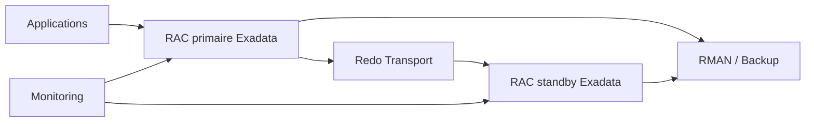

# Module 23 — HA/DR et MAA

## 1. Objectif du module

Ce module explique les principes de **haute disponibilité**, **disaster recovery** et **Maximum Availability Architecture** sur Oracle Exadata.

L’objectif est de distinguer clairement les rôles de RAC, ASM, Data Guard, Broker, RMAN, sauvegarde, switchover, failover, services applicatifs et procédures de reprise.

À la fin de ce module, le lecteur doit être capable de :

- distinguer HA locale et DR ;
- expliquer le rôle de RAC ;
- expliquer le rôle de Data Guard ;
- comprendre switchover et failover ;
- lire transport lag et apply lag ;
- comprendre les principes MAA ;
- valider les services après bascule ;
- éviter de croire qu’une architecture redondante est automatiquement disponible ;
- préparer une analyse go/no-go avant bascule.

---

## 2. HA, DR et MAA

| Terme | Sens |
|---|---|
| HA | Haute disponibilité locale |
| DR | Reprise après sinistre |
| MAA | Architecture Oracle de disponibilité maximale |
| RAC | Plusieurs instances pour une base locale |
| Data Guard | Base standby pour continuité de site |
| RMAN | Sauvegarde/restauration |
| Flashback | Retour logique selon configuration |
| Services | Continuité applicative et routage |

À retenir :

```text
RAC ne remplace pas Data Guard.
Data Guard ne remplace pas RMAN.
RMAN ne remplace pas un plan de continuité.
```

---

## 3. RAC — disponibilité locale

RAC permet à plusieurs instances d’accéder à la même base.

Protège contre :

```text
perte d’une instance
perte d’un DB server
maintenance locale selon design
bascule de service
```

Ne protège pas contre :

```text
perte complète du site
corruption logique propagée
erreur humaine
suppression métier
perte globale du stockage
```

Commandes :

```bash
crsctl stat res -t
srvctl status database -d <db_unique_name> -v
srvctl status service -d <db_unique_name>
```

---

## 4. Data Guard — reprise de site

Data Guard maintient une base standby.

Protège contre :

```text
perte site primaire
maintenance planifiée via switchover
certains scénarios de corruption selon stratégie
continuité DR
```

Composants :

```text
primary database
standby database
redo transport
redo apply
Data Guard Broker
services de bascule
monitoring lag
```

Commandes :

```sql
select database_role, open_mode, protection_mode, switchover_status
from v$database;

select name, value, unit
from v$dataguard_stats;
```

```bash
dgmgrl / "show configuration"
```

---

## 5. Switchover

Un switchover est une bascule contrôlée et réversible.

Usage :

```text
maintenance planifiée
test DR
migration contrôlée
bascule datacenter préparée
```

Conditions :

```text
standby synchronisée
lag acceptable
services prêts
applications informées
rollback ou retour prévu
tests réalisés
```

À retenir :

```text
Un switchover réussi techniquement doit aussi valider les connexions applicatives.
```

---

## 6. Failover

Un failover est une bascule en situation d’incident.

Usage :

```text
perte site primaire
primaire inaccessible
incident majeur
```

Risques :

```text
perte de données selon protection mode
retour arrière plus complexe
réintégration primaire à prévoir
décision métier obligatoire
```

À retenir :

```text
Le failover est une décision de crise, pas une commande technique isolée.
```

---

## 7. Transport lag et Apply lag

| Lag | Signification |
|---|---|
| Transport lag | Retard d’envoi des redo vers la standby |
| Apply lag | Retard d’application des redo sur la standby |

Vue :

```sql
select name, value, unit, time_computed
from v$dataguard_stats;
```

Interprétation :

```text
transport lag élevé → réseau/transport redo suspect
apply lag élevé → standby/apply/I/O/charge suspect
```

---

## 8. Services applicatifs

Après une bascule, il faut vérifier :

```text
services RAC
listeners
SCAN
DNS
connexions applicatives
wallets
chaînes JDBC
load balancer
jobs
batchs
monitoring
```

Commandes :

```bash
srvctl status service -d <db_unique_name>
srvctl config service -d <db_unique_name>
```

SQL :

```sql
select inst_id, name, network_name
from gv$services
order by inst_id, name;
```

---

## 9. MAA — logique d’ensemble

MAA combine plusieurs couches :

```text
RAC pour HA locale
ASM pour stockage redondé
Data Guard pour DR
RMAN pour backup/recovery
Flashback selon besoin
services pour continuité applicative
monitoring pour preuve
runbooks pour procédures
tests réguliers
```

Schéma :



---

## 10. Scénarios d’incident

| Scénario | Mécanisme |
|---|---|
| Instance crash | RAC |
| DB server perdu | RAC + services |
| Storage cell dégradée | ASM + Exadata redundancy |
| Site perdu | Data Guard failover |
| Maintenance site | Data Guard switchover |
| Erreur logique | RMAN / Flashback / restore |
| Corruption | RMAN / Data Guard selon type |
| Lenteur standby | Analyse lag |

---

## 11. Go / No-Go avant bascule

Critères possibles :

```text
lag acceptable
standby ouverte selon rôle attendu
Broker configuration OK
services prêts
backup récent
applications prévenues
tests de connexion réalisés
plan rollback connu
monitoring prêt
validation métier prévue
```

Commandes :

```bash
dgmgrl / "show configuration"
crsctl stat res -t
srvctl status service -d <db_unique_name>
```

```sql
select database_role, open_mode, switchover_status from v$database;
select name, value, unit from v$dataguard_stats;
```

---

## 12. Erreurs fréquentes

| Erreur | Pourquoi c’est dangereux | Correction |
|---|---|---|
| RAC = DR | Faux sentiment de sécurité | Ajouter Data Guard |
| Data Guard = backup | Erreur logique propagée | Garder RMAN |
| Bascule sans services | Application KO | Valider services |
| Ignorer lag | RPO non tenu | Lire transport/apply lag |
| Ne pas tester | Procédure théorique | Exercices réguliers |
| Oublier DNS/app | Bascule DB OK mais métier KO | Validation bout en bout |
| Failover sans décision | Risque perte données | Processus de crise |

---

## 13. Commandes read-only utiles

```sql
select database_role, open_mode, protection_mode, switchover_status
from v$database;

select name, value, unit, time_computed
from v$dataguard_stats;
```

```bash
dgmgrl / "show configuration"
crsctl stat res -t
srvctl status database -d <db_unique_name> -v
srvctl status service -d <db_unique_name>
asmcmd lsdg
```

---

## 14. Exercice pratique

Un standby accumule du lag alors qu’une fenêtre de maintenance approche.

Répondez :

1. Différence entre transport lag et apply lag ?
2. Quelles vues utilisez-vous ?
3. Quels risques pour RPO/RTO ?
4. Pourquoi ne pas lancer le switchover immédiatement ?
5. Quelles validations avant Go ?
6. Quelle recommandation ?

---

## 15. Corrigé indicatif

Transport lag indique un retard d’envoi des redo. Apply lag indique un retard d’application sur standby.

Commandes :

```sql
select name, value, unit from v$dataguard_stats;
select database_role, open_mode, switchover_status from v$database;
```

```bash
dgmgrl / "show configuration"
```

Conclusion :

```text
Le switchover doit attendre que le lag soit compris et acceptable.
La décision go/no-go dépend du RPO/RTO, de la santé Broker, des services
et de la validation applicative.
```

---

## 16. À retenir

```text
À retenir
- RAC protège localement, pas contre perte de site.
- Data Guard protège contre perte de site, mais ne remplace pas RMAN.
- Switchover est planifié ; failover est une décision de crise.
- Transport lag et apply lag doivent être distingués.
- Les services applicatifs sont essentiels après bascule.
- MAA combine RAC, ASM, Data Guard, RMAN, monitoring et procédures.
- Une architecture non testée reste un risque.
```

---

## 17. Références officielles

| Référence | Utilisation dans le module |
|---|---|
| [Oracle Maximum Availability Architecture](https://www.oracle.com/database/technologies/high-availability/maa.html) | Principes MAA. |
| [Oracle Data Guard Documentation](https://docs.oracle.com/en/database/) | Data Guard, Broker, switchover, failover. |
| [Oracle RAC Documentation](https://docs.oracle.com/en/database/) | HA locale, services RAC. |
| [Oracle Backup and Recovery Documentation](https://docs.oracle.com/en/database/) | RMAN et récupération. |
