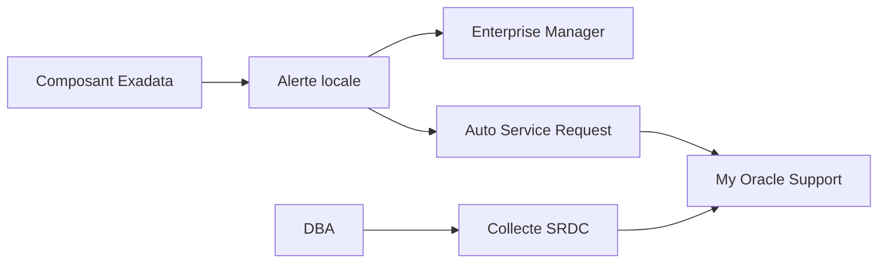

    # Module 26 — Automated Support Ecosystem

    ## 1. Objectif pédagogique

    Maîtriser AHF, TFA, Exachk, ORAchk, ASR et la constitution d’un Service Request. Le chapitre vise une compréhension opérationnelle et théorique : l’étudiant doit pouvoir expliquer le mécanisme, reconnaître les composants impliqués, lire les principales vues ou commandes et résoudre un cas d’école sans modifier l’environnement.

    ## 2. Pourquoi ce sujet est important

    L’écosystème support Exadata accélère le diagnostic, mais il exige une description claire de l’impact et des fichiers pertinents.

    Le sujet **26 Automated Support Ecosystem** doit être traité comme un mécanisme Exadata précis : l’objectif est d’identifier les composants concernés, les métriques qui prouvent le comportement et les limites qui empêchent une conclusion hâtive.

    ## 3. Concepts clés expliqués

    | Concept | Définition claire | Exemple concret |
    |---|---|---|
    | **ASR** | Auto Service Request peut automatiser la création de demandes support matérielles selon configuration. | Une panne matérielle détectée peut générer un signal support. |
| **Service Request** | Demande Oracle Support décrivant impact, symptômes, logs et environnement. | Un SR bien structuré réduit les allers-retours. |
| **Sanitization** | Retrait ou masquage des informations sensibles avant partage de logs. | Les tokens, noms clients ou IP publiques peuvent être masqués. |

    Ces concepts doivent être étudiés ensemble. Par exemple, **ASR** n’a pas la même signification isolément que dans une architecture RAC, ASM et storage cells. La compréhension vient de la relation entre objet Oracle, ressource Exadata et workload applicatif.

    ## 4. Architecture concernée

    | Composant | Rôle dans ce chapitre |
    |---|---|
    | Database servers | Exécutent les instances, services, agents et outils Oracle liés au module. |
| Storage cells | Apportent stockage intelligent, flash, offload, alertes ou métriques lorsque le sujet touche les I/O. |
| ASM / Grid Infrastructure | Fournissent cluster, diskgroups, ressources RAC et accès aux fichiers Oracle. |
| Réseau RoCE / InfiniBand | Transporte les échanges internes rapides et peut influencer latence et disponibilité. |
| Outils Oracle | Enterprise Manager, AHF, Exachk, TFA, RMAN ou Data Guard selon le thème étudié. |

    Les diagrammes associés au chapitre sont :

    - [`support-ecosystem.mmd`](../diagrams/support-ecosystem.mmd)

    ## 5. Fonctionnement détaillé

    L’écosystème support Exadata accélère le diagnostic, mais il exige une description claire de l’impact et des fichiers pertinents.

    Le fonctionnement de **26 Automated Support Ecosystem** se lit en reliant la base Oracle, Grid Infrastructure, ASM, les storage cells, le réseau privé et les outils de support uniquement lorsque ces couches interviennent réellement dans le scénario étudié.

    Pour ce module, les notions centrales sont **ASR, Service Request, Sanitization**. Elles déterminent la façon dont le composant réagit à une charge réelle. Pour **26 Automated Support Ecosystem**, l’analyse commence par une hypothèse technique testable, puis par des preuves read-only qui confirment ou écartent cette hypothèse. Une mauvaise lecture consiste à supposer que la plateforme corrige automatiquement un mauvais modèle de données, une requête mal écrite ou une architecture réseau incomplète.

    ## 6. Exemple concret

    Un incident storage intermittent doit être transformé en SR Oracle avec logs ciblés et contexte métier.

    Dans ce scénario, l’analyse commence par le symptôme métier, puis remonte vers la couche Oracle concernée. Si le sujet touche les I/O, il faut différencier le temps passé dans Oracle Database, les attentes liées aux cells, la distribution ASM et la santé des storage cells. Si le sujet touche la haute disponibilité, il faut distinguer disponibilité locale RAC, continuité de service, sauvegarde et reprise après sinistre.

    ## 7. Commandes, vues et métriques utiles

    Les commandes ci-dessous sont données comme exemples de lecture. Elles doivent être adaptées aux noms de bases, privilèges, versions et conventions du site.

    ```bash
    ahfctl status
tfactl print status
exachk -v
asr show_status
    ```

    | Élément à lire | Interprétation |
    |---|---|
    | ASR | Cette information indique comment le mécanisme ASR se comporte dans un cas réel. Elle doit être lue avec le contexte de charge, de version et d’architecture. |
| Service Request | Cette information indique comment le mécanisme Service Request se comporte dans un cas réel. Elle doit être lue avec le contexte de charge, de version et d’architecture. |
| Sanitization | Cette information indique comment le mécanisme Sanitization se comporte dans un cas réel. Elle doit être lue avec le contexte de charge, de version et d’architecture. |

    ## 8. Interprétation des résultats

    L’interprétation doit répondre à une question technique précise. Une valeur isolée ne suffit pas : une latence se compare à une période comparable, un volume d’I/O se compare à un plan SQL et un état RAC se compare au placement attendu des services. Les métriques Exadata sont particulièrement utiles lorsqu’elles expliquent pourquoi un volume important de données a été lu, filtré, renvoyé ou retardé.

    Dans les chapitres performance, les valeurs liées aux bytes, événements `cell`, AWR ou ASH indiquent le chemin dominant. Dans les chapitres HA/DR, les états de rôle, lag, services et ressources cluster décrivent la capacité réelle à basculer ou maintenir le service. Dans les chapitres support et maintenance, les rapports AHF, Exachk ou TFA doivent être lus comme des aides structurées, pas comme des remplacements de raisonnement.

    ## 9. Erreurs fréquentes

    | Erreur | Cause probable | Correction pédagogique |
    |---|---|---|
    | Confondre symptôme et cause | Le premier message visible vient parfois d’une couche différente de la cause réelle. | Reconstituer le chemin technique avant de conclure. |
    | Appliquer une recette générique | Exadata dépend fortement du workload, du plan SQL, de la version et du modèle de service. | Relire les composants du chapitre et adapter le diagnostic. |
    | Ignorer les dépendances | Une base RAC dépend de GI, ASM, réseau privé et storage cells. | Vérifier les dépendances avant toute hypothèse. |
    | Oublier les limites du mécanisme | Certaines fonctions Exadata ne s’appliquent pas à tous les accès ou toutes les charges. | Identifier les conditions d’éligibilité et les cas d’exclusion. |

    ## 10. Bonnes pratiques

    | Bonne pratique | Application concrète |
    |---|---|
    | Partir du mécanisme | Dessiner le chemin DB → ASM → cell → réseau → retour résultat selon le sujet. |
    | Séparer lecture et changement | Les commandes de lecture servent à comprendre ; les changements exigent runbook et validation. |
    | Comparer avec un état de référence | Une valeur a du sens lorsqu’elle est rapprochée d’une période saine ou d’une cible prévue. |
    | Documenter la version | Les fonctionnalités et commandes peuvent varier selon génération Exadata et version Oracle. |

    ## 11. Exercice pratique

    Vous êtes responsable du sujet **Automated Support Ecosystem** sur une plateforme Exadata de formation. À partir du scénario suivant, rédigez une analyse de deux pages :

    > Un incident storage intermittent doit être transformé en SR Oracle avec logs ciblés et contexte métier.

    Votre réponse doit inclure un schéma simple des composants impliqués, trois commandes ou vues à exécuter, deux métriques à lire, les erreurs à éviter et une recommandation finale.

    ## 12. Corrigé de l’exercice

    Une bonne réponse commence par identifier les composants du chapitre : **ASR, Service Request, Sanitization**. Elle explique ensuite le chemin technique suivi par l’opération et indique pourquoi les commandes proposées permettent de vérifier ce chemin. Les commandes attendues sont celles de la section 7, adaptées aux noms réels de l’environnement.

    Le corrigé doit aussi distinguer les observations et les décisions. Par exemple, constater un lag, une alerte cell, un volume `eligible bytes` ou une ressource CRS offline ne suffit pas : il faut expliquer la conséquence sur l’application, la disponibilité ou la performance.  : optimisation SQL, ajustement de plan de ressources, revue réseau, ouverture SR, test de restore ou préparation CAB selon le module.

    ## 13. Synthèse à retenir

    ```text
    À retenir
    - Automated Support Ecosystem  : base, cluster, ASM, storage cells, réseau et outils Oracle.
    - Les notions centrales du chapitre sont : ASR, Service Request, Sanitization.
    - Les commandes de lecture permettent de comprendre le mécanisme avant toute action de changement.
    - Les erreurs les plus coûteuses viennent d’une lecture isolée d’une seule couche.
    - Un bon administrateur Exadata relie toujours architecture, workload, métriques et impact métier.
    ```


## Rectification V5 vérifiable — contenu expert non générique

Cette section constitue la correction V5 visible du module. Elle remplace l’approche répétitive par un raisonnement propre au thème **Support automatisé**. L’objectif n’est pas d’ajouter une phrase de méthode, mais de montrer comment un administrateur Exadata produit une preuve technique exploitable devant une équipe production, architecture ou support.

| Élément expert V5 | Application concrète au module |
|---|---|
| Objets à nommer explicitement | AHF, TFA, Exachk, ORAchk, SRDC, collecte SR. |
| Méthode de diagnostic | utiliser les outils comme accélérateurs de preuve, pas comme verdict automatique. |
| Cas d’école attendu | un rapport Exachk critique doit être relié au risque réel et à la version. |
| Preuve minimale | Une commande ou vue read-only, une métrique datée, un composant identifié et une interprétation liée au risque métier. |
| Limite de conclusion | Une mesure isolée ne suffit pas ; elle doit être reliée à la période, au workload, à la version Exadata et à l’objectif de service. |

### Raisonnement attendu en situation réelle

Pour **Support automatisé**, le diagnostic commence par une hypothèse précise et réfutable. L’administrateur doit formuler ce qu’il cherche à prouver : saturation, mauvais placement, absence d’offload, contention entre workloads, défaut de redondance, fenêtre de maintenance insuffisante ou frontière de responsabilité cloud. Ensuite, il collecte uniquement des preuves read-only. Cette discipline évite deux erreurs fréquentes : modifier une plateforme stable sans preuve et confondre un symptôme visible avec la cause racine.

Le livrable attendu dans un contexte professionnel est une courte note technique. Elle doit contenir le symptôme, l’heure, les objets Exadata concernés, les commandes utilisées, les résultats observés, l’interprétation et la prochaine action. Si une modification est proposée, elle doit être séparée du diagnostic et rattachée à un runbook, une validation CAB ou une procédure de support Oracle.

### Exercice V5 complémentaire

Rédigez une analyse opérationnelle pour le cas suivant : **un rapport Exachk critique doit être relié au risque réel et à la version**. Votre réponse doit citer les objets Exadata concernés, indiquer trois preuves read-only, expliquer ce qui invaliderait votre hypothèse et proposer une recommandation limitée au périmètre du module.

### Corrigé V5 complémentaire

Une bonne réponse identifie d’abord le composant dominant du sujet **Support automatisé**, puis relie les preuves à un impact mesurable. Les trois preuves doivent couvrir au moins deux couches différentes lorsque le sujet l’exige, par exemple base et cell, cluster et réseau, ou cloud et VM cluster. La recommandation est correcte seulement si elle indique ce qui est prouvé, ce qui reste incertain et quelle action peut être engagée sans créer un risque supérieur au problème initial.

## Références officielles

| Référence | Utilisation dans le module |
|---|---|
| [Oracle University — Exadata Database Machine Administration Workshop](https://education.oracle.com/exadata-database-machine-administration-workshop/courP_4599) | Cadre pédagogique général du workshop. |
| [Oracle Exadata Documentation](https://docs.oracle.com/en/engineered-systems/exadata-database-machine/) | Administration Exadata, Storage Server, CellCLI, maintenance et monitoring. |
| [Oracle Database Documentation](https://docs.oracle.com/en/database/) | Vues dynamiques, SQL, RMAN, Data Guard, AWR/ASH selon licences. |
| [Oracle Maximum Availability Architecture](https://www.oracle.com/database/technologies/high-availability/maa.html) | Principes HA/DR, Data Guard, sauvegarde et continuité de service. |
| [Oracle Autonomous Health Framework](https://docs.oracle.com/en/engineered-systems/health-diagnostics/autonomous-health-framework/) | AHF, Exachk, ORAchk, TFA et diagnostics automatisés. |
## Complément expert V5 — ASR, diagnostics et écosystème support automatisé

### Explication technique spécifique

L’écosystème support Exadata associe alertes locales, diagnostics, Enterprise Manager, Auto Service Request, collecte SRDC, bundles ExaWatcher et procédures My Oracle Support. ASR peut ouvrir automatiquement des demandes de service pour certains défauts matériels, mais il ne remplace pas l’analyse DBA. Le rôle du support expert est de fournir des preuves propres : horodatage, composant, sévérité, impact, commandes read-only, historique et comparaison avec la période saine.[^v5-asr]



### Exemple concret réaliste

Une flash card signale des erreurs prédictives. ASR peut créer un SR, mais le DBA doit joindre l’état de la cellule, les alertes, la période d’impact et la confirmation que les bases restent disponibles. Cette documentation accélère le remplacement et évite les échanges inutiles avec le support.

### Comment raisonner

Sépare automatisation et décision. L’automatisation détecte, collecte ou ouvre ; la décision opérationnelle priorise, planifie et communique. Il faut vérifier si l’alerte est matérielle, logicielle, réseau ou supervision, puis collecter les preuves adaptées.

### Commandes / vues utiles

```bash
cellcli -e "list alerthistory attributes severity,alertMessage,beginTime"
cellcli -e "list cell detail"
cellcli -e "list physicaldisk detail"
adrci exec="show alert -tail 100"
```

### Comment interpréter

Un SR automatique ne prouve pas l’impact applicatif ; il prouve une condition supportable par Oracle. Inversement, une dégradation de performance peut exiger un SR même sans ASR. La qualité de la chronologie et des preuves détermine la rapidité d’escalade.

### Exercice pratique

Une alerte ASR est ouverte pour un composant flash. Que joins-tu au dossier support ?

### Corrigé détaillé

Il faut joindre alerte, détail cellule, détail composant, période, impact observé, état ASM, métriques I/O et versions. Le corrigé est correct car il fournit au support la chaîne composant-impact-preuve au lieu d’un message vague.

### Limites et pièges

Ne pas attendre qu’ASR ouvre tout. Ne pas envoyer des captures sans horodatage. Ne pas modifier la configuration pour “voir si ça passe” avant collecte.

### À retenir

Le support automatisé accélère la réaction, mais l’expertise DBA transforme l’alerte en diagnostic exploitable.

[^v5-asr]: Oracle, *Auto Service Request for Oracle Engineered Systems*, https://www.oracle.com/support/premier/auto-service-request.html
