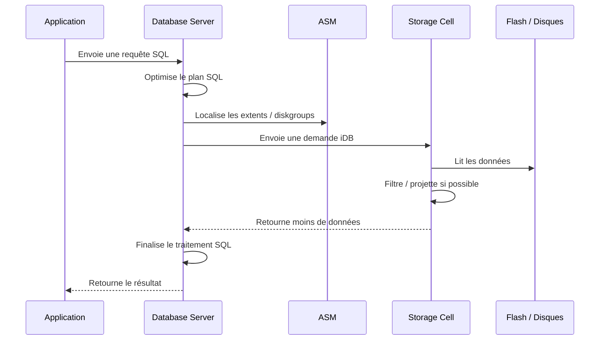

# Fiche de révision — Module 00
# Introduction au workshop Exadata — Questions / Réponses / Schémas

**Objectif :** vérifier la compréhension du module 00 et expliquer clairement le sens d’Exadata avant de passer aux modules techniques.

---

## 1. C’est quoi le vrai sens d’Exadata ?

### Réponse courte

Exadata sert à rapprocher **Oracle Database** du **stockage intelligent** pour réduire les I/O inutiles et améliorer l’exécution des bases critiques.

```text
Exadata = Oracle Database + stockage intelligent + réseau rapide + ASM + Grid Infrastructure + outils Oracle
```

### Explication

Dans une architecture Oracle classique, le stockage envoie principalement des blocs au serveur Oracle. Ensuite, Oracle Database filtre les lignes, choisit les colonnes, fait les jointures et renvoie le résultat.

Dans Exadata, les **Storage Cells** peuvent participer au travail : elles peuvent filtrer certaines lignes, ne renvoyer que certaines colonnes et réduire le volume envoyé aux Database Servers.

### Schéma mental

```text
Oracle classique :
Le stockage envoie beaucoup de blocs.
Oracle Database filtre après réception.

Exadata :
Le stockage est intelligent.
Les Storage Cells peuvent filtrer/projeter avant de renvoyer les données.
```

---

## 2. Pourquoi Exadata n’est pas seulement “une base Oracle plus rapide” ?

### Réponse courte

Parce qu’Exadata est un **système intégré**, pas simplement un serveur plus puissant.

### Explication

Exadata regroupe plusieurs couches conçues pour fonctionner ensemble :

```text
Database Servers
Storage Cells
ASM
Grid Infrastructure
Réseau interne RoCE ou InfiniBand
Exadata System Software
Outils Oracle de diagnostic et support
```

La performance vient de la coopération entre ces couches, pas seulement de CPU ou de RAM plus puissants.

### À retenir

```text
Exadata ne veut pas dire : “Oracle avec plus de CPU”.
Exadata veut dire : “Oracle Database intégré avec un stockage intelligent optimisé pour Oracle”.
```

---

## 3. Comment fonctionnait Oracle avant Exadata ?

### Réponse courte

Avant Exadata, Oracle Database lisait généralement des blocs depuis un stockage externe de type SAN/NAS, puis faisait le traitement côté serveur de base.

### Schéma Oracle classique

```text
Application
    |
    v
Oracle Database Server
    |
    | demande des blocs
    v
Stockage SAN/NAS
    |
    | renvoie des blocs
    v
Oracle Database Server
    |
    | filtre les lignes
    | choisit les colonnes
    | fait les jointures
    | agrège les données
    v
Résultat vers l’application
```

### Exemple

```sql
select nom, montant
from ventes
where region = 'IDF';
```

En architecture classique :

```text
1. Oracle demande les blocs de la table VENTES.
2. Le stockage renvoie les blocs.
3. Le serveur Oracle reçoit beaucoup de données.
4. Oracle filtre ensuite region = 'IDF'.
5. Oracle garde seulement nom et montant.
6. Oracle renvoie le résultat.
```

### Problème

```text
Le stockage a pu envoyer beaucoup de données inutiles.
Le serveur Oracle doit ensuite faire le tri.
```

---

## 4. Comment Exadata change ce fonctionnement ?

### Réponse courte

Exadata permet à certaines opérations SQL d’être traitées directement par les Storage Cells.

### Schéma Exadata

```text
Application
    |
    v
Database Server Exadata
    |
    | demande intelligente via iDB
    | "Lis, filtre, retourne seulement ce qui est utile"
    v
Storage Cells Exadata
    |
    | lisent disque / flash
    | filtrent certaines lignes
    | projettent certaines colonnes
    | réduisent le volume transféré
    v
Database Server Exadata
    |
    | finalise le traitement SQL
    v
Résultat vers l’application
```

### Idée principale

```text
Oracle classique = le stockage donne des blocs.
Exadata = le stockage peut aider à traiter.
```

---

## 5. C’est quoi une Storage Cell ?

### Réponse courte

Une **Storage Cell** est un serveur de stockage intelligent Exadata.

### Explication

Ce n’est pas un simple disque. Une Storage Cell contient :

```text
CPU
mémoire
disques physiques
flash
Exadata System Software
CellCLI
métriques
alertes
Smart Scan
Offload SQL
Storage Index
Flash Cache
Flash Log
IORM
```

### Schéma d’une Storage Cell

```text
+--------------------------------------------------+
| Storage Cell Exadata                             |
+--------------------------------------------------+
| CPU / mémoire                                    |
| Exadata System Software                          |
| CellCLI                                          |
| Flash Cache / Flash Log                          |
| Disques physiques                                |
| Cell disks / Grid disks                          |
| Smart Scan / Offload SQL / Storage Index         |
| IORM / métriques / alertes                       |
+--------------------------------------------------+
```

### Réponse à retenir

```text
Une Storage Cell est un stockage Oracle intelligent avec CPU, mémoire,
logiciel Exadata et fonctions d’optimisation.
```

---

## 6. Les Storage Cells ont-elles leur propre intelligence ?

### Réponse courte

Oui.

### Explication

Les Storage Cells ont leur propre logiciel, leur propre capacité de calcul et leurs propres métriques.

Elles peuvent participer à certains traitements au lieu d’envoyer tous les blocs au Database Server.

Elles ne remplacent pas Oracle Database, mais elles l’aident sur certains accès.

### Exemple

```text
Database Server :
"Je cherche les ventes de la région IDF et seulement les colonnes nom, montant."

Storage Cell :
"Je lis les données, je filtre ce qui est possible, je renvoie moins de données."
```

---

## 7. Comment la base et le stockage coopèrent dans Exadata ?

### Réponse courte

Le Database Server envoie une demande plus intelligente aux Storage Cells via le protocole interne Oracle **iDB**.

### Diagramme de séquence



### Explication

La coopération se fait parce que le Database Server ne demande pas seulement des blocs bruts. Il peut demander aux Storage Cells d’exécuter une partie du travail si la requête est éligible.

---

## 8. C’est quoi Smart Scan ?

### Réponse courte

Smart Scan est une fonction Exadata qui permet aux Storage Cells de traiter une partie d’une requête SQL lors de grands scans.

### Ce que Smart Scan peut faire

```text
filtrer certaines lignes
ne retourner que certaines colonnes
réduire les données envoyées au Database Server
aider à exploiter Storage Index et HCC
```

### Exemple

```sql
select customer_id, amount
from sales
where sale_date >= date '2026-01-01'
and region = 'FR';
```

Avec Smart Scan, les Storage Cells peuvent aider à :

```text
garder uniquement les lignes region = FR
garder uniquement customer_id et amount
réduire le volume envoyé au Database Server
```

### Point important

```text
Smart Scan ne s’applique pas à toutes les requêtes.
Il aide surtout sur certains grands scans éligibles.
```

---

## 9. C’est quoi Offload SQL ?

### Réponse courte

Offload SQL signifie déporter une partie du traitement SQL vers les Storage Cells.

### Explication

Au lieu que tout le travail soit fait par le Database Server, certaines opérations peuvent être faites dans les Storage Cells.

### Exemples d’opérations offloadables

```text
Predicate filtering = filtrer les lignes
Column projection = ne renvoyer que certaines colonnes
Storage Index = éviter certaines lectures inutiles
HCC scan = lire efficacement certaines données compressées
```

### Image simple

```text
Sans offload :
Storage -> renvoie beaucoup de blocs -> Database Server filtre

Avec offload :
Storage Cell -> filtre/projette -> Database Server reçoit moins de données
```

---

## 10. Quand certaines opérations SQL peuvent être déportées vers les Storage Cells ?

### Réponse courte

Principalement lorsque Oracle utilise un accès de type grand scan compatible avec Smart Scan.

### Cas favorables

```text
full table scan
direct path read
grands volumes lus
requête analytique
filtre simple éligible
projection de colonnes claire
partition pruning possible
```

### Cas moins favorables

```text
petite requête très sélective par index
données déjà dans le buffer cache
fonction SQL non offloadable
mauvais plan SQL
statistiques obsolètes
types de données non compatibles
accès qui ne passe pas par direct path read
```

### À retenir

```text
Exadata n’accélère pas automatiquement tout.
Elle accélère surtout certains chemins bien conçus.
```

---

## 11. Différence entre Oracle classique et Exadata

| Sujet | Oracle classique | Oracle Exadata |
|---|---|---|
| Plateforme | Serveurs + stockage séparés | Système intégré Oracle |
| Stockage | SAN/NAS plutôt passif | Storage Cells intelligentes |
| Traitement SQL | Principalement côté serveur Oracle | Certaines opérations peuvent aller côté cells |
| Données transférées | Beaucoup de blocs peuvent remonter | Volume potentiellement réduit |
| Smart Scan | Non disponible | Disponible selon conditions |
| Offload SQL | Non disponible | Disponible selon conditions |
| Flash | Dépend du stockage externe | Flash Cache / Flash Log intégrés |
| IORM | Non disponible au niveau Exadata | Priorisation I/O entre workloads |
| Diagnostic | Souvent multi-outils / multi-équipes | CellCLI, EM, AHF, Exachk, TFA |
| Support | Plusieurs composants séparés | Plateforme Oracle engineered |

### Phrase à retenir

```text
Oracle classique lit des blocs depuis un stockage.
Exadata fait coopérer Oracle Database avec un stockage intelligent.
```

---

## 12. C’est quoi ASM dans Exadata ?

### Réponse courte

ASM est la couche Oracle qui organise les disques Exadata en diskgroups utilisables par la base.

### Chaîne de stockage Exadata

```text
Disque physique / Flash
→ Cell Disk
→ Grid Disk
→ ASM Disk
→ ASM Diskgroup
→ Datafiles / Redo / Controlfiles / FRA
```

### Explication

Les Storage Cells exposent des grid disks.  
ASM les utilise pour construire des diskgroups comme DATA ou RECO.  
Oracle Database stocke ensuite ses fichiers dans ces diskgroups.

---

## 13. C’est quoi le réseau interne RoCE ou InfiniBand ?

### Réponse courte

C’est le réseau rapide qui relie les Database Servers et les Storage Cells.

### Il transporte notamment

```text
trafic RAC
trafic ASM
trafic iDB
échanges entre Database Servers et Storage Cells
```

### Pourquoi c’est important ?

Parce qu’un problème sur ce réseau peut provoquer :

```text
latence I/O
ralentissement SQL
symptômes RAC
problèmes de communication avec les cells
```

---

## 14. C’est quoi IORM ?

### Réponse courte

IORM signifie **I/O Resource Management**.

Il sert à prioriser les I/O entre plusieurs bases, PDB ou workloads sur Exadata.

### Exemple

```text
OLTP paiement = priorité haute
reporting = priorité moyenne
batch nuit = priorité contrôlée
test/dev = priorité basse
```

### Pourquoi c’est important ?

Parce qu’en consolidation, plusieurs workloads partagent les mêmes Storage Cells.  
Sans gouvernance I/O, un batch lourd peut ralentir une application critique.

---

## 15. C’est quoi Flash Cache ?

### Réponse courte

Flash Cache permet de servir des données depuis la flash au lieu de toujours lire les disques.

### Pourquoi c’est utile ?

La flash est plus rapide que les disques mécaniques pour de nombreux accès.

Elle aide surtout pour :

```text
blocs chauds
lectures répétées
charges sensibles à la latence
bases critiques
```

---

## 16. C’est quoi monotenant ?

### Réponse courte

Monotenant signifie qu’un environnement est principalement dédié à une base, une application ou un périmètre principal.

### Exemple

```text
1 plateforme
→ 1 base principale
→ 1 application principale
```

### Avantage

```text
isolement simple
moins de concurrence
diagnostic plus direct
```

### Limite

```text
moins de mutualisation
coût potentiellement plus élevé
ressources parfois sous-utilisées
```

---

## 17. C’est quoi multitenant Oracle ?

### Réponse courte

Multitenant Oracle correspond à l’architecture **CDB/PDB**.

```text
CDB = Container Database
PDB = Pluggable Database
```

### Exemple

```text
CDB_PROD
├── PDB_APP1
├── PDB_APP2
└── PDB_APP3
```

### Explication

Une CDB peut héberger plusieurs PDB.  
Cela permet de consolider plusieurs bases logiques dans une même architecture Oracle.

---

## 18. Différence entre multitenant Oracle et consolidation Exadata

### Réponse courte

Multitenant est un modèle Oracle Database.  
Consolidation Exadata est une stratégie de plateforme.

### Tableau

| Sujet | Signification |
|---|---|
| Multitenant | Plusieurs PDB dans une CDB Oracle. |
| Consolidation Exadata | Plusieurs bases, CDB, PDB, applications ou workloads sur une même plateforme Exadata. |

### Phrase à retenir

```text
Multitenant = architecture database.
Consolidation Exadata = stratégie plateforme.
```

---

## 19. Pourquoi on ne doit jamais conclure à partir d’une seule couche ?

### Réponse courte

Parce qu’un symptôme visible côté base peut venir d’une autre couche.

### Exemple

Une requête lente peut venir :

```text
du plan SQL
d’un manque d’offload
d’une Storage Cell saturée
d’ASM
du réseau interne
d’un service RAC mal placé
d’un batch concurrent
d’un problème flash ou disque
```

### Méthode

```text
1. Identifier le symptôme.
2. Localiser la couche possible.
3. Collecter des preuves read-only.
4. Croiser les métriques.
5. Conclure seulement si les preuves convergent.
```

---

## 20. Quelles commandes lire au début ?

### Commandes read-only utiles

```bash
crsctl stat res -t
olsnodes -n
srvctl status database -d <db_unique_name> -v
asmcmd lsdg
cellcli -e "list cell detail"
cellcli -e "list griddisk detail"
```

### Vues SQL utiles

```sql
select inst_id, instance_name, host_name, status
from gv$instance
order by inst_id;

select name, total_mb, free_mb, type, state
from v$asm_diskgroup
order by name;
```

### Règle

```text
Lire d’abord.
Comprendre ensuite.
Modifier seulement avec preuve, runbook et validation.
```

---

## 21. Quelles erreurs éviter au début ?

| Erreur | Pourquoi c’est dangereux |
|---|---|
| Croire qu’Exadata est juste un serveur rapide | On oublie les Storage Cells, ASM, réseau et offload. |
| Diagnostiquer seulement depuis Oracle Database | La cause peut être dans les cells, ASM, réseau ou flash. |
| Penser que Smart Scan marche toujours | Toutes les requêtes ne sont pas éligibles. |
| Confondre multitenant et consolidation | CDB/PDB n’est pas la même chose qu’une plateforme consolidée. |
| Modifier sans preuve | On peut aggraver l’incident. |
| Oublier IORM | Un workload non critique peut pénaliser une application critique. |

---

## 22. Mini-test de révision

### Question 1

Compléter :

```text
Oracle classique = le stockage renvoie surtout des ________.
Exadata = les Storage Cells peuvent ________, ________ et ________.
```

### Réponse

```text
Oracle classique = le stockage renvoie surtout des blocs.
Exadata = les Storage Cells peuvent filtrer, projeter et réduire les données retournées.
```

---

### Question 2

Citer trois composants Exadata.

### Réponse

```text
Database Servers
Storage Cells
ASM
Grid Infrastructure
Réseau interne RoCE ou InfiniBand
```

---

### Question 3

C’est quoi le plus important dans Exadata ?

### Réponse

```text
La coopération entre Oracle Database et les Storage Cells intelligentes.
```

---

### Question 4

Pourquoi Exadata ne rend pas automatiquement toutes les requêtes rapides ?

### Réponse

```text
Parce que Smart Scan et offload dépendent du plan SQL, du type d’accès, des statistiques,
du volume lu, des fonctions utilisées et des conditions d’éligibilité.
```

---

### Question 5

Quelle est la différence entre multitenant et consolidation ?

### Réponse

```text
Multitenant = CDB/PDB dans Oracle Database.
Consolidation = plusieurs bases, PDB ou workloads sur une même plateforme Exadata.
```

---

## 23. Résumé final à apprendre

```text
Exadata est une plateforme Oracle intégrée pour bases critiques.

Elle combine :
- Database Servers
- Storage Cells intelligentes
- ASM
- Grid Infrastructure
- réseau interne rapide
- logiciels et outils Oracle

Son intérêt principal :
faire coopérer Oracle Database et le stockage
pour réduire certaines I/O inutiles,
accélérer certains grands scans,
mieux consolider les workloads,
et améliorer le diagnostic de bout en bout.

Mais Exadata ne corrige pas automatiquement :
- mauvais SQL
- mauvais modèle de données
- mauvaises statistiques
- mauvais partitionnement
- mauvaise architecture applicative
- absence de gouvernance I/O

La bonne méthode :
lire → comprendre → prouver → interpréter → décider.
```
